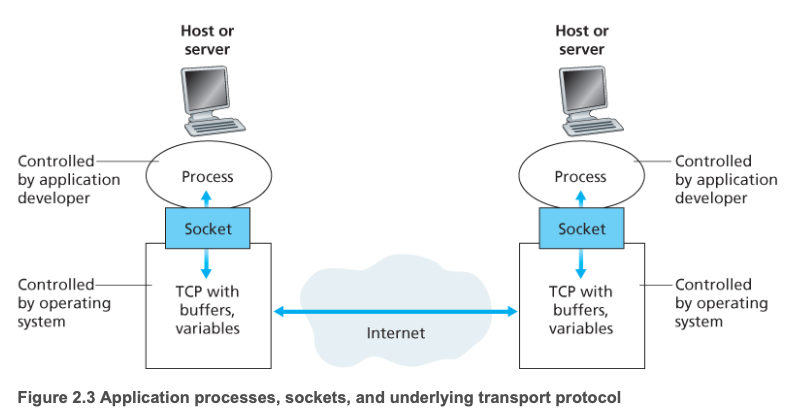
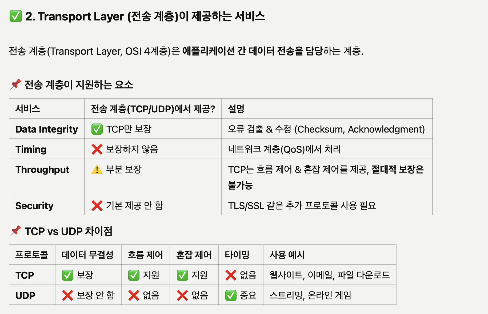

# 2.1 네트워크 애플리케이션의 원리

- 네트워크 애플리케이션 개발의 중심은 다른 위치의 종단 시스템에서 동작, 네트워크를 통해 서로 통신하는 프로그램을 작성하는 것이다.
  - ex: 브라우저, 웹 서버 프로그램, 넷플릭스… etc
- 우리가 새로운 애플리케이션을 개발할 때는 여러 end point에서 실행되는 소프트웨어를 작성해야 한다.

> 중요한 것은 우리가 이를 개발할 땐 네트워크 코어 장비에서 실행되는(router, link layer switch) 소프트웨어까지 작성할 필요는 없다는 것이다.

## 2.1.1 네트워크 애플리케이션 구조

- 애플리케이션 구조는 네트워크 구조와는 분명히 다르다.
  - 애플리케이션 개발자 관점에서 네트워크 구조는 고정, 해당 애플리케이션의 특정 서비스 집합을 제공한다.
- **`Client-Server Architecture`**
  - 항상 동작하고 있는 host → **Server**
  - Server / Service는 client라는 다른 host들로부터 서비스 요청을 받는다.
    - **client**: 둘이 서로 직접 통신하지는 않는다.
    - **server**: 고정 IP 주소라는 잘 알려진 주소를 갖는다.
- **`P2P Architecture`**
  - 항상 켜져 있는 infrastructure server에 최소로 의존한다. (혹은 전혀 안함)
  - 대신에 애플리케이션은 peer라는 간헐적으로 연결된 host 쌍이 서로 직접 통신하게 한다.
    - peer는 service provider가 소유하지 않고 사용자들이 제어하는 데스크톱, 대부분의 peer는 가정, 대학, 사무실에 위치한다.
    - 특정 서버를 통하지 않고 peer간에 통신을 하므로 이 구조를 P2P라고 한다.
  - 가장 큰 특징으로 self-scalability가 있다.
  - 그리고 비용 효율적
  - 그러나 고도의 분산 구조 특성으로 인한 보안, 성능, 신뢰성 면에서 도전을 맞이한다.

## 2.1.2 프로세스 간 통신

- 여러 end point에서 실행하는 프로그램이 어떻게 서로 통신을 할까?
  - 2개의 end point에서 프로세스는 컴퓨터 네트워크를 통한 message 교환으로 서로 통신한다.

### Client, Server process

**두 프로세스 간의 통신 세션에서 통신을 초기화하는 프로세스를 client, 세션을 시작하기 위해 접속을 기다리는 프로세스를 server라고 한다.**

### 프로세스, 컴퓨터 네트워크 사이의 Interface

- 프로세스는 `socket`을 통해 네트워크로 메시지를 보내고 받는다.
  - socket은 host’ application layer, transport layer 간의 interface다.
    
  - socket은 네트워크 애플리케이션이 인터넷에 만든 프로그래밍 interface이므로, 애플리케이션과 네트워크 사이의 API라고도 한다.

### 프로세스 주소 배정

- 한 host 내 프로세스가 packet을 다른 host의 프로세스로 보내기 위해서는 수신 프로세스가 주소를 갖고 있을 필요가 있다.
  - 이를 식별하기 위해 아래 2가지의 정보가 명시되어야 한다.
    - **`호스트의 주소`**
    - **`목적지 호스트 내의 수신 프로세스를 명시하는 식별자`**
- 인터넷에서 host → **`IP주소`**로 식별된다.
  - 32비트, 호스트를 유일하게 식별한다는 것만 기억하자.(4장에서 자세히 다룬다.)
- 송신 host는 수신 host에서 수행되고 있는 수신 프로세스(자세히는 socket)도 식별해야 한다.
  - `PORT number`가 이 목적을 위해 사용된다.

## 2.1.3 애플리케이션이 이용 가능한 Transport Service

- 송신 측의 transport protocol은 네트워크를 통해 메시지를 수신 프로세스의 socket으로 이동시킬 책임이 있다.
  - 많은 protocol을 제공하는데, 어떤 선택을 할 것인가?
  - 제공 해줄 수 있는 서비스로는 무엇인가?

### 신뢰적 데이터 전송(Reliable data transfer)

- 프로토콜이 보장된 데이터 전송 서비스를 제공하는 것.

### 처리율(Throughput)

- 처리율이란?
  - 네트워크 경로를 따라 두 프로세스 간의 통신 세션에서 송신 프로세스가 수신 프로세스로 비트를 전달할 수 있는 비율
- 처리율 요구사항을 갖는 애플리케이션은 대역폭 민감 애플리케이션(bandwidth-sensitive application)이라고 한다.

### Timing

- 데이터를 **제시간에** 전달하는 것

### Security

- 기밀성(confidentiality)
- 데이터 무결성(integrity)
- 종단 인증(authentication)

## 2.1.4 인터넷 전송 프로토콜이 제공하는 서비스

## 2.1.5 애플리케이션 계층 프로토콜

### Qusetion

- 소켓으로 메시지를 보내는데… 메시지의 구성은 어떤식으로?
- 메시지 field는?
- 언제 보내는데?

**Application-layer protocol은 다른 end point에서 실행되는 애플리케이션의 프로세스가 서로 메시지를 보내는 방법을 정의한다.**

- 교환 메시지 타입(request, response)
- 여러 메시지 타입의 문법(field / 구별 방법)
- field의 의미, 정보의 의미
- 언제, 어떻게 프로세스가 메시지를 전송하고 메시지에 응답하는지 결정하는 규칙

## 2.1.6 이 책에서 다루는 네트워크 애플리케이션

- 5개의 주요 분야를 다룬다.
  - 웹, 전자메일, 디렉터리 서비스, 비디오 스트리밍, P2P 애플리케이션
  - 위 순서대로 다룬다.
