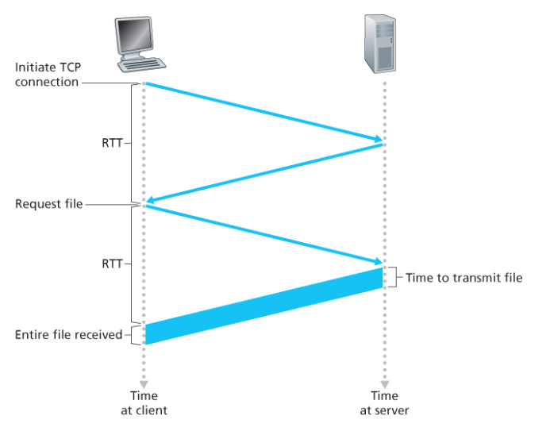
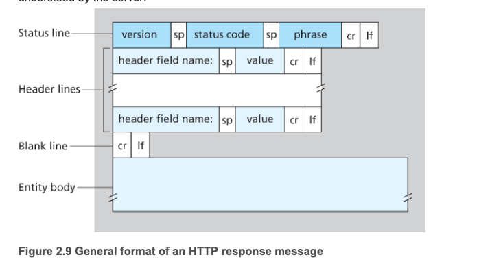
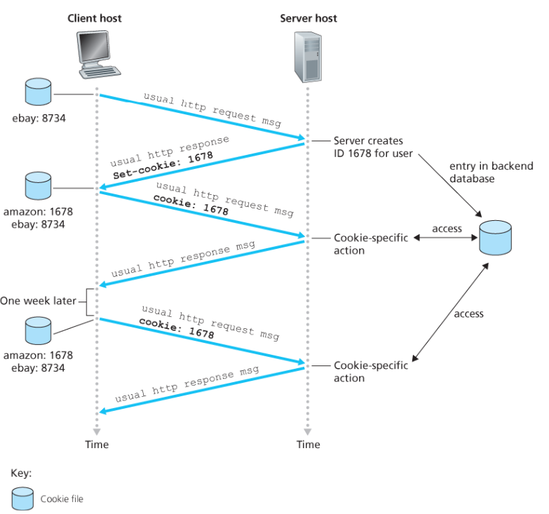
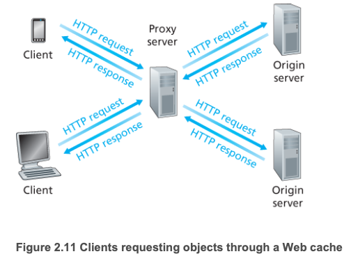
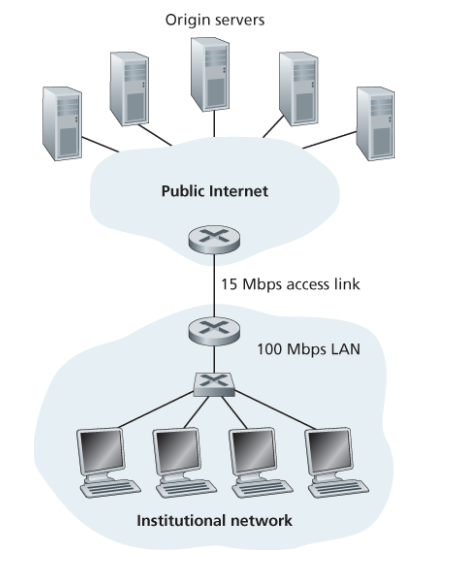
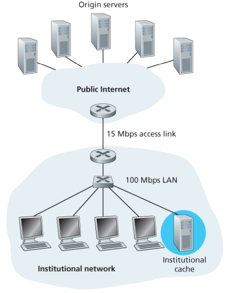

## 2.2 웹과 HTTP

### 2.2.1 HTTP 개요

- `HTTP`
  - 웹의 Application Layer Protocol
  - 두 가지 프로그램으로 구현된다.
    - Client / Server
  - 서로 HTTP 메시지를 교환하여 통신한다.
  - 즉, HTTP는 메시지의 구조, 클라이언트와 서버가 메시지를 어떻게 교환하는지에 대해 정의하고 있다.
- Web Page
  - 객체들로 구성된다.
    - 객체? → 단순히 URL로 지정할 수 있는 하나의 파일
  - 각 URL은 2개의 요소, 즉 객체를 갖고 있는 서버의 host name과 객체의 path name을 가지고 있따.
    > http://www.someSchool.edu/someDepartment/picture.gif
  - www.someSchool → Host name
  - /someDepartment/picture.gif → Path name
- HTTP는 웹 client → 웹 server에게 웹 페이지를 어떻게 요청하는지와 서버가 클라이언트로 어떻게 웹 페이지를 전송하는지를 정의한다.
- TCP를 transport protocol로 사용한다.
  - HTTP 클라이언트는 먼저 서버에 TCP 연결을 시작한다.
    - 일단 연결이 이뤄지면, 브라우저와 서버 프로세스는 그들의 socket interface 통해 TCP로 접속한다.
  - client는 HTTP 요청 메시지를 socket interface로 보내고 socket interface로부터 HTTP 응답 메시지를 받는다.
  - HTTP 서버는 socket interface로부터 요청 메시지를 받고 응답 메시지를 socket interface로 보낸다.
  - 클라이언트가 메시지를 socket interface로 보내면, 메시지는 클라이언트의 손을 떠난 것이고 TCP의 손에 쥐어진 것이다.
    - 메시지는 클라이언트의 손을 떠난 것이고 TCP의 손에 쥐어진 것이다.
      - 메시지가 궁극적으로 서버에 잘 도착한다는 것.
  - HTTP는 데이터의 손실 또는 TCP가 어떻게 손실 데이터를 복구하고 네트워크 내부에서 데이터를 올바른 순서로 배열하는지 걱정할 필요가 없다.
    - TCP, protocol stack의 하위 계층들이 하는 일이다.
- HTTP 서버는 클라이언트에 대한 정보를 유지하지 않으므로, HTTP를 stateless protocol이라고 한다.

---

### 2.2.2 비지속 연결, 지속 연결

**애플리케이션, 어떻게 이용되는지에 따라 일련의 요구가 계속해서, 일정 한 간격으로 주기적으로 혹은 간헐적으로 만들어질 수 있다.**

- client ↔ server의 상호작용이 TCP상에서 발생할 때 개발자는 아래의 결정을 해야한다.
  > 각 request/response 쌍이 분리된 TCP 연결을 통해 보내져야 하는지, 모든 요구와 해당하는 응답들이 같은 TCP 연결상으로 보내져야 하는지?
  - 전자 → non-persistent connection
  - 후자 → persistent connection (Default)

---

**Non-persistent connection HTTP**

(HTTP/1.0은 이를 지원한다.)

- 웹 페이지를 서버에서 클라이언트로 전송하는 단계를 아래의 예로 알아보자.
  → 페이지가 **기본 HTML 파일과 10개의 이미지**로 구성되고, 이 11개의 객체가 같은 서버에 있다.
- 연결 수행 과정은 아래와 같다.
  1. HTTP 클라이언트는 `HTTP 기본 포트 80`을 통해 서버로 `TCP 연결`을 시도한다.
     - TCP 연결과 관련하여 클라이언트와 서버에 각각 소켓이 있게 된다.
  2. HTTP 클라이언트는 설정된 TCP 연결 소켓을 통해 서버로 HTTP 요청 메시지를 보낸다.
     - 이 요청에 객체 경로도 포함된다.
  3. HTTP 서버는 TCP 연결 소켓을 통해 요청 메시지를 받는다.
     - 저장 장치로부터 경로의 객체를 추출한다.
     - HTTP 응답 메시지에 그 객체를 캡슐화 하여 소켓을 통해 클라이언트로 보낸다.
  4. HTTP 서버는 TCP에게 연결을 끊으라고 한다.
     - 실제로는 클라이언트가 응답 메시지를 올바로 받을 때까지 끊지 않는다.
  5. HTTP 클라이언트가 응답 메시지를 받으면, TCP 연결이 중단된다.
     - 메시지는 캡슐화된 객체가 HTML 파일인 것을 나타낸다.
     - 클라이언트는 응답 메시지로부터 파일을 추출하고 HTML 파일을 조사하여 10개의 JPEG 객체에 대한 참조를 찾는다.
  6. 참조되는 JPEG 객체에 대해 1 ~ 4단계를 반복한다.
- HTTP는 통신 프로토콜만 정의할 뿐, 웹 페이지에 대한 관심은 없다.
  - 브라우저는 웹 페이지를 수신하면서, 사용자에게 그 페이지를 보여준다.
- 앞 단계는 서버가 객체를 보낸 후 각 TCP 연결이 끊어지므로 비지속 연결을 사용하고 있따.
  - 연결이 다른 객체를 위해 유지되지 않는다.
  - HTTP/1.0은 non-persistent connection을 지원한다.
  - 그래서 해당 예에서는 사용자가 웹 페이지를 요청할 때 11개의 TCP 연결이 이뤄진다.
    - 사실 사용자가 동시성 정도를 조절하거나, 브라우저가 여러 TCP 연결을 설정하여 응답 시간을 줄일 수 있다.

**그래서 총 응답시간은?**

- 웹 브라우저, 서버 사이에서 TCP 연결을 시도할 때
  
  - ‘three-way handshake’를 포함한다.
  - 즉, 클라이언트가 작은 TCP 메시지를 서버로 보내고, 서버는 작은 메시지로 응답하고, 마지막으로 클라이언트가 다시 서버에게 응답한다.
    - 처음 두 부분이 경과하면 하나의 RTT가, handshake의 처음 두 과정이 끝난 후에 클라이언트는 HTTP 요청 메시지를 TCP 연결로 보내면서 handshake의 세 번째 부분(응답)을 함께 보낸다.
    - 일단 요청 메시지가 서버에 도착하면 서버는 HTML 파일을 TCP 연결로 보낸다.
      - 여기서도 RTT 하나를 필요로 한다.
  - 즉, 총 응답시간은 2\*RTT + (HTML 파일 서버가 전송하는 데 걸리는 시간) 이다.

**Persistent connection HTTP**

- 위에서 본 non-persistent connection 의 단점은 뭘까?

  - **각 요청 객체에 대한 새로운 연결이 설정되고 유지되어야 한다.**
    - TCP 버퍼가 할당되어야 하고, TCP 변수들이 클라이언트와 서버 양쪽에 유지되어야 한다.
    - 이는 수많은 클라이언트들의 요청을 동시에 서비스하는 웹 서버에는 심각한 부담이다.
  - 각 객체는 2RTT를 필요로 한다.

- HTTP/1.1 persistent connection에서 서버는 응답을 보낸 후에 TCP 연결을 그대로 유지한다.
  - 같은 client ↔ server 간의 이후 요청, 응답은 같은 연결을 통해 보내진다.
- HTTP의 디폴트 모드는 파이프라이닝을 이용한 persistent connection을 사용한다.

---

### 2.2.3 HTTP 메시지 format

**HTTP 요청 메시지**

- SP (Space): 필드명과 값을 구분하는 공백 문자 (ASCII 32)
- Value: 헤더 필드의 실제 값
- CR (Carriage Return): 줄의 끝을 나타내는 제어 문자 (ASCII 13)
- LF (Line Feed): 새 줄의 시작을 나타내는 제어 문자 (ASCII 10)

**HTTP 응답 메시지**

- Status Code
  - 200 OK: 요청이 성공했고, 정보가 응답으로 보내졌다.
  - 301 Moved Permanently: 요청 객체가 영원히 이동되었다. 이때, 새로운 URL은 응답 메시지의 Location 헤더에 나와있다.
  - 400 Bad Request : 서버가 요청을 이해할 수 없다.
  - 404 Not Found : 요청한 문서가 서버에 존재하지 않는다.
  - 505 HTTP Version Not Supported : 요청 HTTP 프로토콜 버전을 서버가 지원하지 않는다.

---

### 2.2.4 사용자와 서버 간의 상호작용: 쿠키

- HTTP 서버는 stateless 하다.
  - 그러나 서버가 사용자 접속을 제한하거나 사용자에 따라 콘텐츠를 제공하기 원하므로 웹사이트가 사용자를 확인하는 것이 바람직할 때가 있다.
  - 이 목적으로 HTTP는 `쿠키(cookie)` 를 사용한다.
    [사이트가 사용자를 추적하게 해준다.]

- 쿠키 기술은 4가지 요소를 포함한다.
  - HTTP 응답 메시지 쿠키 헤더 라인
  - HTTP 요청 메시지 쿠키 헤더 라인
  - 사용자의 브라우저에 사용자 end point와 관리를 지속시키는 쿠키 파일
  - 웹사이트의 백엔드 DB
- 위의 그림은 내가 PC로 처음으로 아마존닷컴에 접속하는 상황을 가정한다.
  - 동작은 아래와 같이 이루어진다.
  1. 웹 서버에 `HTTP 요청 메시지`를 전달한다.
  2. 웹 서버는 유일한 식별 번호를 만들고 이 식별 번호로 인덱싱 되는 백엔드 데이터 베이스 안에 엔트리를 만든다.
  3. **HTTP 응답 메시지에** `Set-cookie: 식별 번호`의 헤더를 포함해서 전달한다.
  4. 브라우저는 헤더를 보고, 관리하는 특정한 쿠키 파일에 그 라인을 덧붙인다.
  5. 다시 **동일 웹 서버에 요청을 보낼 때**브라우저는 쿠키 파일을 참조하고 이 사이트에 대한 식별번호를 발췌하여 `Cookie : 식별 번호`의 헤더를 요청과 함께 보낸다.

---

### 2.2.5 웹 캐싱

- 웹 캐시(Web Cache, 프록시 서버(proxy server)라고도 함)는 기점 웹 서버(origin Web Server)를 대신하여 HTTP 요구를 충족시키는 네트워크 개체다.
  - 자체의 저장 디스크를 갖고 있어 최근 호출된 객체의 사본을 저장 및 보존.
    
  - 브라우저는 사용자의 모든 HTTP 요구가 웹 캐시에 가장 먼저 보내지도록 구성되 ㄹ수 있다.
  - 일단, 브라우저가 설정되면 객체에 대한 각각의 브라우저 요청은 웹 캐시에 가장 먼저 보내진다.
- ~~ url에 객체를 요구한다고 생각해보자.
  1. 브라우저는 웹 캐시와 TCP 연결을 설정하고 웹 캐시에 있는 객체에 대한 HTTP 요청을 보낸다.
  2. 웹 캐시는 객체의 사본이 저장되어 있는지 확인하고, **저장되어 있다면 클라이언트 브라우저로 HTTP 응답 메시지와 함께 객체를 전송한다.**
  3. **갖고 있지 않다면, 기점 서버로 TCP 연결을 설정한다.**이후 웹 캐시는 캐시와 서버 간의 TCP 연결로 객체에 대한 HTTP 요청을 보낸다. 기점 서버는 웹 캐시로 HTTP 응답 메시지를 보낸다.
  4. 웹 캐시의 객체를 수신할 때, 객체를 지역 저장장치에 복사하고 클라이언트 브라우저에 HTTP 응답 메시지를 보낸다. (이때, 이미 설정된 TCP를 통해 보낸다.)
- **캐시(cache)는 요청과 응답을 모두 하는 클라이언트이면서 서버이다.**

- origin web server를 두고 왜 쓰는가?

  1. **클라이언트 요구에 대한 응답 시간을 줄일 수 있다.**
     - 보통 클라이언트와 캐시 사이에 높은 속도의 연결이 설정되어 있어 웹서버 캐시에 객체를 갖고 있다면 병목 현상을 줄일 수 있다.
  2. 웹 캐시는 한 기관에서 인터넷으로의 접속하는 링크 상의 웹 트래픽을 대폭 줄일 수 있다.
  3. 인터넷 전체의 웹 트래픽을 실질적으로 줄여주어 모든 애플리케이션의 성능이 좋아진다.

- 예시를 통해 보자.
  [**웹 캐시 미사용]\*\*
  

  - 평균 객체의 크기가 `1 Mb`이고, 기관 브라우저로부터 기점 서버에 대한 평균 요청 비율이 초당 `15 요청`이라고 가정하자.
  - HTTP 메시지 요청이 무시할만큼 작으므로 네트워크 접속 회선에 어떤 트래픽도 발생시키지 않는다고 가정하자.
  - 또한, 접속 회선의 인터넷 부분 라우터가 **HTTP 요청을 전달하고 응답을 받을 때까지 평균 소요 시간**을 `2초`라고 가정하자.통상 이러한 지연을 `인터넷 지연`이라고 한다.
    $$
    총 응답 시간 = LAN 지연 + 접속 지연 + 인터넷 지연
    $$
  - LAN의 트래픽 강도
    → `(15 요청/초) X (1 Mb/요청) / 100 Mbps = 0.15`
  - 접속 회선(라우터와 라우터 사이)의 트래픽 강도
    → `(15 요청/초) X (1 Mb/요청) / 15 Mbps = 1`
  - 트래픽 강도가 1에 가까우면 회선의 지연은 매우 커지는데…
    - **접속 회선의 접속률을 100 Mbps 수준으로 늘리면 트래픽 강도를 0.15로 낮추어 해결할 수 있겠지만, 매우 많은 비용이 들어간다.**

  **[웹 캐시 사용]**

  

  - `캐시가 만족시킨 요청의 비율(hit rate)`은 일반적으로 0.2 ~ 0.7이다.
    - 이 예시에서는 0.4의 적중률을 가진다고 가정하자.
  - 캐시와 클라이언트는 고속 LAN으로 연결되어 있어, 요청의 40%는 캐시에 의해(10ms 이내) 즉시 만족된다.
    - 하지만 여전히 60%의 요청은 여전히 기점 서버에 의해 만족되어야 하므로 트래픽 강도는 1.0에서 0.6으로 감소한다.
  - 일반적으로 0.8 미만의 트래픽 강도는 작은 지연에 속한다.

  - 2초에 의하면 무시할 수 있는 수준이다.

- CDN 회사는 인터넷 전역을 통해 많은 지역적으로 분산된 캐시를 설치하고 있으며,
  이를 통해 많은 트래픽을 지역화하고 있다. (전용 CDN을 사용하기도 한다.)
- 콘텐츠 전송 네트워크(CDN)을 통해 웹 캐시는 인터넷에서 점진적으로 중요한 역할을 하고 있다.

**조건부 GET**

- 웹 캐싱이 사용자가 느끼는 응답 시간을 줄일 수 있지만, 캐시 내부에 있는 객체의 복사본이 새것이 아닐 수도 있다는 문제를 야기한다.
  - 복사본이 클라이언트에 캐싱된 이후에 웹 서버에 있는 객체가 갱신되었을 수도 있다.

<quote>

HTTP는 클라이언트가 **브라우저로 전달되는 모든 객체가 최신의 것임을 확인하면서 캐싱**해주는데, 이러한 방식을 조건부 GET(conditional GET)이라고 한다.

</quote>

---

### 2.2.6 HTTP/2

- 이의 주요 목표는 하나의 TCP 연결상에서 멀티플렉싱 요청/응답 지연 시간을 줄이는 데 있으며, 추가적인 기능을 제공한다.
  - 요청 우선순위화, 서버 푸시, HTTP 헤더 필드의 효율적인 압축 기능.. + etc
- 클라이언트와 서버 간의 데이터 포맷 방법과 전송 방법을 변경했다.

**기존 HTTP/1.1의 문제점**

- 단일 TCP 연결 사용 시 HOL(Head of Line) 블로킹 발생
- 대용량 컨텐츠가 작은 객체들의 전송을 차단
- 이를 해결하기 위해 최대 6개의 병렬 TCP 연결 사용
  - 서버 자원 과다 사용
  - TCP 혼잡 제어의 효율성 저하

**HTTP/2 프레이밍**

- 프레이밍(framing)?
  - HTTP 메시지를 독립된 프레임 단위로 분할
  - 프레임 간 인터리빙(끼워넣기) 구현
  - 수신측에서 원본 메시지로 재조립
- **작동 방식**
  1. 헤더필드와 메시지 본문을 별도 프레임으로 분할
  2. 서버측 프레이밍 서브계층에서 프레임 인터리빙
  3. 단일 TCP 연결을 통한 전송
  4. 클라이언트측에서 원본 메시지로 재조립
- **바이너리 인코딩의 장점**
  - 효율적인 파싱 가능
  - 프레임 크기 최소화
  - 에러 처리 능력 향상

**메시지 우선순위화**

- 1~256 범위의 가중치 할당
- 높은 수치가 높은 우선순위
- 메시지 간 의존성 설정 가능
- 서버의 전송 순서 최적화 지원

**서버 푸시 기능**

- 클라이언트 요청 이전에 리소스 선제적 전송
- HTML 문서 분석을 통한 필요 객체 예측
- 추가 요청 대기 시간 제거
- 페이지 로딩 성능 향상

**HTTP/3**

- QUIC 프로토콜 기반 설계
- 현재 표준화 진행 중
- 추가적인 성능 개선 기대
