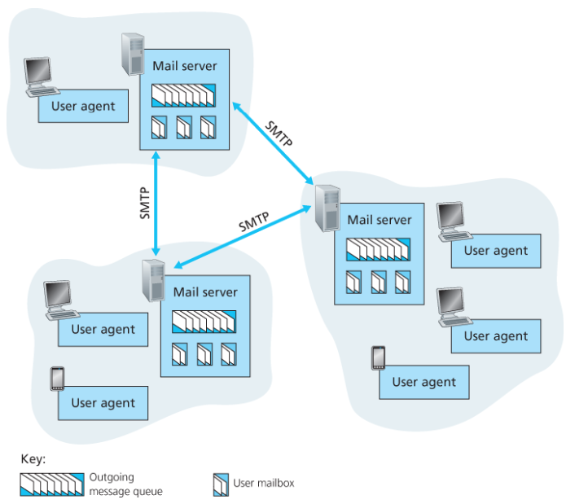
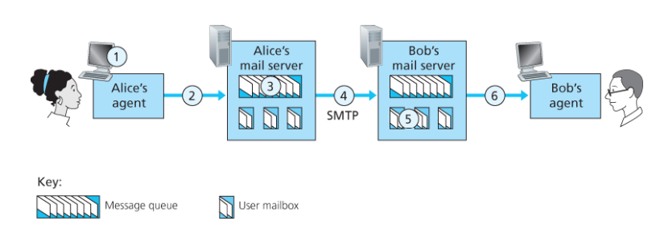
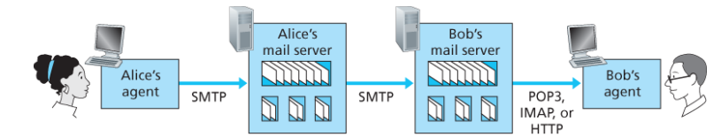

## 2.3 인터넷 전자메일

**이 절에서는 인터넷 전자메일 구조의 중심에 있는 Application layer Protocol을 알아본다.**

- 인터넷 메일 시스템, 그 주요 요소에 대한 상위 레벨의 관점을 갖길 바란다.



- 인터넷 메일 시스템의 상위 레벨 개념을 보여준다.
- 다이어그램의 구성 요소
  - `user agent`
    - 아웃룩, 애플 메일… etc
  - `mail server`
    - 전자메일 infrastructure의 중심
    - 각 수신자는 서버 안에 mailbox를 갖고 있다.
  - `SMTP`(Simple Mail Transfer Protocol)
    - 인터넷 전자메일을 위한 주요 application layer protocol이다.
    - 메일을 송신자의 메일 서버로부터 수신자의 메일 서버로 전송하는 데 TCP의 신뢰적인 데이터 전송 서비스를 이용한다.
    - 송신자 메일 서버에서 수행하는 클라이언트와 수신자 메일 서버에서 수행되는 서버를 갖고 있다.
    - SMPT의 클라리언트와 서버 모두가 모든 메일 서버에서 수행된다.
    - 메일 서버가 상대 메일 서버로 메일을 보낼 때는 SMTP의 클라이언트로 동작하는 반면, 메일 서버가 상대 메일 서버로부터 메일을 받을 때는 SMTP 서버로 동작한다.

---

### 2.3.1 SMTP

- 낡은 특성을 가진 오래된 기술
  - 모든 메일 메시지의 몸체(헤더뿐 아니라)는 단순한 7비트 ASCII여야 한다.



- 앨리스가 간단한 ASCII 메시지를 밥에게 보낸다고 가정하자.
  1. 앨리스는 전자메일 user agent를 수행하고 밥의 전자메일 주소를 제공하고, 메시지를 작성하고 user agent에게 메시지를 보내라고 명령한다.
  2. 앨리스의 user agent는 메시지를 그녀의 메일 서버에 보내고 그곳에서 message queue에 메시지를 놓는다.
  3. 앨리스의 메일 서버에서 동작하는 SMTP의 클라이언트 측은 message queue에 있는 메시지를 본다.
  4. 초기 SMTP handshaking 이후에 SMTP 클라이언트는 앨리스의 메시지를 TCp 연결로 보낸다.
  5. 밥의 메일 서버 호스트에서 SMTP의 서버 측은 메시지를 수신한다.
     - 밥의 메일 서버는 그 메시지를 밥의 메일박스에 놓는다.
  6. 밥은 편한 시간에 그 메시지를 읽기 위해 user agent를 시동한다.
- SMTP는 메일을 보낼 때 두 메일 서버가 먼 거리에 떨어져 있더라도 중간 메일 서버를 사용하지 않음이 중요하다.
  - 특히, 수신자의 메일 서버가 죽어 있다면 메시지는 어느 중간 메일 서버에 저장되는 것이 아니라 송신자의 메일 서버에 남아 새로운 시도를 위해 기다린다.
- SMTP가 메시지를 송신 메일 서버에서 수신 메일 서버로 어떻게 전송하는가?
  1. 클라리언트 SMTP(송신 메일 서버 호스트에서 수행된다)는 `서버 SMTP`(수신 메일 서버 호스트에서 수행된다)의 25번 포트로 TCP 연결을 설정한다.
     - 일단 이 연결이 설정되면 서버/클라이언트는 application layer handshaking을 수행한다.
     - SMTP 클라이언트와 서버는 정보를 전송하기 전에 서로를 소개한다.
       - handshaking 과정에서 SMTP 클라이언트는 송신자의 전자메일 주소, 수신자의 전자메일 주소를 제공한다.
  2. 소개를 마치면, 클라이언트는 메시지를 보낸다.
     - SMTP는 서버에 오류 없이 메시지를 전달하기 위해 TCP의 reliable data transfer service에 의존한다.

---

### 2.3.2 메일 메시지 포맷

- RFC 5322에 정의되어 있다.
  - 헤더, 메시지는 빈 줄(CRLF)로 분리된다.
  - 모든 헤더는 From: 헤더라인과 To: 헤더 라인을 반드시 가져야 한다.

```
From: alice@crepes.fr
To: bob@hamburger.edu
Subject: Searching for the meaning of life.

Message
```

---

### 2.3.3 메일 접속 프로토콜(SMTP)

- 수신자가 자신의 호스트에서 user agent를 수행하는데… 메일 서버도 로컬 PC에 놓으면 관리하기 편하지 않을까?
  > 메일 서버는 메일박스를 관리하고 SMTp의 클라이언트와 서버 측 모두를 수행한다는 것을 잊지 말자.
  - 그럼 수신자의 호스트는 언제든 켜져 있어야 하고 인터넷에 연결 되어 있어야 한다..
- 대신에 일반 사용자는 로컬 호스트에서 user agent를 수행하고 늘 켜져 있는 공유 메일 서버에 저장된 메일박스에 접근한다.
  - 메일 서버는 보통 사용자들과 공유한다.



- 클라이언트의 사용자 에이전트는 수신자의 메일 서버로 직접 대화하지 않는다.
  - 송신자의 user agent는 그녀의 메일 서버로 전자메일 서비스를 SMTP 또는 HTTP를 이용하여 보낸다.
  - 송신자의 메일 서버는 SMTP(클라이언트 SMTP)를 사용하여 수신자의 메일 서버로 전자메일 메시지를 중계한다.
- 수신자는 자신의 ISP 내부의 메일 서버에 있는 자신의 메시지를 어떻게 얻을 수 있는가?
  1. 수신자가 웹 기반 전자메일이나 지메일 같은 스마트폰 앱을 사용하고 있다면 user agent는 수신자의 전자메일을 확인하기 위해 HTTP를 사용한다.
     - 이 경우 수신자의 메일 서버는 SMTP(송신자의 메일 서버와 통신을 위함) 인터페이스 + HTTP 인터페이스를 가지고 있어야 한다.
  2. 다른 방법의 경우, 메일 클라이언트를 사용하는데, RFC 3501에 정의된 IMAP(Internet mail access protocol)을 사용한다.
  - HTTP / IMAP 사용 방법 모두 수신자의 메일 서버에 의해 유지되는 폴더를 관리하게 된다.
    - 수신자는 자신의 메시지를 자신이 생성한 폴더로 이동, 삭제, 중요 메시지 표기 등을 할 수 있다.
