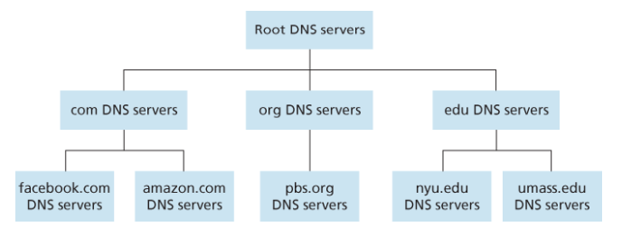
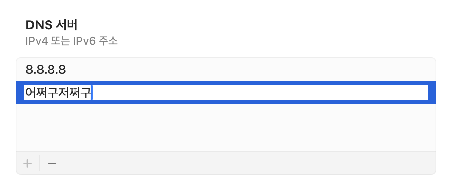
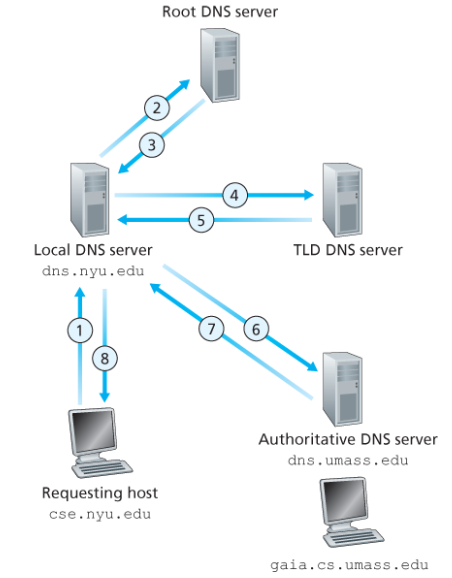
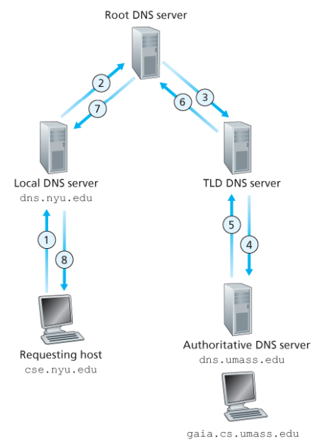

## 2.4 DNS: 인터넷의 디렉터리 서비스

사람을 여러 가지 방법으로 식별할 수 있는 것처럼, 인터넷 호스트도 마찬가지다.

호스트의 식별자 중 하나는 호스트 이름(hostname)이다.

- [www.facebook.com](http://www.facebook.com) 은 기억하기 쉬워 사용자가 좋아한다.

하지만, 이러한 이름은 인터넷에서의 그 호스트 위치에 대한 정보를 거의 제공하지 않는다.

더 나아가, 호소트 이름은 가변 길이의 alphaNumeric 문자로 구성되므로 라우터가 처리하는 데 어려움이 있다.

- 이러한 이유로 호스트는 흔히 말하는 **IP 주소(IP address)** 로도 식별된다.
- IP Address
  - 4바이트로 구성되고 계층구조를 갖는다.
    - 127.7.106.83
  - 위와 같은 형태이고, 0~255의 십진수로 표현하는 각 바이트는 점으로 구분한다.
  - 계층구조여서 주소를 왼쪽으로 오른쪽으로 조사함으로써, 그 호스트가 인터넷의 어디에 위치하는지에 대한 자세한 정보를 얻을 수 있따.

---

### 2.4.1 DNS가 제공하는 서비스

- 호스트 이름을 IP 주소로 변환해주는 디렉터리 서비스가 필요하다.
- 이것이 인터넷 DNS(domain name system)의 주요 임무다.
  1. DNS 서버들의 계층구조로 구현된 분산 데이터베이스
  2. 호스트가 분산 데이터베이스로 질의하도록 허락하는 Application layer Protocol
- DNS 서버는 주로 BIND 소프트웨어를 수행하는 유닉스 컴퓨터다.
- DNS 프로토콜은 UDP 상에서 수행되고 포트 번호 53을 이용한다.
- DNS는 다른 Application protocol들이 HTTP, SMTP, FTP 등 사용자가 제공한 호스트 이름을 IP 주소로 변환하기 위해 주로 이용한다.

 

[Computer-Networking_A-Top-Down-Approach/Chapter_2/2.4 DNS: 인터넷의 디렉터리 서비스 at main · IT-Book-Organization/Computer-Networking_A-Top-Down-Approach](https://github.com/IT-Book-Organization/Computer-Networking_A-Top-Down-Approach/tree/main/Chapter_2/2.4%20DNS%3A%20%EC%9D%B8%ED%84%B0%EB%84%B7%EC%9D%98%20%EB%94%94%EB%A0%89%ED%84%B0%EB%A6%AC%20%EC%84%9C%EB%B9%84%EC%8A%A4)

- **위 링크 참고 (왜 UDP를 쓰는가?)**
  - **1️⃣ 빠른 속도**
    - TCP의 경우 데이터 전송 시작 전에 3-way-handshaking 과정이 있는 반면, UDP는 연결 설정에 드는 비용이 없다.
    - DNS는 신뢰성보다 속도가 더 중요한 서비스이기 때문에 TCP보다 UDP가 더 적합하다.
    - DNS가 전송하는 데이터 패킷 사이즈가 매우 작으므로 UDP가 유리.
      이때 단순히 패킷의 사이즈가 작다고 DNS가 UDP를 채택한 것은 아니고,
    - 전달하는 패킷의 크기가 작기 때문에 신뢰성이 보장되지 않아도 되기 때문이다.
      - 못 받으면 다시 전달하면 된다.
  - **2️⃣ 연결 상태를 유지할 필요가 없다.**
    - TCP는 호스트 간의 연결 상태를 유지한다.
    - 이때 TCP의 패킷 안에는 여러 정보가 담겨 있지만, UDP는 어떤 정보도 기록하지 않고 유지할 필요도 없다.
    - DNS 서버는 TCP보다 많은 클라이언트를 수용할 수 있으므로 연결 상태를 유지하지 않고 정보 기록을 최소화할 수 있는 UDP를 채택하였다.

 

**어떤 사용자의 호스트에서 수행되는 브라우저가 URL (www.someschool.edu/index.html)을 요청할 때 무슨 일이 발생하는지를 보자.**

1. 같은 사용자 컴퓨터는 DNS 애플리케이션의 클라이언트를 수행한다.
2. 브라우저는 URL로부터 호스트 이름(www.someschool.edu)을 추출하고 그 호스트 이름을 DNS 애플리케이션의 클라이언트에 보낸다.
3. DNS 클라이언트는 DNS 서버로 호스트 이름을 포함하는 질의를 보낸다.
4. DNS 클라이언트는 결국 호스트 이름에 대한 IP 주소를 받게 된다.
5. 브라우저가 DNS로부터 IP 주소를 받으면, 브라우저는 해당 IP 주소와 그 주소의 80번 포트에 위치하는 HTTP 서버 프로세스로 TCP 연결을 초기화한다.

- 위의 예로부터 DNS는 DNS를 사용하는 인터넷 애플리케이션에 추가 지연을 준다는 것을 볼 수 있다.
  - 나중에 논의하지만, 원하는 IP 주소는 가까운 DNS 서버에 캐싱되어 있어서 평균 DNS 지연뿐만 아니라 DNS 네트워크 트래픽 감소에 도움을 준다.
- 추가적인 서비스는 무엇이 있을까?

  - `host aliasing`
    - 복잡한 호스트 이름을 가진 호스트는 하나 이상의 별명을 가질 수 있다.
    - `relay1.west-coast.enterprise.com` 같은 호스트 이름은 `enterprise.com` 같은 별칭을 가질 수 있다.
      - 위의 경우에 `relay1.west-coast.enterprise.com`를 `정식 호스트 이름(canonical hostname)`이라고 한다.
    - **DNS는 호스트의 IP 주소 뿐만 아니라 제시한 별칭 호스트 이름에 대한 정식 호스트 이름을 얻기 위해 이용될 수 있다.**
  - `mail server aliasing`
    - 전자메일 주소는 기억하기 쉬운 것이 좋다.
  - `load distribution`

    - 인기 있는 사이트는 여러 서버에 중복되어 있어서, 각 서버가 다른 end point에서 수행되고 다른 IP주소를 갖는다.
    - DNS 데이터베이스는 이 IP 주소 집합을 갖고 있다.
    - **클라이언트가 주소 집합으로 매핑하는 호스트 이름에 대한 DNS 질의를 하면, 서버는 IP 주소 집합 전체를 가지고 응답한다.**
      - 그러나 각 응답에서의 주소는 순환식으로 보낸다.
      - **클라이언트는 대체로 주소 집합 내부의 첫 번째 IP 주소로 HTTP 요청 메시지를 보내므로, DNS의 순환 방식은 트래픽을 분산하는 효과를 낸다.**

     

    [DNS 기반 부하 분산이란? | DNS 부하 분산 | Cloudflare](https://www.cloudflare.com/ko-kr/learning/performance/what-is-dns-load-balancing/)

---

### 2.4.2 DNS 동작 원리 개요

**호스트 이름을 IP 주소로 변환하는 서비스에 초점을 맞춘다.**

> **사용자의 호스트에서 실행되는 어떤 애프리케이션이 호스트 이름을 IP 주소로 변환하려 한다고 가정하자.**

- 애플리케이션은 변환될 호스트 이름을 명시하여 DNS 측의 클라이언트를 호출할 것이다.
- 그리고 사용자 호스트의 DNS는 네트워크에 query 메시지를 보낸다.
  - 모든 DNS query, response 메시지는 포트 53의 UDP 데이터그램으로 보내진다.
- 매우 조금의 지연 후 사용자 호스트의 DNS는 요청한 매핑에 해당하는 DNS 응답 메시지를 받는다.
- 이 매핑은 호출한 애플리케이션으로 전달된다.

> 사용자 호스트의 호출한 애플리케이션 관점에서 DNS는 간단하고 직접적인 변환 서비스를 제공하는 블랙박스다.

**그래서 블랙박스는 어떻게 구현되는데?**

- 전 세계에 분산된 많은 DNS 서버뿐만 아니라 DNS 서버와 질의를 하는 호스트 사이에서 어떻게 통신하는지를 명시하는 Application layer protocol로 구성되어 있다.

이러한 중앙 집중 방식에서 클라이언트는 모든 질의를 단일 네임 서버로 보내고, DNS 서버는 질의 클라이언트에게 직접 응답한다.

- 오늘날에도 적합한 형태인가?
  - 수많은 호스트를 가진 오늘날의 인터넷에는 적합하지 않다.
  - 야기될 문제들
    - 서버의 고장 → 네임 서버 고장 시 전체가 마비된다.
    - 트래픽양 → 단일 DNS 서버가 모든 DNS 질의를 처리해야 한다.
    - 중앙 집중 DB → 뉴욕에 있는 서버, 호주로부터 받는 질의는?
    - 유지관리 → 단일 네임 서버는 모든 인터넷 호스트에 대한 레코드를 유지해야 하는데, 자주 갱신을 해줘야 한다.
  - 즉, 확장성이 전혀 없다.
- 오늘날 DNS는 분산되도록 설계되었다.

---

### 분산 계층 데이터베이스

- 대체로 분산 계층 DB는 위의 그림과 같은 계층으로 구성된 세 유형의 DNS 서버가 있다.
  - (루트)root DNS server
  - (최상위 레벨 도메인 네임)top-level domain, TLB DNS server
  - (책임)authoritative DNS server

 

**위 3가지 유형의 DNS 서버들이 어떻게 상호작용하는지, 어떤 DNS 클라이언트가 호스트 이름 www.amazon.com의 IP 주소를 결정하기 원한다고 가정하자.**

1. 먼저 이 클라이언트는 `root DNS server` 중 하나에 접속한다.
2. `root DNS server`는 **최상위 레벨 도메인 com을 갖는** `TLD server IP 주소`를 보낸다.
3. 클라이언트는 이 `TLD server` 중 하나에 접속하고, `TLD server`는 도메인 amazon.com을 가진 `authoritative DNS server`의 IP 주소를 보낸다.
4. 클라이언트는 amazon.com의 `authoritative DNS server` 중 하나로 접속한다.
5. `authoritative DNS server`는 호스트 이름 www.amazon.com의 IP 주소를 보낸다.

 

**그래서 이 3가지 유형의 DNS 서버가 뭐길래?**

- root DNS server
  - 1000개 이상의 root server instance가 전 세계에 흩어져 있다.
  - 루트 서버들은 13개의 다른 루트 서버 복사체이고, 12개의 다른 기관에서 관리되며, 인터넷 할당 번호 관리기관[IANA]에 의해 조정된다.
  - 루트 네임 서버는 TLD 서버의 IP 주소들을 제공한다.
- TLD server
  - com, org, net, edu, gov 같은 상위 레벨 도메인과 kr, uk, fr, ca, jp 같은 모든 국가의 상위 레벨 도메인에 대한 TLD 서버가 있다.
  - TLD를 지원하는 네트워크 인프라는 크고 복잡하다.
  - 책임 DNS 서버에 대한 IP 주소를 제공한다.
- authoritative DNS server

  - 인터넷에서 접근하기 쉬운 호스트를 가진 모든 기관은 호스트 이름을 IP 주소로 매핑하는 공개적인 DNS 레코드를 제공해야 한다.
  - 기관의 책임 DNS 서버는 이 DNS 레코드를 갖고 있다.
  - 기관은 이 레코드를 갖도록 자신의 책임 DNS 서버의 구현을 선택할 수 있고, 일부 서비스 제공자의 책임 DNS 서버에 이 레코드를 저장하도록 비용을 지불한다.
  - 대부분의 대학 큰 기업들은 자신의 기본 책임 DNS와 보조 책임 DNS 서버를 유지하고 구현한다.

- **로컬(local) DNS 서버**

  

  - 로컬 DNS 서버는 서버들의 계층 구조에 엄격하게 속하지는 않지만 DNS 구조의 중심에 있다.
  - ISP는 로컬 DNS 서버를 갖고, 로컬 DNS 서버로부터 IP 주소를 호스트에게 제공한다.
  - 대체로 호스트에 가까이 있기 때문에 지연이 적다.
  - 이건 뭐였을까? (이전 안드로이드 프로그래밍 때 겪었던 문제..)
    - [Internet stopped working on Android Emulator (Mac OS)](https://stackoverflow.com/questions/44535500/internet-stopped-working-on-android-emulator-mac-os)

- 호스트 **cse.nyu.edu**가 **gaia.cs.umass.edu**의 IP 주소를 원한다고 가정하자.
  - 또한 **cse.nyu.edu**에 대한 NYU의 로컬 DNS 서버가 `dns.nyu.edu`이고
  - **gaia.cs.umass.edu**에 대한 책임 DNS 서버는 `dns.umass.edu`라고 가정하자.
    
  1. `cse.nyu.edu`의 호스트는 자신의 로컬 DNS 서버에 질의를 보낸다.
     - 이때 변환하고 싶은 호스트의 이름을 같이 보낸다.
  2. 로컬 DNS 서버는 그 질의 메시지를 루트 DNS 서버에게 전달한다.
  3. 루트 DNS 서버는 `edu`를 인식하고, `edu`에 대한 책임을 가진 TLD 서버의 IP 주소 목록을 로컬 DNS 서버에 보낸다.
  4. 로컬 DNS 서버는 TLD 서버에 질의를 보낸다.
  5. TLD 서버는 `umass.edu`를 인식하고, `dns.umass.edu`로 이름 지어진 책임 DNS 서버의 IP 주소로 응답한다.
  6. 로컬 DNS 서버는 직접 책임 DNS 서버로 질의 메시지를 다시 보낸다.
  7. 최종 `gaia.cs.umass.edu`의 IP 주소를 응답한다.
  8. 호스트에 최종 IP 주소를 응답한다.
- 위의 예에서 하나의 호스트 이름 매핑을 얻기 위해 질의 메시지 네 번과 응답 메시지 네 번, 총 8번의 메시지가 보내졌다.

  - 이걸 어떻게 줄일 수 있을까..? → DNS 캐싱 방법을 곧 볼 것이다.
  - 또한 TLD 서버는 호스트 이름에 대한 책임 서버를 안다고 가정했다.
    - 하지만 일반적으로 그렇지 않다.
  - 대신에 TLD 서버는 호스트 이름에 대한 책임 DNS를 아는 중간 DNS 서버만 알고 있다.
    - 중간 DNS 서버와의 질의 과정 까지 포함되면 전체 10번의 메시지를 보내게 된다.
  - 이는 재귀적 질의(recursive query), 반복적 질의(iterative query)를 사용한다.

    - **재귀적 질의**
      - 한 번 물어보면 DNS 서버가 알아서 다 해결해줌
      - "이거 찾아주세요" → "네, 제가 다 알아봐서 답 가져다드릴게요"
      - 서버 부담 ⬆️, 클라이언트 편의성 ⬆️
    - **반복적 질의** - DNS 서버가 자기가 아는 것만 알려주고 다음에 어디로 물어보라고 안내해줌

      - "이거 어디있나요?" → "전 몰라요. 여기 가보세요" → (다음 서버로 이동) → "여기 가보세요" .. - 서버 부담 ⬇️, 클라이언트가 여러 번 물어봐야 함

      

  - 위의 그림은 모든 query가 recursive한 사슬임을 보여준다.

---

### DNS 캐싱

- DNS 서버가 받은 응답을 로컬에 임시 저장
- 같은 질의가 다시 오면 처음부터 찾지 않고 저장된 정보 활용
- TTL(Time to Live) 기간이 지나면 캐시 삭제
- **뭐가 장점인데?**
  1. 응답 속도 향상
     - 매번 전체 DNS 서버들을 거칠 필요 없음
     - 캐시된 정보 바로 응답 가능
  2. 네트워크 부하 감소
     - DNS 메시지 수 감소
     - 특히 루트 DNS 서버 부하 크게 감소
     - TLD 서버 IP도 캐시해서 루트 DNS 우회 가능
- **주의할 점은?**
  - 호스트 이름과 IP 주소는 영구적이지 않음
  - TTL(time to live)로 캐시 유효기간 설정하여 정보 최신성 유지

### DNS 레코드, 메시지

- DNS 서버들은 호스트 이름을 IP 주소로 매핑하기 위한 `자원 레코드(Resource Records)`를 저장한다.
- 자원 레코드는 다음과 같은 필드를 포함하는 4개의 Tuple로 되어 있다.
  $$
  (Name, Value, Type, TTL)
  $$
- `TTL(Time to Live)`은 자원 레코드의 생존 기간이다. (아래 예는 무시한다.)
- Name과 Value는 Type을 따른다.

---

**Type = A**

> Address

- Name : 호스트 이름(hostname)
- Value : 호스트 이름에 대한 IP 주소
- 예1: (relay1.bar.foo.com, 145.37.93.126, A)
- 예2: `google.com → 142.251.42.142`

**Type = NS**

> Name Server

- Name : 도메인(domain)
- Value : 도메인 내부의 호스트에 대한 IP 주소를 얻을 수 있는 방법을 아는 책임 DNS 서버의 호스트 이름
- 예1: (foo.com, dns.foo.com, NS)
- 예: `naver.com → ns1.naver.com`

**Type = CNAME**

> Canonical NAME

- Name : 정식 호스트 이름의 alias name
- Value : 별칭 호스트 이름 Name에 대한 정식 호스트 이름
- 예1: (foo.com, relay1.bar.foo.com, CNAME)
- 예2: `www.google.com → googlehost.l.google.com`

**Type = MX**

> Mail eXchange

- Value : 별칭 호스트 이름 Name을 갖는 메일 서버의 정식 이름
- MX 레코드는 메일 서버의 호스트 이름이 간단한 별칭을 갖는 것을 허용한다.
- 예1: (foo.com, mail.bar.foo.com, MX)
- 예2: `gmail.com → mail.google.com`

---

**1. 메일 서버 찾기 (MX Record)**

$$
(example.com, mail.example.com, MX, TTL)
$$

- Name: 도메인 이름
- Value: 메일 서버의 실제 이름
- Type: MX
- 의미: "example.com의 메일은 mail.example.com이 처리합니다"

**2. 별칭으로 실제 서버 찾기 (CNAME Record)**

$$
(foo.example.com, bar.example.com, CNAME, TTL)
$$

- Name: 별칭
- Value: 실제 정식 이름
- Type: CNAME
- 의미: "foo.example.com은 bar.example.com의 별칭입니다"

**3. DNS 서버의 레코드 보유**

책임 DNS 서버인 경우 (직접 A 레코드 보유):

$$
(host.example.com, 192.168.1.1, A, TTL)
$$

- 직접 IP 주소 매핑 정보를 가짐

책임 DNS 서버가 아닌 경우 (NS 레코드):

$$
(example.com, dns.example.com, NS, TTL)
$$

$$
(dns.example.com, 192.168.1.2, A, TTL)
$$

- NS 레코드로 책임 서버 위치 안내
- 해당 책임 서버의 A 레코드도 함께 제공

---
