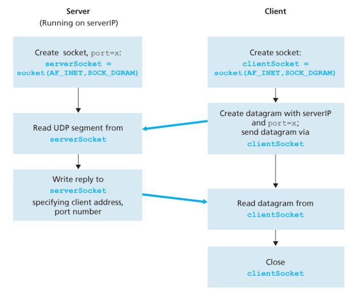
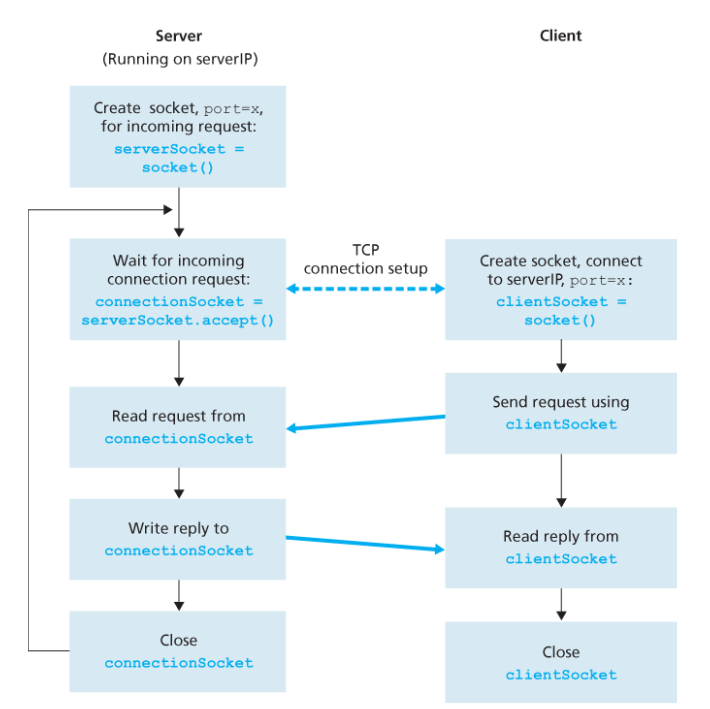

다음과 같은 간단한 클라이언트-서버 애플리케이션을 이용한다.

1. 클라이언트는 키보드로부터 한 줄의 문자를 읽고 그 데이터를 서버로 보낸다.
2. 서버는 그 데이터를 수신하고 문자를 대문자로 변환한다.
3. 서버는 수정된 데이터를 클라이언트에게 보낸다.
4. 클라이언트는 수정된 데이터를 수신하고 그 줄을 화면에 나타낸다.

---

- 위 그림은 UDP 전송 서비스상에서 통신하는 클라이언트, 서버의 주요 소켓 관련 활동을 나타낸다.

---

- 위 그림은 전형적인 클라이언트-서버 TCP 연결 구조이다.

→ Codes/UDP_TCP에 파일들을 첨부하였다.
