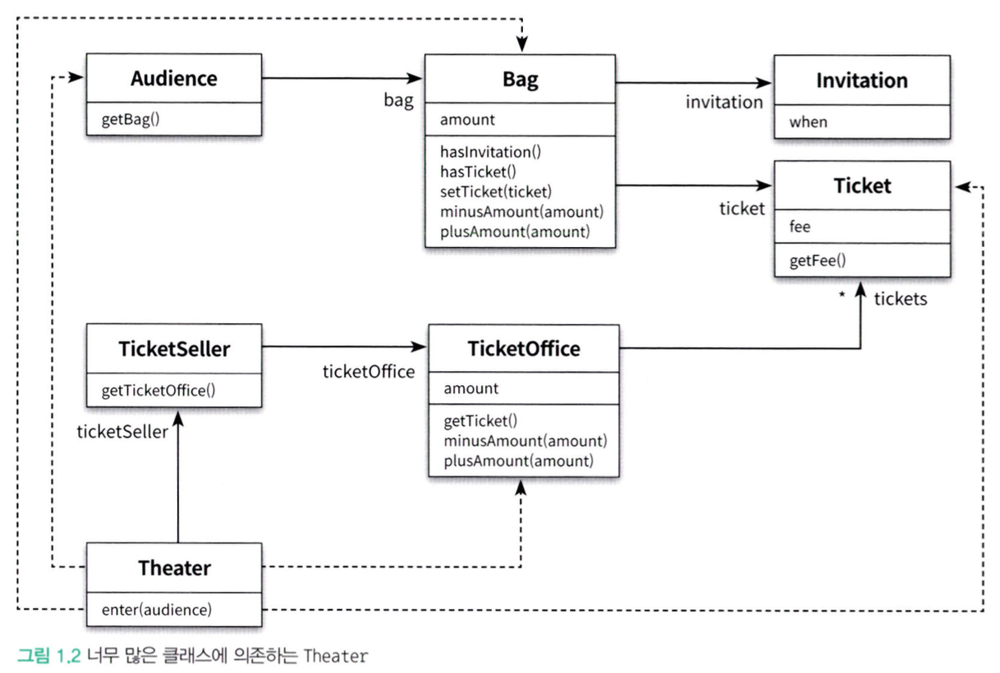
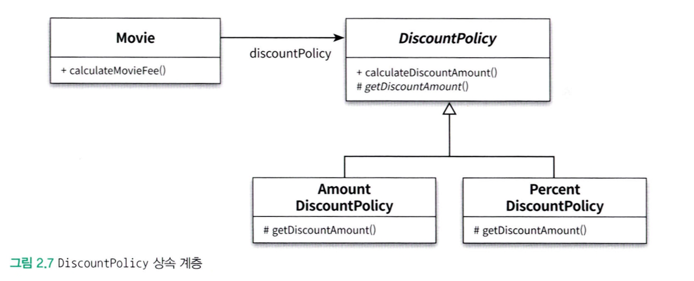

# 03.24 TIL(2)

날짜: 2025년 3월 24일
과목: Object
유형: 개인공부
상태: In progress

## Ch.1 객체, 설계

### 소프트웨어 모듈이 가져야 하는 기능

1. 실행 중에 제대로 동작하는 것
2. 변경을 위해 존재하는 것
3. 코드를 읽는 사람과 의사소통하는 것

**의존성**

- 어떤 객체가 변경될 때 그 객체에게 의존하는 다른 객체도 함께 변경될 수 있다는 사실
  → 객체 사이의 의존성을 와전히 없애는 것이 정답은 아니다.
  `애플리케이션의 기능을 구현하는 데 필요한 최소한의 의존성만 유지하고 불필요한 의존성을 제거`
- 객체 사이의 의존성이 과한 경우를 `결합도(coupling)` 가 높다고 말한다.
  - 결합도는 의존성과 관련돼 있다.
  - 결합도 역시 변경과 관련이 있다.

**캡슐화**

- 개념적이나 물리적으로 객체 내부의 세부적인 사항을 감추는 것
  - 변경하기 쉬운 객체를 만들기 위함

> 객체를 인터페이스와 구현으로 나누고 인터페이스만을 공개하는 것은 객체 사이의 결합도를 낮추고 변경하기 쉬운 코드를 작성하기 위해 따라야 하는 가장 기본적인 설계 원칙

**캡슐화와 응집도**

- 핵심은 객체 내부의 상태를 캡슐화하고 객체 간에 오직 메시지를 통해서만 상호작용하도록 만드는 것
- 밀접하게 연관된 작업만을 수행하고 연관성 없는 작업은 다른 객체에게 위임하는 객체를 가리켜 **응집도(cohesion)가 높다고 말한다.**
  - 자신의 데이터를 스스로 처리하는 자율적인 객체를 만들면 결합도를 낮출 수 있을뿐더러 응집도를 높일 수 있다.
- 객체의 응집도를 높이기 위해서는 객체 스스로 자신의 데이터를 책임져야 한다.
  - 즉, 자신의 데이터를 스스로 처리하는 자율적인 존재여야 한다.

**객체지향 프로그래밍**

- 데이터와 프로세스가 동일한 모듈 내부에 위치하도록 프로그래밍하는 방식
- 훌륭한 객체지향 설계의 핵심은 캡슐화를 이용해 의존성을 적절히 관리함으로써 객체 사이의 결합도를 낮추는 것

### 책임의 이동

- **책임 → `기능`**
- 객체지향 설계에서는 독재자가 존재하지 않고 각 객체에 책임이 적절하게 분배된다.
  - 따라서 각 객체는 **자신을 스스로 책임**진다.
  - 스스로 책임을 수행하는 자율적인 객체들의 공동체를 구성함으로써 완성됨.
- 객체는 다른 객체와의 협력이라는 문맥 안에서 특정한 역할을 수행하는 데 필요한 적절한 책임을 수행해야 한다.
  - 객체가 어떤 데이터를 가지느냐보다는 `객체에 어떤 책임을 할당할 것이냐`에 초점을 맞춰야 한다.
- 불필요한 세부사항을 객체 내부로 캡슐화하는 것은 객체의 `자율성`을 높이고 `응집도` 높은 객체들의 공동체를 창조할 수 있게 한다.

**정리**

- 어떤 기능을 설계하는 방법은 한가지 이상일 수 있다.
- 동일한 기능을 한 가지 이상의 방법으로 설계할 수 있기 때문에 결국 설계는 trade-Off의 산물이다.
  - 어떤 경우에도 모든 사람들을 만족시킬 수 있는 설계를 만들 수 없다.
- 현실에서는 수동적인 존재라고 하더라도 일단 객체지향의 세계에 들어오면 모든 것이 능동적이고 자율적인 존재로 바뀐다.
  → `의인화` : 능동적이고 자율적인 존재로 소프트웨어 객체를 설계하는 원칙

---

## Ch.2 객체지향 프로그래밍

### 협력, 객체, 클래스

- 진정한 객체지향 패러다임의 전환은 클래스가 아닌 `객체에 초점을 맞출 때` 에만 얻을 수 있다.
  - 이를 위해서는 아래의 두 가지에 집중해야 한다.

1. 어떤 클래스가 필요한지를 고민하기 전에 어떤 객체들이 필요한지 고민해라.
   - 클래스는 공통적인 상태와 행동을 공유하는 객체들을 추상화한 것
   - 클래스의 윤곽을 잡기 위해서는 어떤 객체들이 어떤 상태와 행동을 가지는지를 먼저 결정해야
2. 객체를 독립적인 존재가 아니라 기느응ㄹ 구현하기 위해 협력하는 공동체의 일원으로 봐야 한다.
   - 다른 객체에게 도움을 주거나 의존하면서 살아가는 협력적인 존재
   - 객체들의 모양과 윤곽이 잡히면 공통된 특성과 상태를 가진 객체들을 타입으로 분류하고 이 타입을 기반으로 클래스를 구현

**도메인 구조를 따르는 프로그램 구조**

- `도메인`
  - 문제를 해결하기 위해 사용자가 프로그램을 사용하는 분야
  - 클래스의 구조는 도메인의 구조와 유사한 형태를 띠어야 한다.

**클래스 구현**

- private / public을 구분해야 하는 이유?
  - 경계의 명확성이 객체의 자율성을 보장하기 때문

**자율적인 객체**

- 먼저 두 가지 중요한 사실
  1. **객체가 상태(state)와 행동(behavior)을 함께 가지는 복합적인 존재**
  2. **객체가 스스로 행동하는 자율적인 존재라는 것**
- **public interface**
  - 외부에서 접근 가능한 부분
- **implementation**
  - 외부에서는 접근 불가능하고 오직 내부에서만 접근 가능한 부분
- 일반적으로 객체의 상태는 숨기고 행동만 외부에 공개해야 한다.

**협력?**

- 객체의 내부 상태는 외부에서 접근하지 못하도록 감춰야 한다.
  - 대신 외부에 공개하는 public interface를 통해 내부 상태에 접근할 수 있도록 허용
- 객체는 다른 객체의 인터페이스에 공개된 행동을 수행하도록 `요청(request)` 할 수 있다.
- 요청을 받은 객체는 자율적인 방법에 따라 요청을 처리한 후 `응답(response)` 한다.

**객체가 다른 객체와 상호작용할 수 있는 유일한 방법**

- 메시지를 전송(send a message)
  - 다른 객체에게 요청이 도착할 때 해당 객체가 메시지를 수신(receive a message)했다고 이야기한다.
- 메시지를 수신한 객체는 스스로의 결정에 따라 자율적으로 메시지를 처리할 방법을 결정
  - 이처럼 수신된 메시지를 처리하기 위한 자신만의 방법을 `메서드` 라고 부른다.

**TEMPLATE METHOD 패턴**

- 부모 클래스에 기본적인 알고리즘의 흐름을 구현하고 중간에 필요한 처리를 자식 클래스에게 위임하는 디자인 패턴

---

### 상속과 다형성

**컴파일 시간 의존성과 실행 시간 의존성**

- 의존하고 있는 객체의 정확한 타입을 알기 위해서는 의존성을 연결하는 부분을 찾아봐야 한다.

**업캐스팅(upcasting)**

- 자식 클래스가 부모 클래스를 대신하는 것

**다형성**

- 객체지향 프로그램의 컴파일 시간 의존성과 실행 시간 의존성이 다를 수 있다는 사실을 기반으로 한다
- 동일한 메시지를 수신했을 때 객체의 타입에 따라 다르게 응답할 수 있는 능력

**다형성 구현 방법**

- 메시지에 응답하기 위해 실행될 메서드를 컴파일 시점이 아닌 실행 시점에 결정한다는 공통점
- 메시지와 메서드를 실행 시점에 바인딩
  - `지연 바인딩(lazy binding), 동적 바인딩(dynamic binding)`
- 객체지향이 컴파일 시점의 의존성과 실행 시점의 의존성을 분리하고, 하나의 메시지를 선택적으로 서로 다른 메서드를 연결할 수 있는 이유가 바로 지연 바인딩이라는 메커니즘을 사용하기 때문

**구현 상속과 인터페이스 상속**

- 구현 상속 → 서브클래싱(subclassing)
  - 순수하게 코드를 재사용하기 위한 목적으로 상속을 사용하는 것
- 인터페이스 상속 → 서브타이핑(subtyping)
  - 다형적인 협력을 위해 부모 클래스와 자식 클래스가 인터페이스를 공유할 수 있도록 상속을 이용하는 것

> 상속은 구현 상속이 아니라 인터페이스 상속을 위해 사용해야 한다.

**인터페이스와 다형성**

- 구현은 공유할 필요가 없고 순수하게 인터페이스만 공유하고 싶을 때

### 코드 재사용

`합성(composition)`

- 인터페이스에 정의된 메시지를 통해서만 코드를 재사용하는 방법

[💠 상속을 자제하고 합성(Composition)을 이용하자](https://inpa.tistory.com/entry/OOP-%F0%9F%92%A0-%EA%B0%9D%EC%B2%B4-%EC%A7%80%ED%96%A5%EC%9D%98-%EC%83%81%EC%86%8D-%EB%AC%B8%EC%A0%9C%EC%A0%90%EA%B3%BC-%ED%95%A9%EC%84%B1Composition-%EC%9D%B4%ED%95%B4%ED%95%98%EA%B8%B0)

**상속 vs 합성**

| 상속                                                         | 합성                                       |
| ------------------------------------------------------------ | ------------------------------------------ |
| 부모 클래스와 자식 클래스 사이의 의존성은 컴파일 타임에 해결 | 두 객체 사이의 의존성은 런타임에 해결      |
| is-a 관계                                                    | has-a 관계                                 |
| 부모클래스의 구현에 의존 결합도가 높음                       | 구현에 의존하지 않음.                      |
| 내부에 포함되는 객체의 구현이 아닌 인터페이스에 의존         |
| 클래스 사이의 정적인 관계                                    | 객체 사이의 동적인 관계                    |
| 부모 클래스 안에 구현된 코드 자체를 물려 받아 재사용         | 포함되는 객체의 퍼블릭 인터페이스를 재사용 |

그래서 합성이 뭔데?

- 또다른 말로 `조합`
- 기존 클래스를 상속을 통한 확장하는 대신에, 필드로 클래스의 인스턴스를 참조하게 만드는 설계
- 서로 관련없는 이질적인 클래스의 관계에서, 한 클래스가 다른 클래스의 기능을 사용하여 구현해야 한다면 합성의 방식을 사용

**합성을 사용해야 하는 이유**

- 인터페이스에 정의된 메시지를 통해서만 재사용이 가능하기 때문에 구현을 효과적으로 캡슐화할 수 있음.
- 의존하는 인스턴스를 교체하는 것이 비교적 쉽기 때문에 설계를 유연하게 만듦.
- 상속은 클래스를 통해 강하게 결합되는 데 비해 합성은 메시지를 통해 느슨하게 결합
  - 코드 재사용을 위해서는 상속보다는 합성을 선호하는 것이 더 좋은 방법
  - 대표적인 사례가 디자인 패턴 중에 `전략 패턴` 이 될 수 있다.

이처럼 합성은 내부에 포함되는 객체의 구현이 아닌 public interface 통신에 의존한다.

→ 그렇다고 해서 상속을 절대 사용하지 말라는 것은 아니다.
