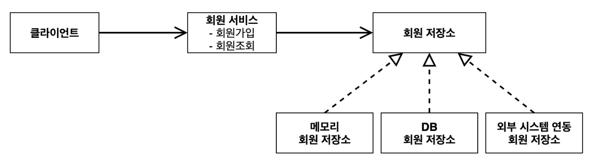
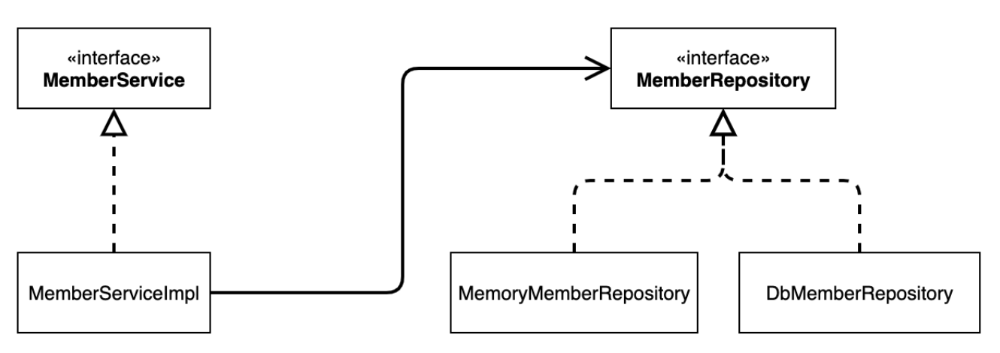
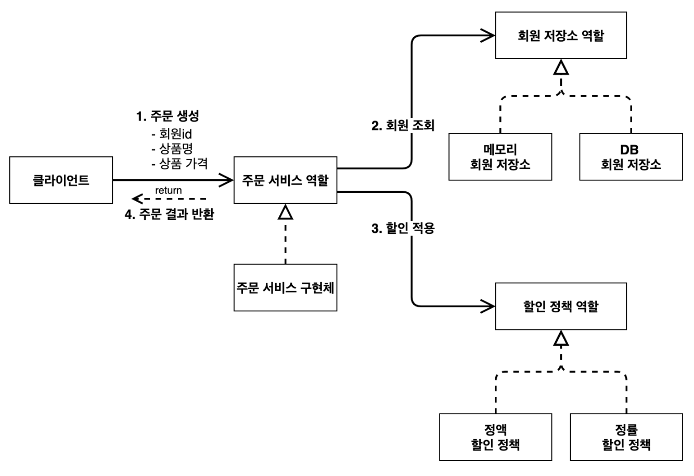
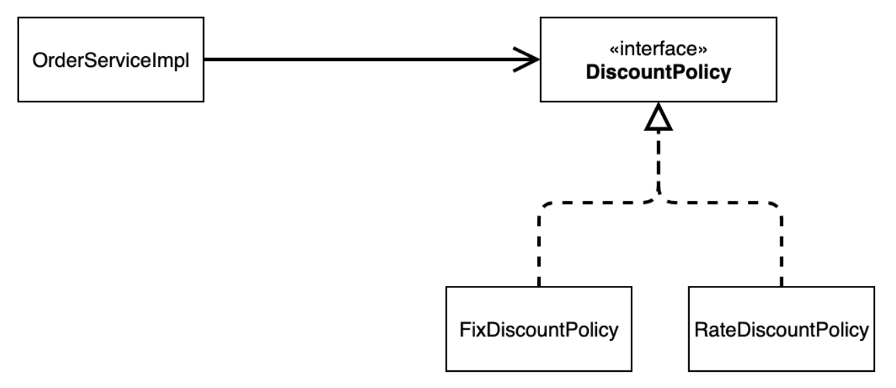
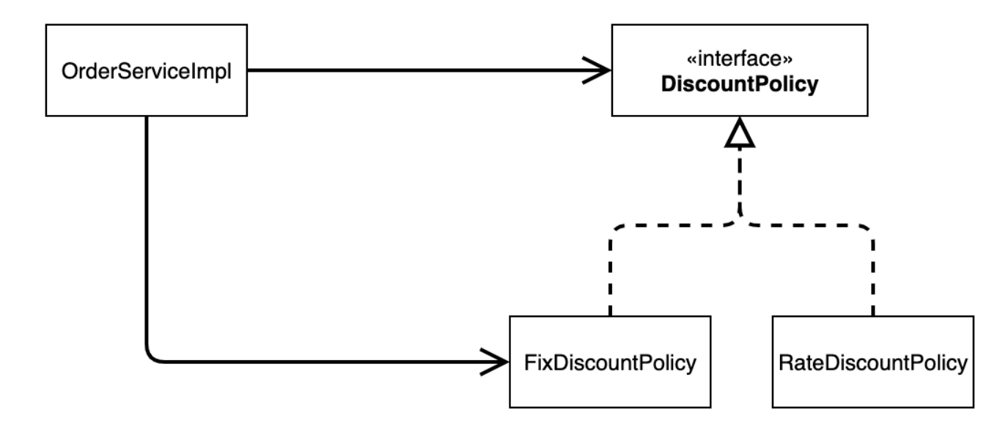
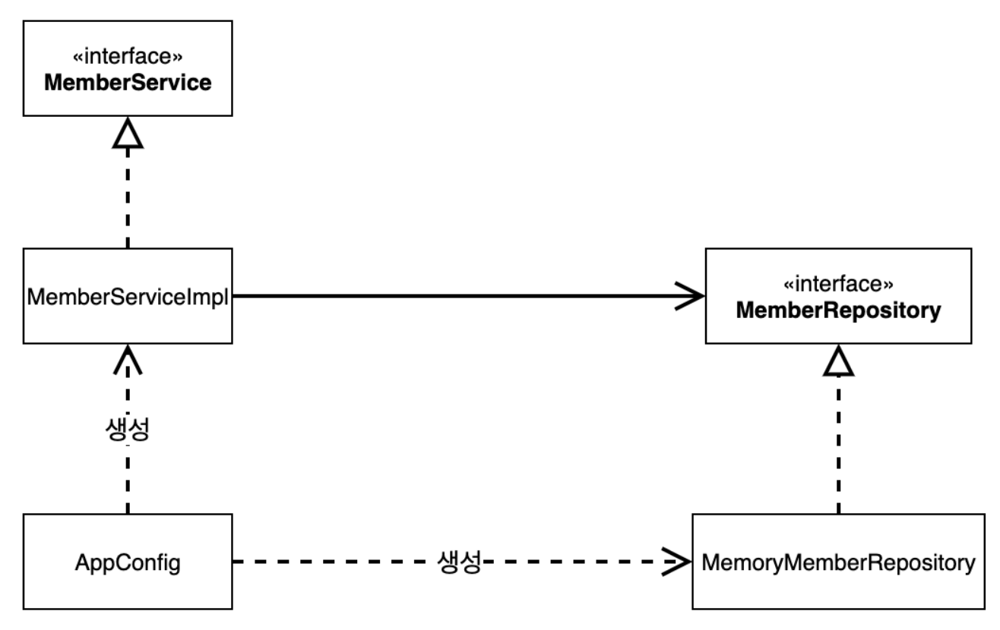
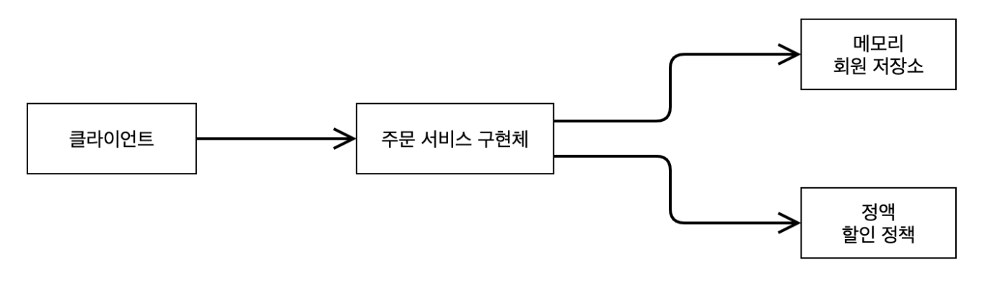

# 03.25 TIL(1)

날짜: 2025년 3월 25일
과목: Spring
유형: 인강
상태: In progress

### 비즈니스 요구사항과 설계

> 기획자가 어느 날 나에게 찾아와서 이러한 요구사항을 말한다고 생각하자.

- 회원
  - 회원을 가입, 조회할 수 있다.
  - 일반 / VIP 두 가지 등급이 있다.
  - 회원 데이터는 자체 DB 또는, 외부 시스템과 연동할 수 있다. (미확정)
- 주문, 할인 정책
  - 회원은 상품을 주문할 수 있다.
  - 회원 등급에 따라 할인 정책을 적용할 수 있다.
  - 할인 정책은 모든 VIP는 1000원을 할인해주는 고정 금액 할인을 적용한다. (나중에 변경 될 수 있다.)
  - 할인 정책은 변경 가능성이 높음. 회사의 기본 할인 정책을 아직 정하지 못했고, 오픈 직전까지 미룬다.
    - 최악의 경우 할인을 적용하지 않을 수도 있음. (미확정)

<br>

> 인터페이스를 만들고 구현체를 언제든지 갈아끼울 수 있도록 설계하면 된다.

- 참고
  - 프로젝트 환경설정을 편리하게 하려고 스프링 부트를 사용한 것이다. 지금은 스프링 없는 순수한 자바로 개발을 진행한다는 점을 꼭 기억하자! 스프링 관련은 한참 뒤에 등장한다.

<br>

---

### 회원 도메인 설계

- 회원 도메인 요구사항
  - 회원을 가입하고 조회할 수 잇다.
  - 회원은 일반, VIP 두 가지 등급이 있다.
  - 회원 데이터는 자체 DB를 구축할 수 있고, 외부 시스템과 연동할 수 있다.

<br>

**회원 도메인 협력 관계**

- 기획자들도 볼 수 있는 그림



<br>

**회원 클래스 다이어그램**

- 실제 서버를 실행하지 않고 클래스들로만 볼 수 있는 그림
- 정적인 그림



<br>

**회원 객체 다이어그램**

- 객체간의 참조가 어떻게 되는지를 나타낸 다이어그램
- 동적인 그림


<br>

### 회원 도메인 설계의 문제점

- 이 코드의 설계상 문제점은?
  - MemberServiceImple의 구현체에 직접 의존
    ```java
    private final MemberRepository memberRepository = new MemoryMemberRepository();
    ```
    - 구현체에 직접 의존
    - 객체지향 설계 원칙에 위배됨.
- 다른 저장소로 변경할 때 OCP 원칙을 잘 준수하는가?
  - 현재 코드는 다른 저장소로 변경하려면 `MemberServiceImple` 코드를 직접 수정해야 함.
    ```java
    private final MemberRepository memberRepository = new DBMemberRepository();
    ```
- DIP를 잘 지키고 있을까?
  - 고수준 모듈이 저수준 모듈에 의존하면 안 되고, 둘 다 추상화에 의존해야 한다는 원칙
  - 현재 `MemberServiceImple` 이 `MemoryMemberRepository` 에 직접 의존함.
    - 이는 DIP 위반
- **의존관계가 인터페이스 뿐만 아니라 구현까지 모두 의존하는 문제점이 있음.**
  → 주문까지 만들고나서 문제점과 해결 방안을 설명

<br>

---

### 주문과 할인 도메인 설계

- 주문과 할인 정책
  - 회원은 상품을 주문할 수 있다.
  - 회원 등급에 따라 할인 정책을 적용할 수 있다.
  - 할인 정책은 모든 VIP는 1000원을 할인해주는 고정 금액 할인을 적용한다. (나중에 변경가능)

<br>

**주문 도메인 협력, 역할, 책임**


1. **주문** **생성**: 클라이언트는 주문 서비스에 주문 생성을 요청한다.

2. **회원** **조회**: 할인을 위해서는 회원 등급이 필요하다. 그래서 주문 서비스는 회원 저장소에서 회원을 조회한다.

3. **할인** **적용**: 주문 서비스는 회원 등급에 따른 할인 여부를 할인 정책에 위임한다.

4. **주문** **결과** **반환**: 주문 서비스는 할인 결과를 포함한 주문 결과를 반환한다.

<br>

**주문 도메인 전체**



- `역할과 구현을 분리` 해서 자유롭게 구현 객체를 조립할 수 있게 설계
  - 덕분에 회원 저장소는 물론이고, 할인 정책도 유연하게 변경할 수 있다.

<br>

**주문 도메인 클래스 다이어그램**


<br>

**정말 우리가 짠 코드가 요구사항 변화에 잘 대응할 수 있는가?**

<br>

---

### 새로운 할인 정책 개발

- **새로운 할인 정책을 확장해보자.**

이번에는 주문한 금액의 %를 할인해주는 새로운 정률 할인 정책을 추가하자.

**RateDiscountPolicy 추가**



### 새로운 할인 정책 적용과 문제점

```java
public class OrderServiceImple implements OrderService {

    private final MemberRepository memberRepository = new MemoryMemberRepository();
//    private final DiscountPolicy discountPolicy = new FixDiscountPolicy();
    private final DiscountPolicy discountPolicy = new RateDiscountPolicy();

    @Override
    public Order createOrder(Long memberId, String itemName, int itemPrice) {
        Member member = memberRepository.findById(memberId);
        int discountPrice = discountPolicy.discount(member, itemPrice);

        return new Order(memberId, itemName, itemPrice, discountPrice);
    }
}

```

**문제점**

- 역할, 구현을 분리했나 → O
- 다형성 활용, 인터페이스와 구현 객체를 분리했나 → O
- OCP, DIP 같은 객체지향 설계 원칙을 충실히 준수했나? → X
  - 그렇게 보이지만 사실은 아니다.
  - DIP
    - 클래스 의존관계를 분석해보면, 추상(인터페이스) 뿐만 아니라 구체(구현) 클래스에도 의존
    - 추상(인터페이스) 의존: `DiscountPolicy`
    - 구체(구현) 클래스: `FixDiscountPolicy`, `RateDiscountPolicy`
  - OCP
    - 지금 코드는 기능을 확장해서 변경하면, 클라이언트 코드에 영향을 준다 → 따라서 OCP 위반

<br>

**실제 의존관계**



**인터페이스만 의존하도록 코드 변경**

```java
public class OrderServiceImple implements OrderService {
		private DiscountPolicy discountPolicy;
}
```

<br>

- **그런데** **구현체가** **없는데** **어떻게** **코드를** **실행할** **수** **있을까**?

<br>

**해결방안**

- 누군가가 클라이언트인 `OrderServiceImpl`에 `DiscountPolicy`의 구현 객체를 대신 생성하고 주입해줘야 한다.

<br>

---

### 관심사의 분리

- 애플리케이션의 전체 동작 방식을 구성(config)하기 위해, 구현 객체를 생성하고, 연결하는 책임을 가지는 별도의 설정 클래스를 만들어보자.

**AppConfig의 탄생**



- 객체의 생성과 연결은 AppConfig가 담당한다.
- DIP 완성 → MemberServiceImpl은 MemberRepository인 추상에만 의존하면 된다.
- 관심사의 분리 → 객체를 생성하고 연결하는 역할, 실행하는 역할이 명확히 분리됨.

<br>

**AppConfig의 등장으로 애플리케이션이 크게 사용 영역과, 객체를 생성하고 구성(Configuration)하는 영역으로 분리되었다.**

<br>

---

### 좋은 객체 지향 설계의 5가지 원칙의 적용

1. SRP → 단일 책임 원칙

   > 한 클래스는 하나의 책임만 가져야 함.

   - 클라이언트 객체는 직접 구현 객체를 생성하고, 연결하고, 실행하는 다양한 책임을 가지고 있음
   - SRP 단일 책임 원칙을 따르면서 관심사를 분리함
   - 구현 객체를 생성하고 연결하는 책임은 AppConfig가 담당
   - 클라이언트 객체는 실행하는 책임만 담당

1. DIP 의존관계 역전 원칙

   > 프로그래머는 “추상화에 의존해야지, 구체화에 의존하면 안된다.” 의존성 주입은 이 원칙을 따르는 방법 중 하나

   - 새로운 할인 정책을 개발하고, 적용하려고 하니 클라이언트 코드도 함께 변경해야 했다. 왜냐하면 기존 클라이언트 코드(`OrderServiceImpl` )는 DIP를 지키며 `DiscountPolicy` 추상화 인터페이스에 의존하는 것 같았지만, `FixDiscountPolicy` 구체화 구현 클래스에도 함께 의존했다.
   - 클라이언트 코드가 `DiscountPolicy` 추상화 인터페이스에만 의존하도록 코드를 변경했다.
   - 하지만 클라이언트 코드는 인터페이스만으로는 아무것도 실행할 수 없다.
   - AppConfig가 `FixDiscountPolicy` 객체 인스턴스를 클라이언트 코드 대신 생성해서 클라이언트 코드에 의존관계를 주입했다. 이렇게해서 DIP 원칙을 따르면서 문제도 해결했다.

1. OCP

   > 소프트웨어 요소는 확장에는 열려 있으나 변경에는 닫혀 있어야 한다.

   - 다형성 사용하고 클라이언트가 DIP를 지킴
   - 애플리케이션을 사용 영역과 구성 영역으로 나눔
   - AppConfig가 의존관계를 `FixDiscountPolicy`로 변경해서 클라이언트 코드 `RateDiscountPolicy` 에 주입하므로 클라이언트 코드는 변경하지 않아도 됨
   - **소프트웨어** **요소를** **새롭게** **확장해도** **사용** **영역의** **변경은** **닫혀** **있다**!

---

### IoC, DI, Container

**제어의 역전 IoC(Inversion of Control)**

- 기존 프로그램은 클라이언트 구현 객체가 스스로 필요한 서버 구현 객체를 생성, 연결, 실행했다.
  - 구현 객체가 프로그램의 제어 흐름을 스스로 조종했다.
  - 개발자 입장에서는 매우 자연스러움… (기존의 나)
- 반면에 `AppConfig`가 등장한 이후에 구현 객체는 자신의 로직을 실행하는 역할만 담당
  - 프로그램의 제어 흐름은 이제 `AppConfig`가 가져감.
  - 예로, `OrderServiceImpl`은 필요한 인터페이스들을 호출하지만 어떤 구현 객체들이 실행될지 모름
- 프로그램에 대한 제어 흐름에 대한 권한은 모두 `AppConfig`가 가지고 있음.
  - 심지어 `OrderServiceImpl`도 `AppConfig`가 생성
  - 그리고 `AppConfig`는 `OrderServiceImpl`이 아닌 `OrderService` 인터페이스의 다른 구현 객체를 생성하고 실행할 수도 있음.
  - 그런 사실도 모른체 `OrderServiceImpl`은 묵묵히 자신의 로직을 실행할 뿐
- 이렇듯 프로그램의 제어 흐름을 직접 제어하는 것이 아니라 외부에서 관리하는 것을 제어의 역전(IoC)이라고 함

<br>

**프레임워크 vs 라이브러리**

- 프레임워크가 내가 작성한 코드를 제어하고, 대신 실행하면 그것은 프레임워크가 맞다.
- 반면에 내가 작성한 코드가 직접 제어의 흐름을 담당한다면 그것은 프레임워크가 아니라 라이브러리.

<br>

**프레임워크**는 **그 틀안에 제어 흐름에 대한 주도성이 내포**되어 있고, **라이브러리**는 **사용자가 전적으로 제어 흐름에 대한 주도성**을 가진다.

<br>

**프레임워크는 전체 어플리케이션의 구조를 정의하여 일정한 개발 패턴을 따르게끔 한다.**

- 앞서 말한 제어 흐름을 가지고 있다는 것과 거의 유사한 의미

<br>

**라이브러리는 특정 기능만을 제공할 뿐 어플리케이션의 전체 구조에는 관여하지 않음.**

- 사용하는 개발자 스스로 원하는 방식으로 구조를 설계할 수 있다.

<br>

**의존관계 주입 DI (Dependency Injection)**

- 의존관계는 정적인 클래스 의존 관계, 실행 시점에 결정되는 동적인 객체(인스턴스) 의존 관계 둘을 분리해서 생각해야 함.

  1. 정적인 클래스 의존관계
     - 애플리케이션을 실행하지 않아도 분석할 수 있다.
     - `OrderServiceImpl`은 `MemberRepository`, `DiscountPolicy`에 의존한다는 것을 알 수 있다.
     - 그런데 클래스 의존관계 만으로는 실제 어떤 객체가 `OrderServiceImpl`에 주입 될지 알 수 없다.
       
  1. 동적인 객체 인스턴스 의존 관계

     - 애플리케이션 실행 시점에 실제 생성된 객체 인스턴스의 참조가 연결된 의존 관계다.

     

     - 애플리케이션 **실행 시점(런타임)**에 외부에서 실제 구현 객체를 생성하고 클라이언트에 전달해서 클라이언트와 서버의 실제 의존관계가 연결 되는 것을 **의존관계 주입**이라 한다.
     - 객체 인스턴스를 생성하고, 그 참조값을 전달해서 연결된다.
     - 의존관계 주입을 사용하면 클라이언트 코드를 변경하지 않고, 클라이언트가 호출하는 대상의 타입 인스턴스를 변경할 수 있다.
     - 의존관계 주입을 사용하면 정적인 클래스 의존관계를 변경하지 않고, 동적인 객체 인스턴스 의존관계를 쉽게 변경할 수 있다.

<br>

**정리**

- AppConfig 처럼 객체를 생성하고 관리하면서 의존관계를 연결해 주는 것을 `IoC Container` 또는 `DI Container`라고 한다.

<br>

---

### Spring Container

- `ApplicationContext` 를 스프링 컨테이너라 한다.
- 기존에는 개발자가 `AppConfig` 를 사용해서 직접 객체를 생성하고 DI를 했지만, 이제부터는 스프링 컨테이너를 통해서 사용한다.
- 스프링 컨테이너는 `@Configuration` 이 붙은 `AppConfig` 를 설정(구성) 정보로 사용한다. 여기서 `@Bean` 이라 적힌 메서드를 모두 호출해서 반환된 객체를 스프링 컨테이너에 등록한다. 이렇게 스프링 컨테이너에 등록된 객체를 스프링 빈이라 한다.
- 이전에는 개발자가 필요한 객체를 `AppConfig` 를 사용해서 직접 조회했지만, 이제부터는 스프링 컨테이너를 통해서 필요한 스프링 빈(객체)를 찾아야 한다. 스프링 빈은 `applicationContext.getBean()` 메서드를 사용해서 찾을 수 있다.
- 기존에는 개발자가 직접 자바코드로 모든 것을 했다면 이제부터는 스프링 컨테이너에 객체를 스프링 빈으로 등록 하고, 스프링 컨테이너에서 스프링 빈을 찾아서 사용하도록 변경되었다.
