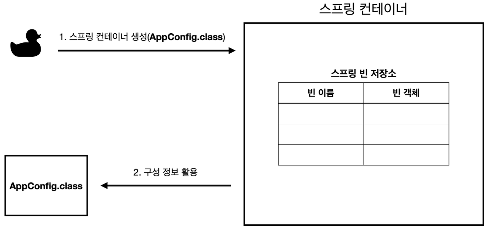
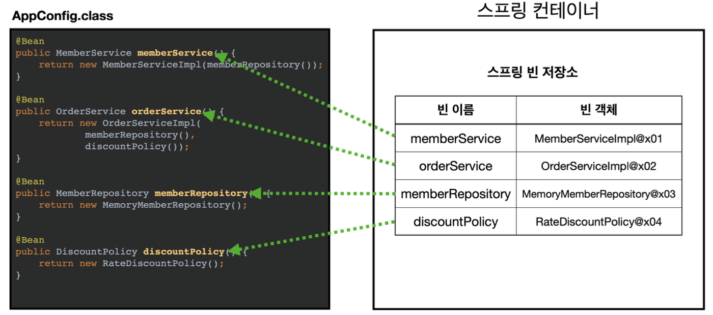
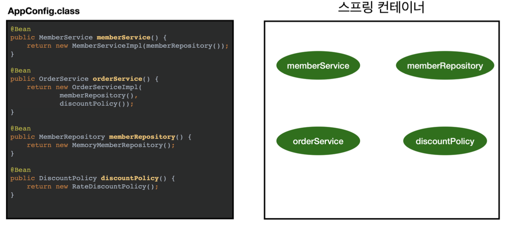
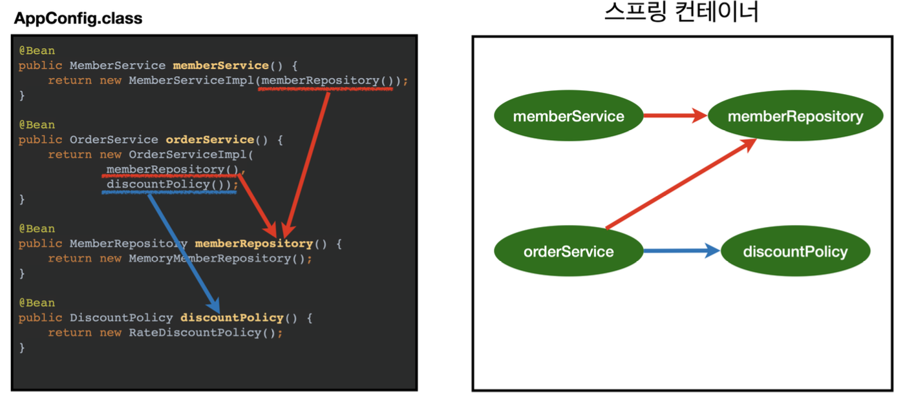
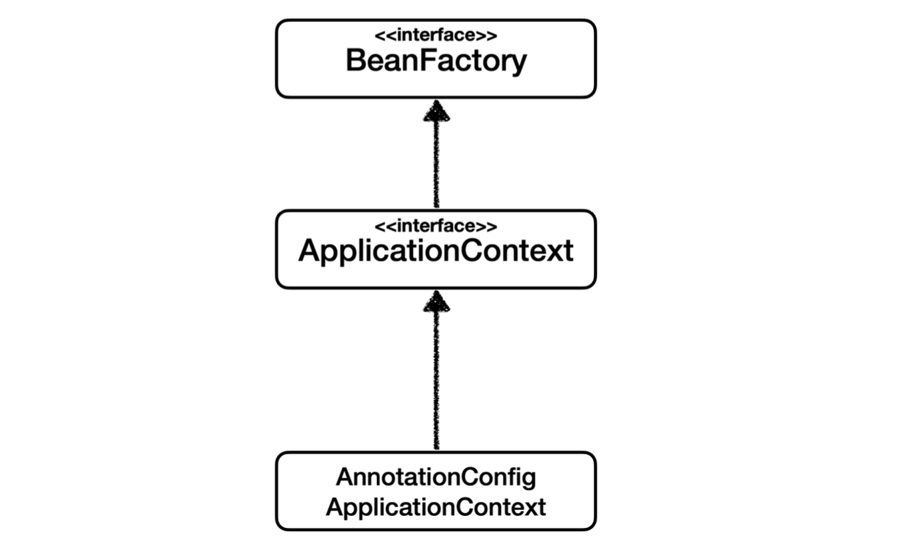
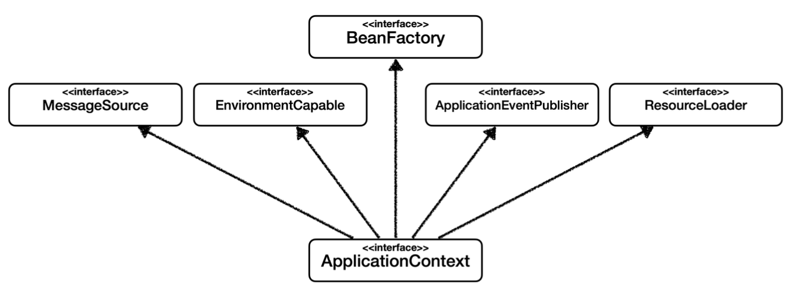
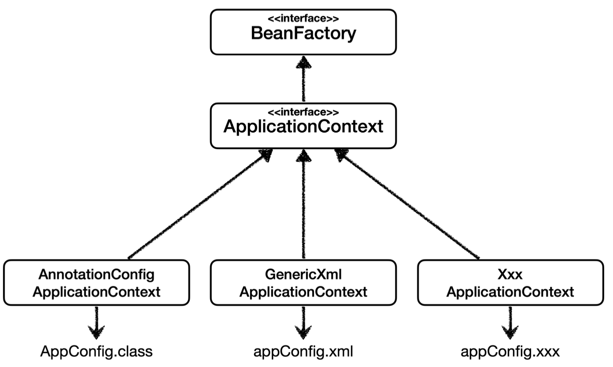
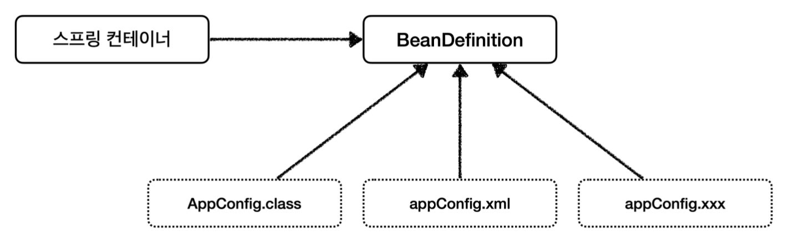
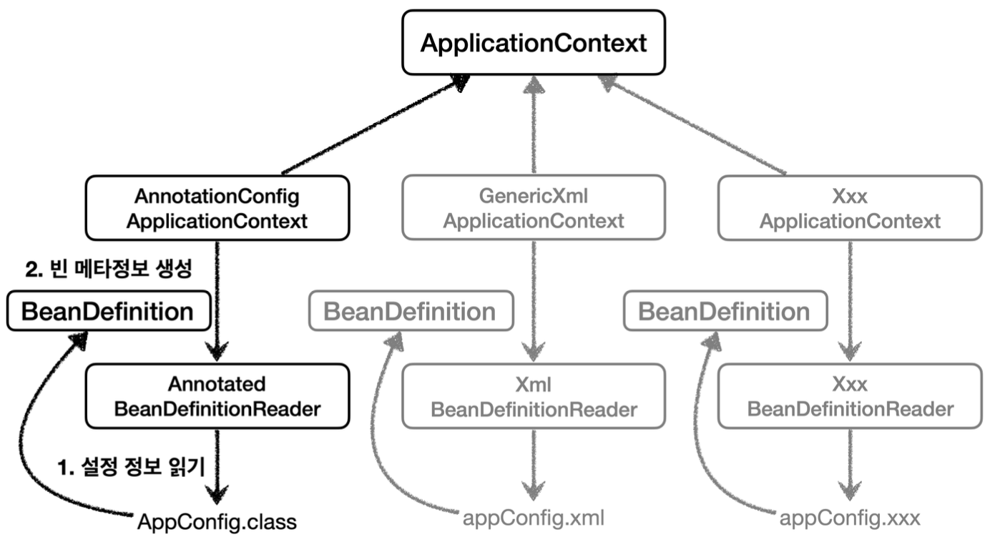

# 03.26 TIL(1)

> DIContainer를 iOS 앱을 개발할 때 사용했을 때는 오버엔지니어링이다... 라는 이야기를 많이 들었는데, Spring은 Spring Container를 통해 Bean을 등록하는 게 되게 당연하듯이 이야기를 하네?

**1. Spring과 iOS의 환경 차이**

- **Spring(Java/Kotlin) → 대규모 시스템을 고려한 설계**
  - Java 기반의 애플리케이션은 **대규모 엔터프라이즈 시스템**에서 동작하는 경우가 많음
  - 복잡한 객체 간의 의존성을 관리해야 하고, 이를 효율적으로 다루기 위해 DI(Dependency Injection)가 필수적으로 사용됨.
  - Spring에서는 ApplicationContext가 **객체를 생성하고 관리**하는 역할을 함.
- **iOS(Swift) → 앱 규모가 상대적으로 작음**
  - 일반적인 iOS 앱은 **클라이언트 사이드 애플리케이션**이기 때문에, **객체 그래프가 단순**한 경우가 많음.
  - 굳이 DIContainer를 두지 않고도, 생성자 주입(Constructor Injection)이나 **싱글톤 패턴**만으로도 충분히 의존성을 관리할 수 있음.
  - 따라서 **DIContainer를 추가하면 코드가 복잡해지고, 불필요한 추상화가 발생**할 수 있다.

<br>

**2. 그렇다면, iOS에서는 언제 DIContainer를 사용해야 할까?**

- **사용하면 좋은 경우**
  - **앱의 규모가 크고, 객체 간의 의존성이 복잡**한 경우
  - 네트워크, 데이터베이스, 로깅 등 다양한 **서비스를 주입하고, 환경에 따라 변경이 필요한 경우**
  - **Clean Architecture**와 같이 **의존성 역전 원칙(DIP)을 철저하게 준수하고 싶을 때**
- **사용하지 않아도 되는 경우**
  - 앱이 단순하고, **의존성이 명확하게 관리되는 경우**
  - Swift의 기본 DI 방식(생성자 주입, 프로토콜, 싱글톤)으로 충분한 경우
  - **추상화가 너무 많아져서 유지보수가 어려워지는 경우**

<br>

---

### Spring Container

- 스프링 컨테이너가 생성되는 과정을 알아보za.
  ```java
  // 스프링 컨테이너 생성
  ApplicationContext ac = new AnnotationConfigApplicationContext(AppConfig.class);
  ```
  - `ApplicationContext`를 스프링 컨테이너라고 한다.
  - `ApplicationContext`는 인터페이스.
  - 스프링 컨테이너는 `XML` 또는 `annotation` 기반의 자바 설정 클래스로 만들 수도 있다.
  - 이전 `AppConfig`를 사용했던 방식이 `annotation` 기반의 자바 설정 클래스로 스프링 컨테이너를 만든 것.
  - 자바 설정 클래스를 기반으로 `ApplicationContext`를 만들어보자.
    - `new AnnotationConfigApplicationContext(AppConfig.class);`
    - 이 클래스는 ApplicationContext 인터페이스의 구현체이다.

### 스프링 컨테이너의 생성 과정

1. **스프링 컨테이너 생성**

   

   - new AnnotationConfigApplicationContext(AppConfig.class)
   - 스프링 컨테이너를 생성할 때는 구성 정보를 지정해줘야 함.
   - 여기서는 AppConfig.class를 구성 정보로 지정

1. **스프링 빈 등록**

   

   - 스프링 컨테이너는 파라미터로 넘어온 설정 클래스 정보를 사용해서 스프링 빈을 등록

   **빈 이름**

   - Bean 이름은 메서드 이름을 사용
   - 직접 부여할 수도 있음
     - @Bean(name=”memberService2”)

   **주의**

   - Bean 이름은 항상 다른 이름을 부여
   - 같은 이름 부여시, 다른 빈이 무시되거나, 기존 빈을 덮어버리거나 설정에 따라 오류가 발생

1. **스프링 빈 의존관계 설정 - 준비**

   

1. **스프링 빈 의존관계 설정 - 완료**

   

   - 스프링 컨테이너는 설정 정보를 참고해서 의존관계를 주입(DI)한다.
   - 단순히 자바 코드를 호출하는 것 같지만, 차이가 있음.
     - 이 차이는 뒤에 싱글톤 컨테이너에서 설명

**참고**

- 스프링은 빈을 생성하고, 의존관계를 주입하는 단계가 나눠져 있음.
- 하지만 자바 코드로 스프링 빈을 등록하면 생성자를 호출하면서 의존관계도 한번에 처리됨.
- 자세한 내용은 의존관계 자동 주입에서 다룬다.

**정리**

- 스프링 컨테이너를 생성하고, 설정(구성) 정보를 참고해서 스프링 빈도 등록하고, 의존관계도 설정했다.
- 그렇다면 컨테이너 내부에서 데이터를 조회하는 방법은?

---

### 컨테이너에 등록된 빈 조회

- 모든 빈 출력하기
  - 실행하면 스프링에 등록된 모든 빈 정보를 출력할 수 있다.
  - `ac.getBeanDefinitionNames()` : 스프링에 등록된 모든 빈 이름을 조회한다.
  - `ac.getBean()` : 빈 이름으로 빈 객체(인스턴스)를 조회한다.
- 애플리케이션 빈 출력하기
  - 스프링이 내부에서 사용하는 빈은 제외하고, 내가 등록한 빈만 출력해보자.
  - 스프링이 내부에서 사용하는 빈은 `getRole()`로 구분할 수 있다.
    - `ROLE_APPLICATION` : 일반적으로 사용자가 정의한 빈
    - `ROLE_INFRASTRUCTURE` : 스프링이 내부에서 사용하는 빈
- `ac.getBeansOfType()` 을 사용하면 해당 타입의 모든 빈을 조회할 수 있다.

<br>

**상속 관계**

- 부모 타입으로 조히하면, 자식 타입도 함께 조회한다.
- 그래서 모든 자바 객체의 최고 부모인 `Object` 타입으로 조회하면, 모든 스프링 빈을 조회한다.

<br>

---

### BeanFactory, ApplicationContext



**BeanFactory**

- 스프링 컨테이너의 최상위 인터페이스
- 스프링 빈을 관리하고 조회하는 역할
- `getBean(`) 메서드를 제공

<br>

**ApplicationContext**

- BeanFactory 기능을 모두 상속받아서 제공
- 빈을 관리하고 검색하는 기능을 BeanFactory가 주는데 굳이..?
  - 애플리케이션을 개발할 때는 빈을 관리하고 조회하는 기능은 물론이고, 수 많은 부가기능이 필요하기 때문!

<br>

**ApplicationContext가 제공하는 부가기능**



- **메시지소스를 활용한 국제화 기능**
  - 예를 들어 한국에서 들어오면 한글, 영어권에서 들어오면 영어로 출력
- **환경변수**
  - 로컬, 개발, 운영등을 구분해서 처리
- **애플리케이션 이벤트**
  - 이벤트를 발행하고 구독하는 모델을 편리하게 지원
- **편리한 리소스 조회**
  - 파일, 클래스패스, 외부 등에서 리소스를 편리하게 조회

<br>

**정리**

- ApplicationContext는 BeanFactory의 기능을 상속받는다.
- ApplicationContext는 빈 관리기능 + 편리한 부가 기능을 제공
- BeanFactory를 직접 사용할 일은 거의 없다. 부가기능이 포함된 ApplicationContext를 사용한다.
- BeanFactory나 ApplicationContext를 스프링 컨테이너라 한다.

<br>

---

### 다양한 설정 형식 지원

- 스프링 컨테이너는 다양한 형식의 설정 정보를 받아들일 수 있게 설계됨
  - java, XML, Groovy 등



1. annotation 기반 자바 코드 설정 사용

   ```java
   new AnnotationConfigApplicationContext(AppConfig.class)
   ```

- `AnnotationConfigApplicationContext` 클래스를 사용하면서 자바 코드로된 설정 정보를 넘기면 된다.

<br>

2. XML 설정 사용

   - 레거시에 많음
   - 컴파일 없이 빈 설정 정보를 변경할 수 있는 장점도..!
   - `GenericXmlApplicationContext` 를 사용하면서 `xml` 설정 파일을 넘기면 된다.

   ```java
   @Test
   void xmlAppContext() {
   		ApplicationContext ac = new GenericXmlApplicationContext("appConfig.xml");

   		MemberService memberService = ac.getBean("memberService", MemberService.class);
   		assertThat(memberService).isInstanceOf(MemberService.class);
   }
   ```

   - 필요하면 스프링 공식 레퍼런스 문서 확인
     - [Spring Framework](https://spring.io/projects/spring-framework)

<br>

---

### BeanDefinition

- 어떻게 이런 다양한 설정 형식을 지원하는 거지?
  - `BeanDefinition`이라는 추상화가 있기 때문
- 역할과 구현을 개념적으로 나눈것
  - XML을 읽어서 `BeanDefinition`을 만든다.
  - 자바 코드를 읽어서 `BeanDefinition`을 만든다.
    → 스프링 컨테이너는 자바 코드인지, XML 인지 몰라도 된다. 오직 `BeanDefinition`만 알면 됨.
- `BeanDefinition`을 빈 설정 메타정보라 한다.
  - `@Bean`, `<bean>` 당 각각 하나씩 메타 정보가 생성
- 스프링 컨테이너는 이 메타정보를 기반으로 스프링 빈을 생성
  

<br>

**코드 수준**



- `AnnotationConfigApplicationContext` 는 `AnnotatedBeanDefinitionReader` 를 사용해서 `AppConfig.class` 를 읽고 `BeanDefinition` 을 생성한다.
- `GenericXmlApplicationContext` 는 `XmlBeanDefinitionReader` 를 사용해서`appConfig.xml`설정 정보를 읽고 `BeanDefinition` 을 생성한다.
- 새로운 형식의 설정 정보가 추가되면, XxxBeanDefinitionReader를 만들어 `BeanDefinition` 을 생성하면 된다.

<br>

**그래서 BeanDefinition엔 뭐가 있는데?**

- `BeanClassName`: 생성할 빈의 클래스 명(자바 설정 처럼 팩토리 역할의 빈을 사용하면 없음)
- `factoryBeanName`: 팩토리 역할의 빈을 사용할 경우 이름, 예) appConfig
- `factoryMethodName`: 빈을 생성할 팩토리 메서드 지정, 예) memberService
- `Scope`: 싱글톤(기본값)
- `lazyInit`: 스프링 컨테이너를 생성할 때 빈을 생성하는 것이 아니라, 실제 빈을 사용할 때 까지 최대한 생성을 지연 처리 하는지 여부
- `InitMethodName`: 빈을 생성하고, 의존관계를 적용한 뒤에 호출되는 초기화 메서드 명
- `DestroyMethodName`: 빈의 생명주기가 끝나서 제거하기 직전에 호출되는 메서드 명
- `Constructor arguments, Propertie`s: 의존관계 주입에서 사용한다. (자바 설정 처럼 팩토리 역할의 빈을 사용하면 없음)

<br>

**정리**

- `BeanDefinition`을 직접 생성해서 스프링 컨테이너에 등록할 수 도 있다. 하지만 실무에서`BeanDefinition`을 직접 정의하거나 사용할 일은 거의 없다.
- 스프링이 다양한 형태의 설정 정보를 `BeanDefinition`으로 추상화해서 사용하는 것 정도만 이해

<br>

---

### DIContainer, SOLID

- **SRP (단일 책임 원칙)**
  - 객체 생성 책임을 DIContainer가 맡아, 클래스는 비즈니스 로직에만 집중할 수 있다.
- **OCP (개방-폐쇄 원칙)**
  - 객체의 구현을 변경할 때, 기존 코드를 수정하지 않고 DI 설정만 변경하면 된다.
- **LSP (리스코프 치환 원칙)**
  - 인터페이스 기반으로 객체를 주입하므로, 하위 클래스가 상위 클래스를 무리 없이 대체할 수 있다.
- **ISP (인터페이스 분리 원칙)**
  - 필요한 인터페이스만 의존하도록 주입받아, 불필요한 의존성을 줄일 수 있다.
- **DIP (의존성 역전 원칙)**
  - 구체 클래스가 아닌 추상화(인터페이스)에 의존하게 만들어, 유연한 설계를 가능하게 한다.
