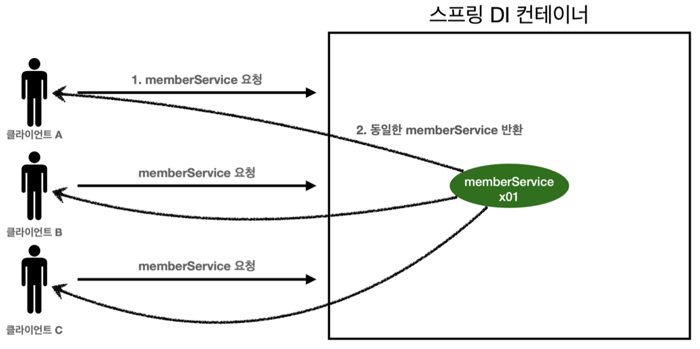
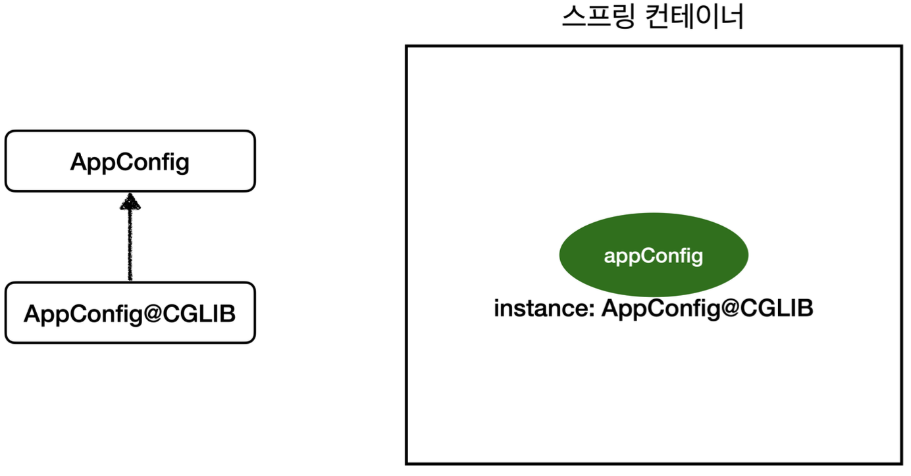

# 03.26 TIL(2)

날짜: 2025년 3월 26일
과목: Spring
유형: 인강
상태: In progress

### 웹 애플리케이션과 싱글톤

> 이름부터 거부감이 드는 싱글톤… 너가 스프링에서는 어떻게 쓰이길래?

- 스프링은 태생이 기업용 온라인 서비스 기술을 지원하기 위해 탄생
  - 웹 애플리케이션이 대부분이지만, App 개발도 얼마든지 할 수 있음
- 대부분의 서비스에서 보통 여러 고객이 동시에 동일한 요청을 한다.


**위 그림의 문제점은 무엇일까?**

- AppConfig가 다음과 같은 형태라면 사용자가 요청을 할 때마다 객체를 새로 생성한다.
- 만약 고객 트래픽이 초당 100이 나오면 초당 100개의 객체가 생성되고 소멸되는 것.
  - 이는 심한 메모리 낭비를 유발한다.
- 그렇다면 해당 객체는 1개만 생성되고, 동일한 객체를 요구하는 사용자들에게 동일한 녀석을 공유하도록 설계할 수 있다면?

> 위의 고민에서 나온 것이 싱글톤 패턴이다.

---

### 싱글톤 패턴

- 클래스의 인스턴스가 딱 1개만 생성되는 것을 보장하는 디자인 패턴
  - 위의 목적을 달성하기 위해선 객체 인스턴스를 2개 이상 생성하지 못하도록 막아야 한다.
  - 그래서 private 생성자를 통해 외부에서 임의로 new 키워드를 사용하지 못하도록 막아야 한다.

<br>

```java
public class SingletonService {

		// 1. static 영역에 객체를 딱 1개만 생성해둔다.
		private static final SingletonService instance = new SingletonService();

		// 2. public으로 열어서 객체 인스턴스가 필요하면 이 static 메서드를 통해서만 조회하도록 허용
		public static SingletonService getInstance() {
				return instance;
		}

		// 3. private 생성자로 외부 new 선언을 막는다.
		private SingletonService() { }

		public void logic() {
				System.out.println("싱글톤 객체 로직 호출");
		}
}
```

```java
┌──────────────────────────────────────────────┐
│          📌 Method Area (메서드 영역)           │
│ ┌──────────────────────────────────────┐     │
│ │ 🚀 SingletonService 클래스             │     │
│ │ ───────────────────────────────────  │     │
│ │ 🔹 static final instance (참조)        | ───► 🏠 Heap 영역의 SingletonService 객체
│ │ 🔹 getInstance() 메서드                │     |
│ │ 🔹 logic() 메서드                      │     |
│ └──────────────────────────────────────┘     │
└──────────────────────────────────────────────┘
                      ▲
                      │
      ┌───────────────┴───────────────┐
      │          🏠 Heap (힙 영역)      │
      │ ┌───────────────────────────┐ │
      │ │  ✅ SingletonService 객체   │ │
      │ │  ───────────────────────  │ │
      │ │  🔹 인스턴스 변수 없음         │ │
      │ │  🔹 logic() 실행 가능        │ │
      │ └───────────────────────────┘ │
      └───────────────────────────────┘
```

<br>

**참고**

- 싱글톤 패턴을 구현하는 방법은 여러가지가 있다. 여기서는 객체를 미리 생성해두는 가장 단순하고 안전한 방법을 선택함.

<br>

**…오 무적인가?**

<br>


**싱글톤 패턴의 문제점**

- 코드 자체가 많이 들어감
- 의존관계상 클라이언트가 구체 클래스에 의존 → **DIP 위반**
  - `SingletonService.getInstance()`로 객체를 불러들인 다음에 사용해야함
- 클라이언트가 구체 클래스에 의존해서 **OCP 원칙**을 위반할 가능성이 높다.
- 테스트하기 까다로움
- 내부 속성을 변경하거나 초기화 하기 어려움
- `private` 생성자를 사용하기 때문에 초기화 하기 어려움
- 결론적으로 유연성이 떨어짐
  - `안티패턴`으로 불리기도 한다.

<br>

---

### 싱글톤 컨테이너

> 스프링 컨테이너는 싱글톤 패턴의 문제점을 해결하면서, 객체 인스턴스를 싱글톤(1개만 생성)으로 관리한다.

- 어..? 어디서 이를 사용했지
  - 스프링 빈

<br>

**싱글톤 컨테이너**

- 스프링 컨테이너는 싱글턴 패턴을 적용하지 않아도, 객체 인스턴스를 싱글톤으로 관리한다.
  - 이전에 설명한 컨테이너 생성 과정을 자세히 보면, 컨테이너는 객체를 하나만 생성해서 관리한다.
- 스프링 컨테이너는 싱글톤 컨테이너 역할을 한다.
  - 싱글톤 객체를 생성하고 관리하는 기능을 싱글톤 레지스트리라 한다.
- 스프링 컨테이너의 이런 기능 덕분에 싱글턴 패턴의 모든 단점을 해결하면서 객체를 싱글톤으로 유지할 수 있다.
  - 싱글톤 패턴을 위한 지저분한 코드가 들어가지 않아도 됨.
  - DIP, OCP, Test, private 생성자로 부터 자유롭게 싱글톤을 사용할 수 있다.

<br>

**싱글톤 컨테이너 적용 후**



- 스프링 컨테이너 덕분에 고객의 요청이 올 때 마다 객체를 생성하는 것이 아니라, 이미 만들어진 객체를 공유해서 효율적으로 재사용할 수 있음.

<br>

**참고**

- 싱글톤 방식만 지원하는 것은 아님.
- 요청할 대마다 새로운 객체를 생성해서 반환하는 기능도 제공 → Bean Scope에서 다룬다.

<br>

---

### 싱글톤 방식의 주의점

> 싱글톤 방식은 여러 클라이언트가 하나의 같은 객체 인스턴스를 공유하기 때문에 싱글톤 객체는 상태를 유지(stateful)하게 설계하면 안된다.

- Stateless!!
  - 특정 클라이언트에 의존적인 필드가 있으면 안된다.
  - 특정 클라이언트가 값을 변경할 수 있는 필드가 있으면 안된다.
  - 가급적 읽기만 가능해야 (read-only)
  - 필드 대신에 자바에서 공유되지 않는 지역변수, 파라미터, ThreadLocal 등을 사용해야 한다.
    - ThreadLocal → 쓰레드 단위로 로컬 변수를 할당하는 기능
      1. ThreadLocal 객체를 생성한다.
      2. ThreadLocal.set() 메서드를 이용해서 현재 쓰레드의 로컬 변수에 값을 저장한다.
      3. ThreadLocal.get() 메서드를 이용해서 현재 쓰레드의 로컬 변수 값을 읽어온다.
      4. ThreadLocal.remove() 메서드를 이용해서 현재 쓰레드의 로컬 변수 값을 삭제한다.
- 스프링 빈의 필드에 공유 값을 설정하면 큰 장애가 발생할 수 있음.

<br>

---

### @Configuration, Byte code

> 스프링 컨테이너는 싱글톤 레지스트리. 따라서 스프링 빈이 싱글톤이 되도록 보장해야한다.

**그런데 스프링이 자바 코드까지 어떻게 하기는… 좀 그런데?**

- 그래서 스프링은 클래스의 바이트코드를 조작하는 라이브러리를 사용한다.

**예제**

```java
@Test
void configurationDeep() {
		ApplicationContext ac = new AnnotationConfigApplicationContext(AppConfig.class);

		// AppConfig도 스프링 빈으로 등록된다.
		AppConfig bean = ac.getBean(AppConfig.class);

		System.out.println("bean = " + bean.getClass());
}

>> 실행결과
bean = class hello.core.AppConfig$$EnhancerBySpringCGLIB$$bd479d70
```

<br>

어라? 순수한 클래스라면 class hello.core.AppConfig까지만 출력되어야 하는데?

<br>

**예상과는 다르게 클래스 명에 CGLIB가 붙으면서 상당히 복잡해진 것을 볼 수 있다.**

- 즉, 내가 만든 클래스가 아니라 스프링이 CGLIB라는 바이트코드 조작 라이브러리를 사용해서 AppConfig 클래스를 상속받은 임의의 다른 클래스를 만들고
- 그 다른 클래스를 스프링 빈으로 등록한 것



**그 임의의 다른 클래스가 바로 싱글톤이 보장되도록 해준다.**

이 클래스는 아래와 같은 기능을 해준다.

- @Bean이 붙은 메서드마다 이미 스프링 빈이 존재하면 존재하는 빈을 반환하고, 스프링 빈이 없으면 생성해서 스프링 빈으로 등록하고 반환하는 코드가 동적으로 만들어진다.
- 이로인해 싱글톤이 보장되는 것
