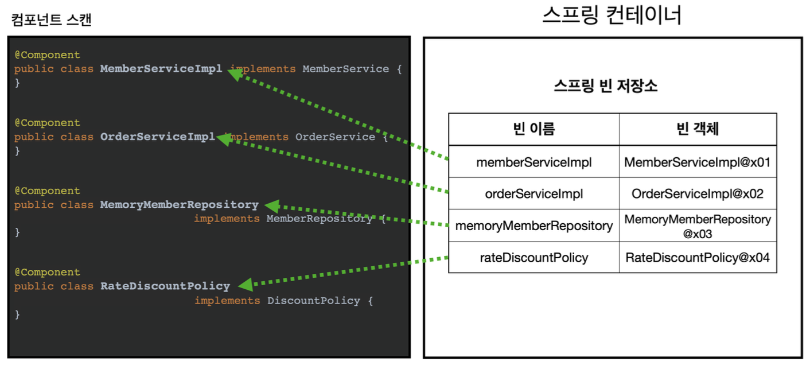
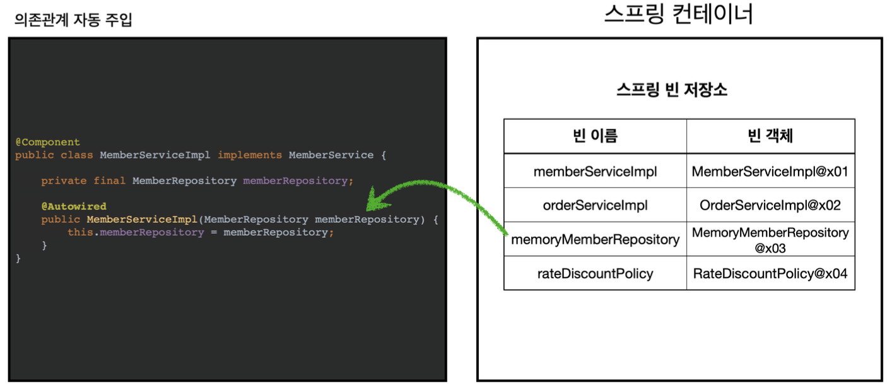
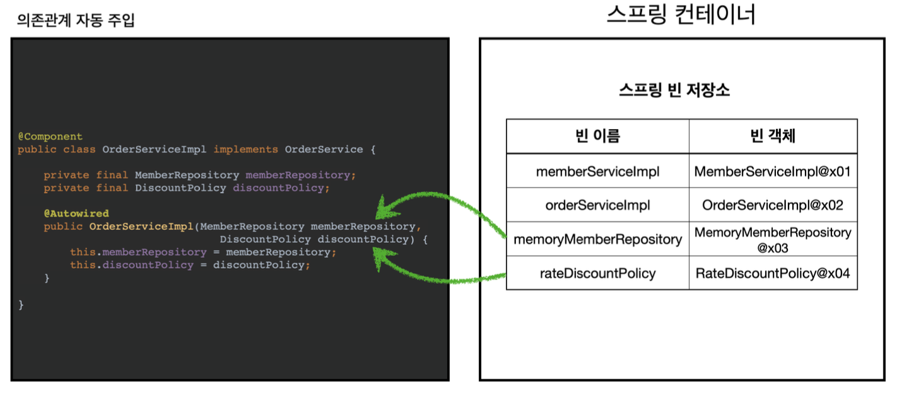

# 03.26 TIL(3)

### 컴포넌트 스캔, 의존관계 자동 주입

- 지금까지 스프링 빈을 등록할 때는 자바 코드의 @Bean를 주로 사용해, 설정 정보에 직접 등록한 스프링 빈을 나열했다.
- 만약 이렇게 등록해야 할 스프링 빈이 엄청나게 많다면…
  - 당연한 휴면에러를 맞이하게 될 지도..?
- 그래서 스프링은 설정 정보가 없어도 자동으로 스프링 빈을 등록하는 컴포넌트 스캔이라는 기능을 제공한다.
- 추가로 의존관계도 자동으로 주입하는 @Autowired라는 기능도 제공한다.

<br>

**예제**

`AutoAppConfig.java`

```java
@Configuration
@ComponentScan(
				excludeFilters = @Filter(type = FilterType.ANNOTATION,
				classes = Configuration.class))
public class AutoAppConfig {
}
```

<br>

- 컴포넌트 스캔을 사용하려면 먼저 @ComponentScan을 설정 정보에 붙여주면 된다.
- 기존의 AppConfig와는 다르게 @Bean으로 등록한 클래스가 하나도 없다.
- 우선은 이전 코드들에 대한 보존을 위해 excluseFilter를 걸어둠.

컴포넌트 스캔은 이름 그대로 @Component 애노테이션이 붙은 클래스를 스캔해서 스프링 빈으로 등록한다.

<br>

**참고**

@Configuration이 컴포넌트 스캔의 대상이 된 이유도 @Configuration 소스코드를 열어보면 @Component 애노테이션이 붙어있기 때문이다.

**MemoryMemberRepository @Component 추가**

```java
@Component
public class MemoryMemberRepository implements MemberRepository {}
```

**RateDiscountPolicy @Component 추가**

```java
@Component
public class RateDiscountPolicy implements DiscountPolicy {}
```

**MemberServiceImpl @Component 추가**

```java
@Component
public class MemberServiceImpl implements MemberService {

		private final MemberRepository memberRepository;

		@Autowired
		public MemberServiceImpl(MemberRepository memberRepository) {
				this.memberRepository = memberRepository;
		}
}
```

- 이전에 AppConfig에서는 @Bean으로 직접 설정 정보를 작성했고, 의존관계도 직접 명시.
  - 이제는 이런 설정 정보 자체가 없기 때문에, 의존관계 주입도 이 클래스 안에서 해결한다.
- `@Autowired`는 의존관계를 자동으로 주입해준다.
  - 이후에 자세한 내용을 다룬다.

**OrderServiceImpl @Component, @Autowired 추가**

```java
@Component
public class OrderServiceImpl implements OrderService {

		private final MemberRepository memberRepository;
		private final DiscountPolicy discountPolicy;

		@Autowired
		public OrderServiceImpl(MemberRepository memberRepository, DiscountPolicy discountPolicy) {
				this.memberRepository = memberRepository;
				this.discountPolicy = discountPolicy;
		}
}
```

- @Autowired를 사용하면 생성자에서 여러 의존관계도 한번에 주입받을 수 있다.

---

### 어떻게 동작하길래?

1. **@ComponentScan**

   

   - `@ComponentScan`은 `@Component`가 붙은 모든 클래스를 스프링 빈으로 등록
   - 이때 스프링 빈의 기본 이름은 클래스명을 사용하되 맨 앞글자만 소문자를 사용한다.
     - 빈 이름 기본 전략: MemberServiceImpl → memberServiceImpl
     - 빈 이름 직접 지정: 만약 스프링 빈의 이름을 직접 지정하고 싶으면 @Component(”memberService2”) 이런식으로 이름을 부여하면 된다.

<br>

2. @Autowired 의존관계 자동 주입

   

   - 생성자에 `@Autowired`를 지정하면, 스프링 컨테이너가 자동으로 해당 스프링 빈을 찾아서 주입한다.
   - 이때 기본 조회 전략은 타입이 같은 빈을 찾아서 주입한다.
     - getBean(MemberRepository.class)와 동일하다고 이해하기
     - 더 자세한 내용은 뒤에서… (언제나와!!!!)

   

   - 생성자에 파라미터가 많아도 다 찾아서 자동으로 주입한다.

---

### 탐색 위치, 기본 스캔 대상

> 탐색할 패키지의 시작 위치 지정

- 모든 자바 클래스를 다 컴포넌트 스캔하면 시간이 많이 잡아먹힌다.
  - 그래서 꼭 필요한 위치부터 탐색하도록 시작 위치를 지정할 수 있다.

```java
@ComponentScan(
		basePackages = "hello.core", ... etc
)
```

- `basePackages`
  - 탐색할 패키지의 시작 위치를 지정. 이 패키지를 포함해 하위 패키지를 모두 탐색
  - basePackages = { “hello.core”, “hello.service” } 이렇게 여러 시작 위치를 지정할 수도 있음
- `basePackageClasses`
  - 지정한 클래스의 패키지를 탐색 시작 위치로 지정
- 만약 지정하지 않으면 @ComponentScan이 붙은 설정 정보 클래스의 패키지가 시작 위치가 됨

**권장 방법**

- 패키지 위치를 지정하지 않고, 설정 정보 클래스의 위치를 프로젝트 최상단에 두는 것
- 스프링 부트의 기본 디폴트

---

### 컴포넌트 스캔 기본 대상

> 컴포넌트 스캔은 @Component 뿐만 아니라 다음과 내용도 추가로 대상에 포함된다.

- `@Component` → 컴포넌트 스캔에서 사용
- `@Controller` → MVC 컨트롤러에서 사용
- `@Service` → 비즈니스 로직에서 사용
- `@Repository` → 스프링 데이터 접근 계층에서 사용
- `@Configuration` → 설정 정보에서 사용

**컴포넌트 스캔의 용도 뿐만 아니라 다음 애노테이션이 있으면 스프링은 부가 기능을 수행**

- `@Controller` → 스프링 MVC 컨트롤러로 인식
- `@Repository` → 스프링 데이터 접근 계층으로 인식하고, 데이터 계층의 예외를 스프링 예외로 변환해준다.
- `@Configuration` → 앞서 보았듯이 스프링 설정 정보로 인식하고, 스프링 빈이 싱글톤을 유지하도록 추가 처리 를 한다.
- `@Service` → 사실 @Service는 특별한 처리를 하지 않는다. 대신 개발자들이 핵심 비즈니스 로직이 여기에 있겠구나 라고 비즈니스 계층을 인식하는데 도움이 된다.

<br>

**참고**

- 애노테이션에는 상속관계라는 것이 없음. 애노테이션이 특정 애노테이션을 들고 있는 것을 인식할 수 있는 것은 자바 언어의 기능이 아닌, 스프링이 지원하는 기능

<br>

---

### 필터

- `includeFilters`
  - 컴포넌트 스캔 대상을 추가로 지정
- `excluseFilters`
  - 컴포넌트 스캔에서 제외할 대상을 지정

**예제**

```java
@Configuration
@ComponentScan(
			includeFilters = @Filter(type = FilterType.ANNOTATION, classes = MyIncludeComponent.class),
			excludeFilters = @Filter(type = FilterType.ANNOTATION, classes = MyExcludeComponent.class)
)
static class ComponentFilterAppConfig {
)
```

- `includeFilters` 에 `MyIncludeComponent` 애노테이션을 추가해서 BeanA가 스프링 빈에 등록된다.
- `excludeFilters` 에 `MyExcludeComponent` 애노테이션을 추가해서 BeanB는 스프링 빈에 등록되지 않는다.

<br>

---

### FilterType 옵션

> 5가지의 필터 옵션 → 컴포넌트 스캔 시 어떤 클래스를 빈으로 등록할지 결정

1. ANNOTATION

   - 애노테이션 기반으로 클래스를 스캔하는 방식임. 특정 애노테이션이 붙은 클래스만 스캔.

   ```java
   @ComponentScan(includeFilters = @Filter(type = FilterType.ANNOTATION,
                                         classes = MySpecialAnnotation.class))

   ```

   - 이렇게 하면 `@MySpecialAnnotation`이 붙은 클래스만 빈으로 등록됨.

<br>

2. ASSIGNABLE_TYPE

   - 지정한 타입이나 그 하위 타입의 클래스를 스캔함. 특정 인터페이스나 클래스를 구현/상속한 클래스를 찾을 때 유용

   ```java
   @ComponentScan(includeFilters = @Filter(type = FilterType.ASSIGNABLE_TYPE,
                                         classes = MyService.class))

   ```

   - `MyService` 클래스나 이를 상속한 모든 클래스가 스캔 대상이 됨.

<br>

3. ASPECTJ

   - AspectJ 표현식을 사용해 더 복잡한 패턴 매칭을 수행함. 강력한 패턴 매칭 기능 제공

   ```java
   @ComponentScan(includeFilters = @Filter(type = FilterType.ASPECTJ,
                                         pattern = "org.example..*Service+"))

   ```

   - 이는 AspectJ 패턴에 맞는 클래스들만 스캔함. 위 예시는 Service로 끝나는 모든 클래스를 스캔함.

<br>

4. REGEX

   - 정규 표현식을 사용해 클래스 이름 패턴 매칭을 수행함. 문자열 패턴 기반으로 유연한 필터링 가능함.

   ```java
   @ComponentScan(includeFilters = @Filter(type = FilterType.REGEX,
                                         pattern = "org\\.example\\.Default.*"))

   ```

   - 정규식에 맞는 클래스명을 가진 클래스들만 스캔함. 위 예시는 'org.example.Default'로 시작하는 모든 클래스를 스캔함.

<br>

5. CUSTOM

   - 개발자가 직접 정의한 `TypeFilter` 인터페이스 구현체를 사용해 더 세밀한 제어가 가능함. 가장 유연한 필터링 방식임.

   ```java
   @ComponentScan(includeFilters = @Filter(type = FilterType.CUSTOM,
                                         classes = MyCustomTypeFilter.class))

   ```

   - `MyCustomTypeFilter` 클래스에서 정의한 로직대로 필터링함. 복잡한 조건의 필터링이 필요할 때 사용함.
