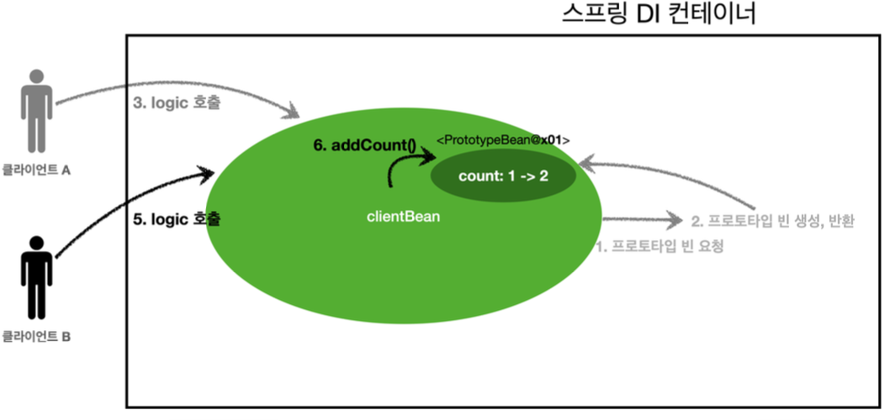

# 03.30 TIL(1)

날짜: 2025년 3월 30일
과목: Spring
유형: 인강
상태: In progress

### Bean Scope

- Bean이 존재할 수 있는 범위

**스프링이 제공하는 Scope**

- Singleton
- Prototype
- etc
  - Web
    - request
    - session
    - application

```java
@Scope("prototype")
@Component
public class PrototypeBean {
}
```

---

### Prototype Scope

- 해당 Scope를 가지는 Bean을 스프링 컨테이너에 조회하면 항상 새로운 인스턴스를 생성해서 반환한다.

**싱글톤 Bean 요청**


1. 싱글톤 스코프의 빈을 컨테이너에 요청
2. 본인이 관리하는 빈을 반환
3. 이후에 같은 요청이 컨테이너로 들어와도 같은 객체 인스턴스의 스프링 빈을 반환

<br>

**프로토타입 Bean 요청**


1. 프로토타입 스코프의 빈을 스프링 컨테이너에 요청
2. 스프링 컨테이너는 이 시점에 프로토타입 빈을 생성하고, 필요한 의존관계를 주입

<br>


1. 스프링 컨테이너는 생성한 프로토타입 빈을 클라이언트에 반환
2. 이후 같은 요청이 컨테이너로 와도 항상 새로운 프로토타입 빈을 생성해서 반환

<br>

**정리**

> 스프링 컨테이너는 프로토타입 빈을 생성하고, 의존관계 주입, 초기화까지만 처리한다.

- 클라이언트에 반환한 이후에는 관리하지 않음.
- 그래서 @PreDestroy 같은 종료 메서드가 호출되지 않음.

- 싱글톤 빈은 스프링 컨테이너가 관리하기 때문에 스프링 컨테이너가 종료될 때 빈의 종료 메서드가 실행되지만
- 프로토타입 빈은 스프링 컨테이너가 생성과 의존관계 주입 그리고 초기화 까지만 관여하고, 더는 관리하지 않음.
  - 따라서 프로토타입 빈은 스프링 컨테이너가 종료될 때 `@PreDestroy` 같은 종료 메서드가 전혀 실행되지 않음.

<br>

**Prototype Bean 특징 정리**

- 스프링 컨테이너에 요청할 때 마다 새로 생성
- 스프링 컨테이너는 프로토타입 빈의 생성과 의존관계 주입, 초기화까지만 관여
- 종료 메서드가 호출되지 않음.
- 프로토타입 빈은 프로토타입 빈을 조회한 클라이언트가 관리해야 하므로, 종료 메서드 호출도 클라이언트에서 직접 해야함.

---

### Singleton With Prototype Scope

> 싱글톤 빈과 프로토타입 빈을 함께 사용할 때는 의도한 대로 잘 동작하지 않으므로 주의해야 한다.

**그림 예제**


1. 클라이언트A는 스프링 컨테이너에 프로토타입 빈을 요청한다.
2. 스프링 컨테이너는 프로토타입 빈을 새로 생성해서 반환(x01)한다. → count = 0
3. 클라이언트는 조회한 프로토타입 빈에 addCount를 호출하면서 count++을 한다.

→ x01의 count는 1이 된다.

<br>

**싱글톤과 프로토타입 빈**


1. clientBean은 싱글톤이므로, 보통 스프링 컨테이너 생성 시점에 함께 생성되고, 의존관계 주입도 발생한다.
   1. clientBean은 의존관계 자동 주입을 사용 → 주입 시점에 스프링 컨테이너에 프로토타입 빈을 요청
   2. 스프링 컨테이너는 프로토타입 빈을 생성해서 clientBean에 반환 → count = 0
2. 이제 clientBean은 프로토타입 빈을 내부 필드에 보관 (정확히는 참조값을)

<br>


> 클라이언트 A는 clientBean을 스프링 컨테이너에 요청해서 받는다. 싱글톤이므로 항상 같은 clientBean이 반환

1. 클라이언트 A는 clientBean.logic을 호출
2. clientBean은 prototypeBean의 addCount를 호출해서 count를 증가시킨다. count = 1

<br>



> 클라이언트 B는 clientBean을 스프링 컨테이너에 요청해서 받음.

- clientBean**이** **내부에** **가지고** **있는** **프로토타입** **빈은** **이미** **과거에** **주입이** **끝난** **빈**
  - 주입 시점에 스프링 컨테이너에 요청해서 프로토타입 빈이 새로 생성이 된 것이지, 사용 할 때마다 새로 생성되는 것이 아님

1. 클라이언트 B는 `clientBean.logic` 을 호출한다.
2. `clientBean` 은 prototypeBean의 `addCount()` 를 호출해서 프로토타입 빈의 count를 증가
   - count가 기존 1이었으므로 2가 됨.

이런 문제를 어떻게 해결할 수 있을까?

---

### Provider

- 싱글톤 빈과 프로토타입 빈을 함께 사용할 때, 어떻게 하면 사용할 때 마다 항상 새로운 프로토타입 빈을 생성할 수 있을까?

1. 스프링 컨테이너에 요청

   ```java
   static class ClientBean {
   		@Autowired
   		private ApplicationContext ac;

   		public int logic() {
   				PrototypeBean prototypeBean = ac.getBean(PrototypeBean.class);
   				prototypeBean.addCount();
   				int count = prototypeBean.getCount();
   				return count;
   		}
   }
   ```

   - ac.getBean()을 통해 항상 새로운 프로토타입 빈이 생성된다.
   - 의존관계를 외부에서 DI 받는게 아니라 직접 필요한 의존관계를 찾는 것은 `Dependency Lookup` (DL) 의존관계 조회(탐색) 이라 한다.
   - 이렇게 스프링의 애플리케이션 컨텍스트 전체를 주입받게 되면, 스프링 컨테이너에 종속적인 코드가 되고, 단위 테스트도 어려워짐.
   - 지금 필요한 것은 DL 정도의 기능만 제공하는 무언가가 있으면 됨.

1. ObjectFactory, ObjectProvider

   ```java
   @Autowired
   private ObjectProvider<PrototypeBean> prototypeBeanProvider;

   public int logic() {
   		PrototypeBean prototypeBean = prototypeBeanProvider.getObject();
   		prototypeBean.addCount();
   		int count = prototypeBean.getCount();
   		return count;
   }
   ```

   - `ObjectProvider` 의 `getObject()` 를 호출하면 내부에서는 스프링 컨테이너를 통해 해당 빈을 찾아서 반환 (DL)

1. JSR-330 Provider

   - `javax.inject.Provider` 라는 JSR-330 자바 표준을 사용하는 방법
   - `jakarta.inject:jakarta.inject-api:2.0.1` 라이브러리를 gradle에 추가

   ```java
   @Autowired
   private Provider<PrototypeBean> provider;

   public int logic() {
   		PrototypeBean prototypeBean = provider.get();
   		prototypeBean.addCount();
   		int count = prototypeBean.getCount();
   		return count;
   }
   ```

   - 특징
     - get() 메서드 하나로 기능이 매우 단순
     - 별도의 라이브러리 추가
     - 다른 컨테이너에서도 사용가능(자바 표준)

<br>

**정리**

- 프로토타입 빈?
  - 매번 사용할 때 마다 의존관계 주입이 완료된 새로운 객체가 필요하면 사용
  - but.. 싱글톤 빈으로 대부분의 문제를 해결할 수 있다.
- ObjectProvider, JSR330 Provider 등은 프로토타입 뿐만 아니라 DL이 필요한 경우는 언제든지 사용 가능

---

### 웹 스코프

- 특징
  - 웹 환경에서만 동작
  - 프로토타입과 다르게 스프링이 해당 스코프의 종료시점까지 관리, 즉 종료 메서드가 호출됨
- 종류
  - request: HTTP 요청 하나가 들어오고 나갈 때 까지 유지되는 스코프, 각각의 HTTP 요청마다 별도의 빈 인스턴스가 생성되고, 관리됨.
  - session: HTTP Session과 동일한 생명주기를 가지는 스코프
  - application: 서블릿 컨텍스트(ServletContext)와 동일한 생명주기를 가지는 스코프
  - websocket: 웹 소캣과 동일한 생명주기를 가지는 스코프

**HTTP request, Scope**


```java
@Component
@Scope(value = "request")
public class MyLogger {

		private String uuid;
		private String requestURL;

		public void setRequestURL(String requestURL) {
				this.requestURL = requestURL;
		}

		public void log(String message) {
				System.out.println("[" + uuid + "]" + "[" + requestURL + "] " + message);
		}

		@PostConstruct
		public void init() {
				uuid = UUID.randomUUID().toString();
				System.out.println("[" + uuid + "] request scope bean create:" + this);
		}

		@PreDestroy
		public void close() {
				System.out.println("[" + uuid + "] request scope bean close:" + this);
		}
}
```

- @Scope(value = “request”)를 사용해서 request 스코프로 지정
  - HTTP 요청 당 하나씩 생성되고, HTTP 요청이 끝나는 시점에 소멸

**아래와 같은 문제는 뭐지?**

```java
Error creating bean with name 'myLogger': Scope 'request' is not active for the
current thread; consider defining a scoped proxy for this bean if you intend to
refer to it from a singleton;
```

- 스프링은 싱글톤 빈들을 모두 생성하고 의존성을 주입함
- 이때 싱글톤 빈(컨트롤러나 서비스)이 request 스코프 빈(myLogger)을 주입받으려 함
- 그러나 애플리케이션 시작 시점에는 HTTP 요청이 없으므로 request 스코프가 활성화되지 않음
- 따라서 request 스코프 빈을 생성할 수 없어 에러 발생

<br>

**해결 방법**

1. **Provider 사용**

- `ObjectProvider<MyLogger>`를 사용해 빈 생성을 지연시킴
- 실제 HTTP 요청 시점에 `getObject()`로 빈을 조회
- 같은 요청 내에서는 같은 빈이 반환됨

```java
@Controller
@RequiredArgsConstructor
public class LogDemoController {
    private final LogDemoService logDemoService;
    private final ObjectProvider<MyLogger> myLoggerProvider;

    @RequestMapping("log-demo")
    @ResponseBody
    public String logDemo(HttpServletRequest request) {
        MyLogger myLogger = myLoggerProvider.getObject();
        // ...
    }
}
```

<br>

2. **proxy 방식**

> 프록시는 객체 지향 프로그래밍에서 다른 객체를 대신하는 대리자 역할을 하는 객체. 원본 객체에 직접 접근하는 대신 프록시 객체를 통해 간접적으로 접근하는 방식

- `@Scope` 애노테이션에 `proxyMode` 속성 추가
- `proxyMode = ScopedProxyMode.TARGET_CLASS` (클래스 기반 프록시)
- `MyLogger`를 상속받은 가짜 프록시 객체를 생성하여 주입
- 프록시 객체는 요청이 오면 내부에서 실제 빈을 요청하는 위임 로직 수행

```java
@Component
@Scope(value = "request", proxyMode = ScopedProxyMode.TARGET_CLASS)
public class MyLogger {
    // ...
}
```

<br>

**웹 스코프와 프록시 동작 원리**

> CGLIB라는 라이브러리로 내 클래스를 상속 받은 가짜 프록시 객체를 만들어서 주입

- `@Scope` 의 `proxyMode = ScopedProxyMode.TARGET_CLASS)` 를 설정하면
  - 스프링 컨테이너는 CGLIB라는 바이트코드를 조작하는 라이브러리를 사용
  - MyLogger를 상속받은 가짜 프록시 객체를 생성
- 우리가 등록한 순수한 MyLogger 클래스가 아니라 `MyLogger$$EnhancerBySpringCGLIB` 이라는 클래스로 만들어진 객체가 대신 등록되어 있음.
- 그리고 스프링 컨테이너에 "myLogger"라는 이름으로 진짜 대신에 이 가짜 프록시 객체를 등록
- `ac.getBean("myLogger", MyLogger.class)`로 조회해도 프록시 객체가 조회되는 것을 확인가능
- 의존관계 주입도 이 가짜 프록시 객체가 주입

<br>


**가짜** **프록시** **객체는** **요청이** **오면** **그때** **내부에서** **진짜** **빈을** **요청하는** **위임** **로직이** **들어있다**.

- 가짜 프록시 객체는 내부에 진짜 `myLogger` 를 찾는 방법을 알고 있다.
- 클라이언트가 `myLogger.log()` 을 호출하면 사실은 가짜 프록시 객체의 메서드를 호출한 것이다.
- 가짜 프록시 객체는 request 스코프의 진짜 `myLogger.log()` 를 호출한다.
- 가짜 프록시 객체는 원본 클래스를 상속 받아서 만들어졌기 때문에 이 객체를 사용하는 클라이언트 입장에서는 사실 원본인지 아닌지도 모르게, 동일하게 사용할 수 있다(다형성)

<br>

**동작** **정리**

- CGLIB라는 라이브러리로 내 클래스를 상속 받은 가짜 프록시 객체를 만들어서 주입
- 이 가짜 프록시 객체는 실제 요청이 오면 그때 내부에서 실제 빈을 요청하는 위임 로직이 있음.
- 가짜 프록시 객체는 실제 request scope와는 관계가 없다. 그냥 가짜이고, 내부에 단순한 위임 로직만 있고, 싱글톤 처럼 동작

<br>

**특징 정리**

- 프록시 객체 덕분에 클라이언트는 마치 싱글톤 빈을 사용하듯이 편리하게 request scope를 사용할 수 있다.
- 사실 Provider를 사용하든, 프록시를 사용하든 핵심 아이디어는 진짜 객체 조회를 꼭 필요한 시점까지 지연처리한다는 점
- 단지 애노테이션 설정 변경만으로 원본 객체를 프록시 객체로 대채 가능
  - 다형성과 DI 컨테이너가 가진 큰 강점
