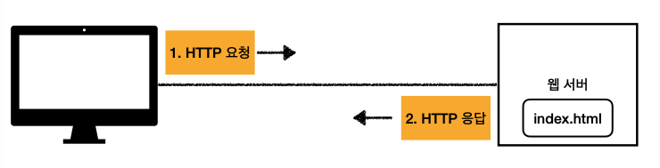
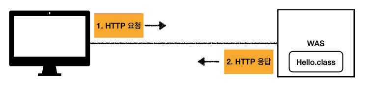
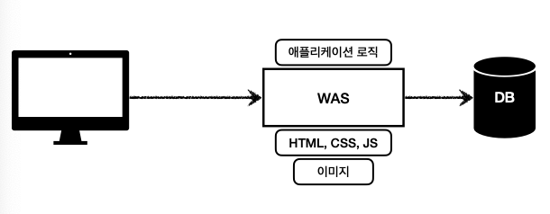
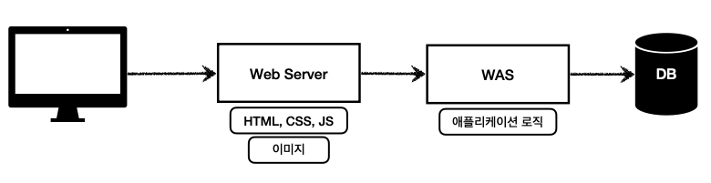
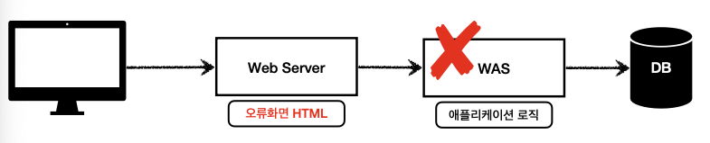
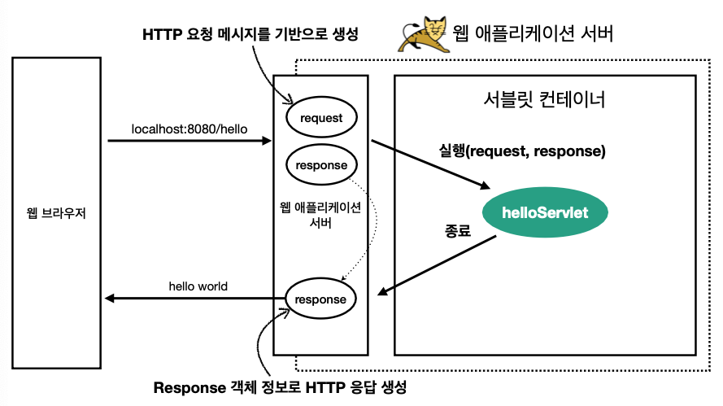
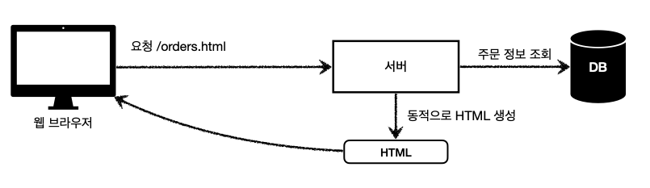
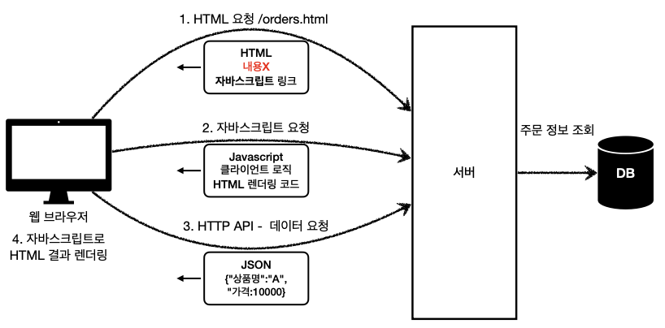

# 04.05 TIL(1)

### Web Server



- HTTP 기반으로 동작
- 정적 리소스 제공, 기타 부가기능
- 정적(파일) HTML, CSS, JS, 이미지, 영상
  - etc: NGINX, APACHE

---

### WAS - Web Application Server



- HTTP 기반으로 동작
- 웹 서버 기능 포함 + (정적 리소스 제공 가능)
- 프로그램 코드를 실행해서 애플리케이션 로직 수행
  - 동적 HTML, HTTP API(JSON)
  - 서블릿, JSP, 스프링 MVC
  - etc: Tomcat, Jetty, Undertow

---

**그래서 둘의 차이가 뭔데?**

- 웹 서버는 정적 리소스(파일), WAS는 애플리케이션 로직
- 둘의 용어 경계도 모호함
  - 웹 서버도 프로그램을 실행하는 기능을 포함하기도 하고…
  - 웹 애플리케이션 서버도 웹 서버의 기능을 제공
- 자바는 서블릿 컨테이너 기능을 제공하면 WAS
  - 서블릿 없이 자바코드를 실행하는 서버 프레임워크도 존재
- WAS는 애플리케이션 코드를 실행하는데 더 특화되어 있음.

---

### 웹 시스템 구성 - WAS, DB



- WAS, DB 만으로 시스템 구성 가능
- WAS는 정적 리소스, 애플리케이션 로직 모두 제공 가능

하지만 WAS가 너무 많은 역할을 담당하고, 서버 과부하가 우려될 수 있다.

즉, 가장 비싼 애플리케이션 로직이 정적 리소스 때문에 수행이 어려워 질 수 있고

WAS 장애시 오류 화면도 노출할 수 없다. (그냥 다운)

## 이를 해결하기 위해 아래와 같이 시스템을 구성한다.

### 웹 시스템 구성 - WEB, WAS, DB



- 정적 리소스는 웹 서버가 처리
- 웹 서버는 애플리케이션 로직같은 동적인 처리가 필요하면 WAS에 요청을 위임
- WAS는 중요한 애플리케이션 로직 처리 전담
- 효율적인 리소스 관리
  - 정적 리소스가 많이 사용되면 Web 서버 증설
  - 애플리케이션 리소스가 많이 사용되면 WAS 증설
- 정적 리소스만 제공하는 웹 서버는 잘 죽지 않음
- 애플리케이션 로직이 동작하는 WAS 서버는 잘 죽음
- WAS, DB 장애시 WEB 서버가 오류 화면 제공 가능
  

---

### 서블릿

```java
@WebServlet(name = "helloServlet", urlPatterns = "/hello")
public class HelloServlet extends HttpServlet {

	@Override
	protected void service(HttpServletRequest request, HttpServletResponse response {
		// 애플리케이션 로직
	}
}
```

- urlPatterns(/hello)의 URL이 호출되면 서블릿 코드가 실행
- HTTP 요청 정보를 편리하게 사용할 수 있는 HttpServletRequest
- HTTP 응답 정보를 편리하게 제공할 수 있는 HttpServletResponse

---



- HTTP 요청시
  1. 클라이언트(브라우저)가 HTTP 요청을 서버에 보냄
  2. 서블릿 컨테이너(예: 톰캣)가 요청을 받아서 HttpServletRequest와 HttpServletResponse 객체를 생성함
  3. 컨테이너가 적절한 서블릿을 찾아 service() 메소드를 호출하면서 이 두 객체를 전달함
  4. 개발자가 작성한 서블릿 코드에서 이 객체들을 활용해 비즈니스 로직 처리
  5. Response 객체에 응답 정보를 채움
  6. 서블릿의 실행이 끝나면 컨테이너는 Response 객체의 내용을 HTTP 응답으로 변환해 클라이언트에게 전송

<br>

- **싱글톤으로 관리됨**
  - 최초 로딩 시점에 서블릿 객체를 미리 만들어두고 재활용
  - 모든 고객 요청은 동일한 서블릿 객체 인스턴스에 접근
  - **공유 변수 사용 주의**
  - 서블릿 컨테이너 종료시 함께 종료

---

### **쓰레드 풀**

- 특징
  - 필요한 쓰레드를 쓰레드 풀에 보관하고 관리한다.
  - 쓰레드 풀에 생성 가능한 쓰레드의 최대치를 관리한다. 톰캣은 최대 200개 기본 설정 (변경 가능)
- 사용
  - 쓰레드가 필요하면, 이미 생성되어 있는 쓰레드를 쓰레드 풀에서 꺼내서 사용한다.
  - 사용을 종료하면 쓰레드 풀에 해당 쓰레드를 반납한다.
  - 최대 쓰레드가 모두 사용중이어서 쓰레드 풀에 쓰레드가 없으면?
  - 기다리는 요청은 거절하거나 특정 숫자만큼만 대기하도록 설정할 수 있다.
- 장점
  - 쓰레드가 미리 생성되어 있으므로, 쓰레드를 생성하고 종료하는 비용(CPU)이 절약되고, 응답 시간이 빠르다.
  - 생성 가능한 쓰레드의 최대치가 있으므로 너무 많은 요청이 들어와도 기존 요청은 안전하게 처리할 수 있다.

---

### WAS의 멀티 쓰레드 자원

- 멀티 쓰레드에 대한 부분은 WAS가 처리
- **개발자가 멀티 쓰레드 관련 코드를 신경쓰지 않아도 됨**
- 개발자는 마치 **싱글 쓰레드 프로그래밍을 하듯이 편리하게 소스 코드를 개발**
- 멀티 쓰레드 환경이므로 싱글톤 객체(서블릿, 스프링 빈)는 주의해서 사용

---

### SSR



- 서버 사이드 렌더링
  - 특징
    - 서버가 데이터를 가져와 HTML을 완성함
    - 초기 로딩 시 완성된 콘텐츠를 받음
    - 페이지 이동 시 서버에 새로운 요청을 보냄
    - 검색 엔진 최적화(SEO)에 유리함
    - 초기 렌더링 속도가 빠름
  - 관련기술: JSP, 타임리프

---

### CSR



- 클라이언트 사이드 렌더링
  - 특징
    - 서버는 주로 빈 HTML과 JavaScript 파일을 제공함
    - 브라우저에서 JavaScript가 실행되어 DOM을 구성함
    - 데이터는 API 호출을 통해 가져와 화면에 표시함
    - 페이지 전환 시 서버에 새로운 페이지를 요청하지 않고 필요한 부분만 변경함
    - 초기 로딩 후 페이지 전환이 빠름
