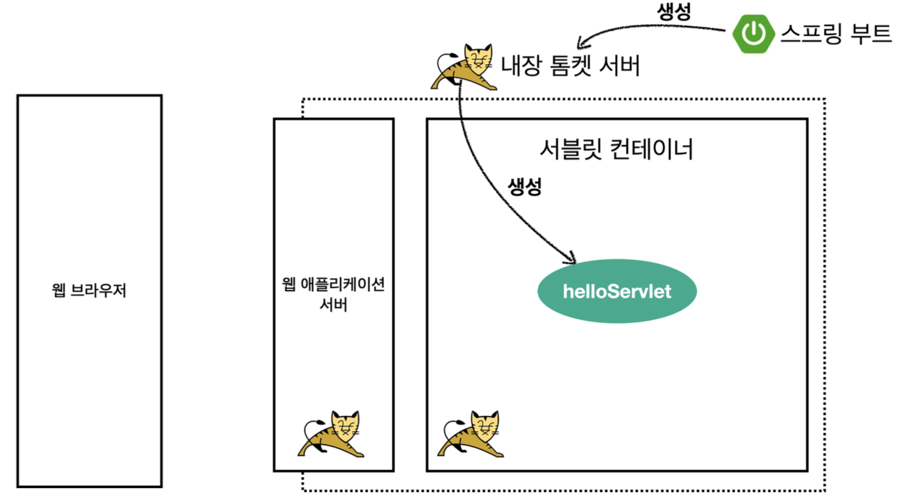

# 04.06 TIL(1)

### 스프링 부트 서블릿 환경 구성

@ServletComponentScan

- 스프링 부트는 서블릿을 직접 등록해서 사용할 수 있도록 @ServletComponentScan을 지원.

  ```java
  @WebServlet(name = "helloServlet", urlPatterns = "/hello")
  public class HelloServlet extends HttpServlet {

      @Override
      protected void service(HttpServletRequest req, HttpServletResponse resp) throws ServletException, IOException {
          System.out.println("HelloServlet.service");
          System.out.println("req = " + req);
          System.out.println("resp = " + resp);

          String username = req.getParameter("username");
          System.out.println("username = " + username);

          resp.setContentType("text/plain");
          resp.setCharacterEncoding("UTF-8");
          // 응답 메시지 바디에 입력한 이름을 넣어준다.
          resp.getWriter().write("hello " + username);
      }
  }
  ```

- @WebServlet 서블릿 애노테이션

  - name: 서블릿 이름
  - urlPatterns: URL 매핑

- HTTP 요청을 통해 매핑된 URL이 호출되면 서블릿 컨테이너는 다음 메서드를 실행
  `protected void service(HttpServiceRequest request, HttpServletResponse response)`

---

### Servlet 컨테이너 동작 방식

1. 내장 톰캣 서버 생성

   

1. HTTP 요청, 응답 메시지

   

1. 웹 애플리케이션 서버의 요청 응답 구조

   

---

### HttpServletRequest

- 역할
  - 서블릿은 개발자가 HTTP 요청 메시지를 편리하게 사용할 수 있도록 파싱후 HttpServletRequest 객체에 담아서 제공
- 사용법

  ```java
  package hello.servlet.basic.request;

  import jakarta.servlet.ServletException;
  import jakarta.servlet.annotation.WebServlet;
  import jakarta.servlet.http.Cookie;
  import jakarta.servlet.http.HttpServlet;
  import jakarta.servlet.http.HttpServletRequest;
  import jakarta.servlet.http.HttpServletResponse;

  import java.io.IOException;

  @WebServlet(name = "requestHeaderServlet", urlPatterns = "/request-header")
  public class RequestHeaderServlet extends HttpServlet {
      @Override
      protected void service(HttpServletRequest req, HttpServletResponse resp) throws ServletException, IOException {

          String method = req.getMethod();

          printStartLine(req);
          printHeaders(req);
          printHeaderUtils(req);
      }

      //start line 정보
      private void printStartLine(HttpServletRequest request) {
          System.out.println("--- REQUEST-LINE - start ---");

          // HTTP 요청 메세지의 Method 조회
          System.out.println("request.getMethod() = " + request.getMethod());

          // HTTP 요청 메세지의 URL 조회
          System.out.println("request.getProtocol() = " + request.getProtocol());

          // HTTP 요청 메세지의 프로토콜
          System.out.println("request.getScheme() = " + request.getScheme());

          // http://localhost:8080/request-header
          System.out.println("request.getRequestURL() = " + request.getRequestURL()); // /request-header
          System.out.println("request.getRequestURI() = " + request.getRequestURI()); //username=hi
          System.out.println("request.getQueryString() = " + request.getQueryString());
          System.out.println("request.isSecure() = " + request.isSecure()); //https 사용 유무
          System.out.println("--- REQUEST-LINE - end ---");
          System.out.println();
      }

      //Header 모든 정보
      private void printHeaders(HttpServletRequest request) {
          System.out.println("--- Headers - start ---");

          /*
          Enumeration<String> headerNames = request.getHeaderNames();
          while (headerNames.hasMoreElements()) {
              String headerName = headerNames.nextElement();
              System.out.println(headerName + ": " + request.getHeader(headerName));
          }
          */

  				// 현대의 Header 정보 조회 방법
          request.getHeaderNames().asIterator()
                  .forEachRemaining(headerName -> System.out.println(headerName + ": "
                          + request.getHeader(headerName)));
          System.out.println("--- Headers - end ---");
          System.out.println();
      }

      //Header 편리한 조회
      private void printHeaderUtils(HttpServletRequest request) {
          System.out.println("--- Header 편의 조회 start ---");
          System.out.println("[Host 편의 조회]");
          System.out.println("request.getServerName() = " +
                  request.getServerName()); //Host 헤더
          System.out.println("request.getServerPort() = " +
                  request.getServerPort()); //Host 헤더
          System.out.println();
          System.out.println("[Accept-Language 편의 조회]");
          request.getLocales().asIterator()
                  .forEachRemaining(locale -> System.out.println("locale = " +
                          locale));
          System.out.println("request.getLocale() = " + request.getLocale());
          System.out.println();
          System.out.println("[cookie 편의 조회]");
          if (request.getCookies() != null) {
              for (Cookie cookie : request.getCookies()) {
                  System.out.println(cookie.getName() + ": " + cookie.getValue());
              }
          }
          System.out.println();
          System.out.println("[Content 편의 조회]");
          System.out.println("request.getContentType() = " +
                  request.getContentType());
          System.out.println("request.getContentLength() = " +
                  request.getContentLength());
          System.out.println("request.getCharacterEncoding() = " +
                  request.getCharacterEncoding());
          System.out.println("--- Header 편의 조회 end ---");
          System.out.println();
      }
  }
  ```

---

### HTTP 요청 데이터

> HTTP 요청 메시지를 통해 클라이언트에서 서버로 데이터를 전달하는 방법은 주로 3가지를 사용한다.

- GET - 쿼리 파라미터
  - /url**?username=hello&age=20**
  - 메시지 바디 없이, URL의 쿼리 파라미터에 데이터를 포함해서 전달
  - 예) 검색, 필터, 페이징 등에서 많이 사용
- POST - HTML Form
  - content-type: application/x-www-form-urlencoded
  - 메시지 바디에 쿼리 파라미터 형식으로 전달 username=hello&age=20
  - 예) 회원 가입, 상품 주문, HTML Form 사용
- HTTP message body에 데이터를 직접 담아서 요청
  - HTTP API 에서 주로 사용, JSON, XML, TEXT
- 데이터 형식은 주로 JSON 사용
  - POST, PUT, PATCH

---

### GET - 쿼리 파라미터

- 전달 데이터
  - username=foden
  - age=25
- 쿼리 파라미터는 URL에 다음과 같이 `?`를 시작으로 보낼 수 있다.
  - 추가 파라미터는 `&`로 구분하면 된다.
  - http://localhost:8080/request-param?username=foden&age=25

```java
/*
    * 1. 파라미터 전송 기능
    * http://localhost:8080/request-param?username=hello&age=20
    * 2. 동일한 이름의 파라미터가 여러 개일 경우
    * http://localhost:8080/request-param?username=hello&username=hi
 */
@WebServlet(name = "requestParamServlet", urlPatterns = "/request-param")
public class RequestParamServlet extends HttpServlet {

    @Override
    protected void service(HttpServletRequest request, HttpServletResponse response) throws ServletException, IOException {
        System.out.println("[전체 파라미터 조회] - start");

        request.getParameterNames().asIterator()
                .forEachRemaining(paramName -> System.out.println(paramName + " = " + request.getParameter(paramName)));
        System.out.println("[전체 파라미터 조회] - end");
        System.out.println();

        System.out.println("[단일 파라미터 조회] - start");
        String username = request.getParameter("username");
        String age = request.getParameter("age");
        System.out.println("username = " + username);
        System.out.println("age = " + age);
        System.out.println();

        System.out.println("[이름이 같은 복수 파라미터 조회] - start");
        String[] usernames = request.getParameterValues("username");
        for (String s : usernames) {
            System.out.println("username = " + s);
        }

        response.getWriter().write("ok");
    }
}
```

---

### POST HTML Form

- 특징
  - content-type: `application/x-www-form-urlencoded`
  - 메시지 바디에 쿼리 파라미터 형식으로 데이터를 전달.
    - username=hello&age=20
- `application/x-www-form-urlencoded` 형식은 앞서 GET에서 살펴본 쿼리 파라미터 형식과 같음.
  - 따라서 쿼리 파라미터 조회 메서드를 그대로 사용하면 된다.
  - 클라이언트(웹 브라우저) 입장에서는 두 방식에 차이가 있지만, 서버 입장에서는 둘의 형식이 동일하므로, `request.getParameter()`로 편리하게 구분없이 조회할 수 있다.

<br>

**참고**

- content-type은 HTTP 메시지 바디의 데이터 형식을 지정한다.
  - GET URL **쿼리** **파라미터** **형식**으로 클라이언트에서 서버로 데이터를 전달할 때는 HTTP 메시지 바디를 사용하지 않기 때문에 content-type이 없음.
  - POST HTML Form **형식**으로 데이터를 전달하면 HTTP 메시지 바디에 해당 데이터를 포함해서 보내기 때문에 바디에 포함된 데이터가 어떤 형식인지 content-type을 꼭 지정해야함.
    - 이렇게 폼으로 데이터를 전송하는 형식을 `application/x-www-form-urlencoded` 이라 함

---

### API 메시지 바디

- **HTTP message body**에 데이터를 직접 담아서 요청
  - HTTP API에서 주로 사용, JSON, XML, TEXT
  - 데이터 형식은 주로 JSON 사용
  - POST, PUT, PATCH

1. **단순 텍스트**

   ```java
   @WebServlet(name = "requestBodyStringServlet", urlPatterns = "/request-body-string")
   public class RequestBodyStringServlet extends HttpServlet {

       @Override
       protected void service(HttpServletRequest request, HttpServletResponse response) throws ServletException, IOException {
           ServletInputStream inputStream = request.getInputStream();
           /*
           copyToString 메서드 사용
           - 버퍼를 생성하여 InputStream에서 데이터를 읽음
           - 지정된 인코딩(UTF-8)을 사용하여 바이트를 문자로 디코딩함
           - 읽은 모든 데이터를 하나의 문자열로 결합함
           - 스트림 관련 예외를 적절히 처리함
            */
           String messageBody = StreamUtils.copyToString(inputStream, StandardCharsets.UTF_8);

           System.out.println("messageBody = " + messageBody);

           response.getWriter().write("ok");
       }
   }
   ```

**참고**

- Stream
  - 데이터의 흐름을 표현하는 추상적 개념
    - 자바에서 스트림은 입력(InputStream), 출력(OutputStream)으로 구분됨.
  - 특징
    - 단방향 데이터 흐름을 제공
    - 바이트 단위로 데이터를 처리
    - 네트워크, 파일, 메모리 등 다양한 데이터 소스와 상호작용이 가능
  - HTTP 통신에서는 클라이언트가 서버로 요청을 보낼 때 데이터(request body)를 스트림 형태로 전송 → 이를 서버에서 읽기 위해 InputStream을 사용
- 코드에서 request.getInputStream() 이 실행되는 과정
  1. 클라이언트(브라우저 등)가 HTTP 요청을 보냄
  2. 요청은 HTTP 헤더와 바디로 구성됨
  3. 웹 서버(Tomcat 등)가 요청을 받아 서블릿 컨테이너에 전달함
  4. 서블릿 컨테이너는 URL 패턴(`/request-body-string`)을 확인하여 해당 서블릿으로 요청을 라우팅함
  5. `service()` 메서드가 호출됨
  6. `request.getInputStream()`이 실행되어 HTTP 요청 바디에 접근할 수 있는 `ServletInputStream` 객체를 반환함

1. **JSON**

   - JSON 결과를 파싱해서 사용할 수 있는 자바 객체로 변환하려면 JSON 변환 라이브러리를 추가해서 사용해야 함.
     - Spring MVC를 선택하면 기본으로 Jackson 라이브러리(ObjectMapper)를 제공

   ```java
   @WebServlet(name = "requestBodyJsonServlet", urlPatterns = "/request-body-json")
   public class RequestBodyJsonServlet extends HttpServlet {

       //JSON 데이터를 자바 객체로 변환하는 ObjectMapper를 사용한다.
       private final ObjectMapper objectMapper = new ObjectMapper();

       @Override
       protected void service(HttpServletRequest request, HttpServletResponse response) throws ServletException, IOException {
           ServletInputStream inputStream = request.getInputStream();
           String messageBody = StreamUtils.copyToString(inputStream, StandardCharsets.UTF_8);

           System.out.println("messageBody = " + messageBody);

           HelloData helloData = objectMapper.readValue(messageBody, HelloData.class);
           System.out.println("helloData.username = " + helloData.getUsername());
           System.out.println("helloData.age = " + helloData.getAge());

           response.getWriter().write("ok");
       }
   }
   ```

---

### HttpServletResponse

- 역할

  - HTTP 응답 메시지 생성
    - HTTP 응답코드 지정
    - 헤더 생성
    - 바디 생성
  - 편의 기능 제공
    - Content-Type, 쿠키, Redirect

  ```java
  @WebServlet(name = "responseHeaderServlet", urlPatterns = "/response-header")
  public class ResponseHeaderServlet extends HttpServlet {
      @Override
      protected void service(HttpServletRequest request, HttpServletResponse response) throws ServletException, IOException {
          // [status-line]
          response.setStatus(HttpServletResponse.SC_OK);

          // [response-header]
          response.setHeader("Content-Type", "text/plain");
          response.setHeader("Cache-Control", "no-cache, no-store, must-revalidate");
          response.setHeader("Pragma", "no-cache");
          response.setHeader("my-header", "hello");

          // [Header 편의 메서드]
          content(response);
          cookie(response);
          redirect(response);

          PrintWriter writer = response.getWriter();
          writer.println("ok");
      }

      private void content(HttpServletResponse response) {
          //Content-Type: text/plain;charset=utf-8
          //Content-Length: 2
          //response.setHeader("Content-Type", "text/plain;charset=utf-8");
          response.setContentType("text/plain");
          response.setCharacterEncoding("utf-8");
          //response.setContentLength(2); //(생략시 자동 생성)
      }

      private void cookie(HttpServletResponse response) {
          //Set-Cookie: myCookie=good; Max-Age=600;
          //response.setHeader("Set-Cookie", "myCookie=good; Max-Age=600");
          Cookie cookie = new Cookie("myCookie", "good");
          cookie.setMaxAge(600); //600초
          response.addCookie(cookie);
      }

      private void redirect(HttpServletResponse response) throws IOException {
          //Status Code 302
          //Location: /basic/hello-form.html
  //        response.setStatus(HttpServletResponse.SC_FOUND); //302
  //        response.setHeader("Location", "/basic/hello-form.html");
          response.sendRedirect("/basic/hello-form.html");
      }
  }
  ```

---

### HTTP 응답 데이터

- HTTP 응답 데이터는 주로 아래 내용을 담아서 전달한다.
  - 단순 텍스트 응답 → 앞에서 사용한 `writer.println("ok")`
  - HTML 응답
  - HTTP API - MessageBody JSON 응답

1. HTML 응답

   - content-type을 `text/html`로 지정해야 한다.

   ```java
   @WebServlet(name = "responseHtmlServlet", urlPatterns = "/response-html")
   public class ResponseHtmlServlet extends HttpServlet {
       @Override
       protected void service(HttpServletRequest request, HttpServletResponse response) throws ServletException, IOException {
           // Content-Type: text/html;charset=utf-8
           response.setContentType("text/html");
           response.setCharacterEncoding("utf-8");

           PrintWriter writer = response.getWriter();
           writer.println("<html>");
           writer.println("<body>");
           writer.println("<div>안녕하세요</div>");
           writer.println("<div>반갑습니다</div>");
           writer.println("</body>");
           writer.println("</html>");
       }
   }
   ```

2. JSON 응답

   - content-type을 `application/json` 로 지정해야 한다.
     - Jackson 라이브러리가 제공하는 `objectMapper.writeValueAsString()`을 사용하면 객체를 JSON 문자로 변경 가능

   ```java
   @WebServlet(name = "responseJsonServlet", urlPatterns = "/response-json")
   public class ResponseJsonServlet extends HttpServlet {

       private final ObjectMapper objectMapper = new ObjectMapper();

       @Override
       protected void service(HttpServletRequest request, HttpServletResponse response) throws ServletException, IOException {
           // Content-Type: application/json
           response.setContentType("application/json");
           response.setCharacterEncoding("utf-8");

           HelloData helloData = new HelloData();
           helloData.setUsername("foden");
           helloData.setAge(25);

           // {"username":"foden", "age":25}
           String result = objectMapper.writeValueAsString(helloData);
           response.getWriter().write(result);

       }
   }
   ```

**참고**

> PrintWriter는 자바의 I/O 클래스. 텍스트 기반 출력을 위한 고수준 객체

### PrintWriter

- `PrintWriter` 클래스는 `java.io` 패키지에 속하며, 텍스트 데이터를 출력하기 위한 다양한 메서드를 제공
  - 특히 HTTP 응답을 작성할 때 주로 사용됨.
- 특징
  - 문자 데이터 출력에 최적화되어 있음
  - 개행 문자 처리 기능을 내장하고 있음
  - 다양한 데이터 타입(문자열, 숫자 등)을 자동 변환하여 출력 가능함
  - 출력 스트림에 대한 버퍼링을 제공함
  - 예외 처리 방식이 단순함 (CheckedException을 발생시키지 않음)
- 서블릿 컨텍스트에서 response.getWriter()의 동작 과정
  1. 클라이언트에게 HTTP 응답을 보내기 위한 준비를 함
  2. 응답의 콘텐츠 타입이 설정되지 않았다면 기본값으로 `text/html; charset=ISO-8859-1`을 설정함
  3. 내부적으로 `OutputStreamWriter`를 생성하여 바이트 스트림을 문자 스트림으로 변환함
  4. 이 `OutputStreamWriter`를 `PrintWriter`로 래핑하여 반환함
