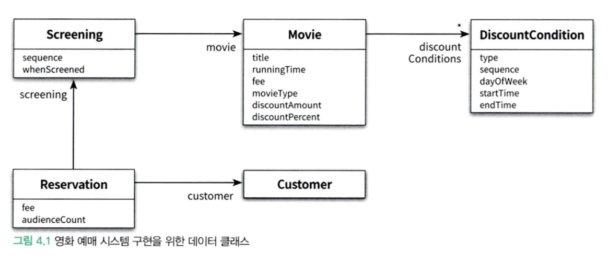
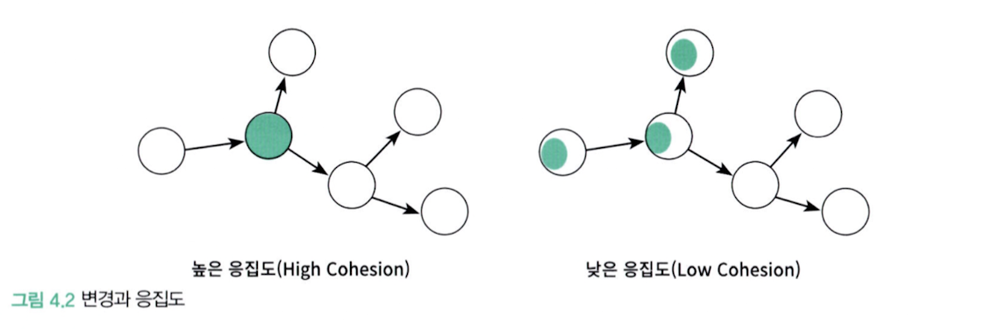
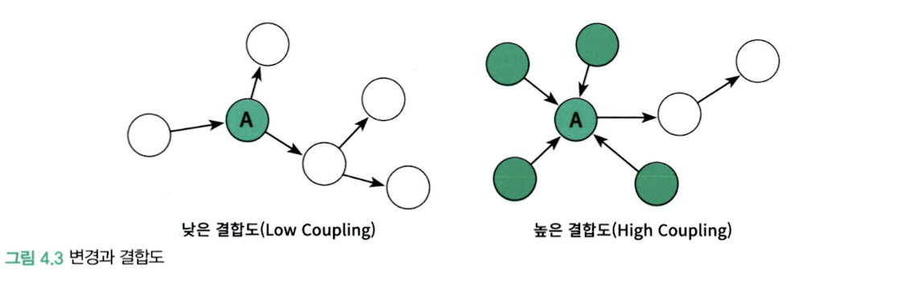
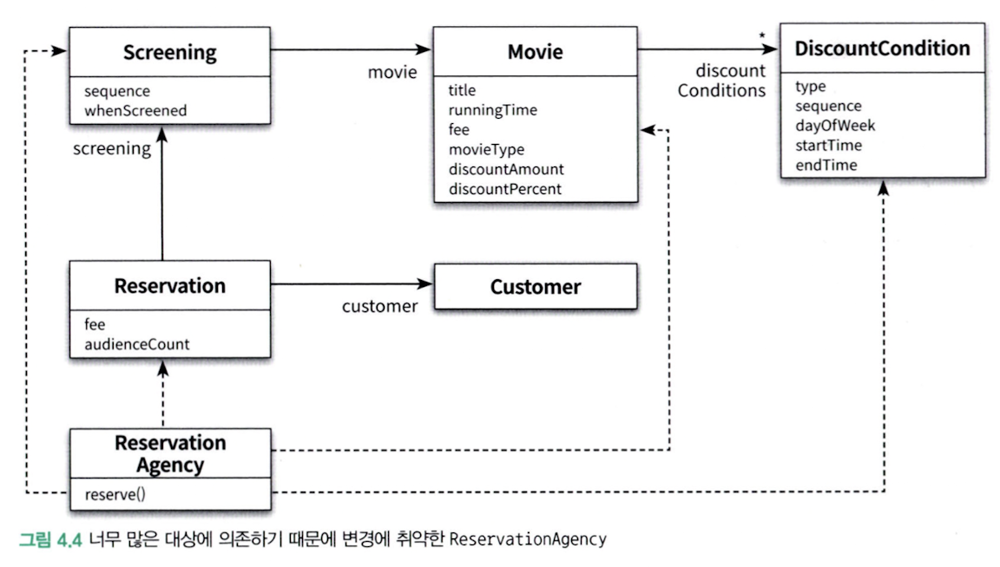

# Object Ch4

**객체지향 설계의 핵심은 `역할, 책임, 협력` 이다.**

- 협력 → 메시지를 주고받는 객체들 사이의 상호작용
- 책임 → 객체가 다른 객체와 협력하기 위해 수행하는 행동
- 역할 → 대체 가능한 책임의 집합

<br>

**책임 주도 설계**

> 이름에서 알 수 있는 것처럼, 가장 중요한 것은 `책임` 이다.

- 객체지향 설계란 올바른 객체에게 올바른 책임을 할당하면서 낮은 결합도와 높은 응집도를 가진 구조를 창조하는 활동
  1. 객체지향 설계의 핵심이 책임
  2. 책임을 할당하는 작업이 응집도와 결합도 같은 설계 품질과 깊이 연관돼 있다는 것

<br>

Q. 결합도와 응집도를 합리적인 수준으로 유지할 수 있는 원칙

**A. 객체의 상태가 아니라 객체의 행동에 초점을 맞추는 것**

객체를 단순한 데이터의 집합으로 바라보는 시각은 객체 내부 구현을 public Interface에 노출시키는 결과를 낳는다.

**영화 예매 시스템을 책임이 아닌 상태를 표현하는 데이터 중심의 설계를 살펴보고 객체지향적으로 설계한 구조와 어떤 차이점이 있는지 본다.**

---

### 데이터 중심의 영화 예매 시스템

> 데이터 중심의 관점에서 객체는 자신이 포함하고 있는 데이터를 조작하는 데 필요한 오퍼레이션을 정의한다.

↔ 책임 중심의 관점에서 객체는 다른 객체가 요청할 수 있는 오퍼레이션을 위해 필요한 상태를 보관한다.

<br>

**결론부터 말하자면 훌륭한 객체지향 설계는 데이터가 아니라 책임에 초점을 맞춰야 한다.**

- 상태를 객체 분할의 중심축으로 삼으면 구현에 관한 세부사항이 객체의 인터페이스에 스며들게 되어 캡슐화의 원칙이 무너진다.
- 결과적으로 상태 변경은 인터페이스의 변경을 초래하며 이 인터페이스에 의존하는 모든 객체에게 변경의 영향이 퍼지게 된다.

<br>

**객체는 책임을 드러내는 안정적인 인터페이스 뒤로 책임을 수행하는 데 필요한 상태를 캡슐화함으로써 구현 변경에 대한 파장이 외부로 퍼져나가는 것을 방지**

---

### 데이터 준비

```java
public class Movie {
    private String title;
    private Duration runningTime;
    private Money fee;
    private List<DiscountCondition> discountConditions;

    private MovieType movieType;
    private Money discountAmount;
    private double discountPercent;
}
```

일단 정한 거니 그렇게 가자.

movieType이 왜 들어가는 지를 생각해보면

- Movie가 할인 금액을 계산하는 데 필요한 데이터는 discountAmount 혹은 discountPercent인데, 어떤 정책이 적용되는 지를 알기 위해 사용한다.

<br>

```java
public enum MovieType {
    AMOUNT_DISCOUNT,    // 금액 할인 정책
    PERCENT_DISCOUNT,   // 비율 할인 정책
    NONE_DISCOUNT       // 미적용
}
```

이제 데이터를 준비했으니, 캡슐화를 위한 접근자, 수정자를 추가했다.

```java
public class Movie {
    public MovieType getMovieType() {
        return movieType;
    }

    public void setMovieType(MovieType movieType) {
        this.movieType = movieType;
    }

    public Money getFee() {
        return fee;
    }

    public void setFee(Money fee) {
        this.fee = fee;
    }

    public List<DiscountCondition> getDiscountConditions() {
        return Collections.unmodifiableList(discountConditions);
    }

    public void setDiscountConditions(List<DiscountCondition> discountConditions) {
        this.discountConditions = discountConditions;
    }

    public Money getDiscountAmount() {
        return discountAmount;
    }

    public void setDiscountAmount(Money discountAmount) {
        this.discountAmount = discountAmount;
    }

    public double getDiscountPercent() {
        return discountPercent;
    }

    public void setDiscountPercent(double discountPercent) {
        this.discountPercent = discountPercent;
    }
}

```

<br>

이와 같은 패턴으로

`DiscountCondition` , `Screening`, `Reservation`, `Customer` 클래스도 구현했다.



---

### 영화를 예매하자

```java
public class ReservationAgency {
    public Reservation reserve(Screening screening, Customer customer,
                               int audienceCount) {
        Movie movie = screening.getMovie();

        boolean discountable = false;
        for(DiscountCondition condition : movie.getDiscountConditions()) {
            if (condition.getType() == DiscountConditionType.PERIOD) {
                discountable = screening.getWhenScreened().getDayOfWeek().equals(condition.getDayOfWeek()) &&
                        condition.getStartTime().compareTo(screening.getWhenScreened().toLocalTime()) <= 0 &&
                        condition.getEndTime().compareTo(screening.getWhenScreened().toLocalTime()) >= 0;
            } else {
                discountable = condition.getSequence() == screening.getSequence();
            }

            if (discountable) {
                break;
            }
        }

        Money fee;
        if (discountable) {
            Money discountAmount = Money.ZERO;
            switch(movie.getMovieType()) {
                case AMOUNT_DISCOUNT:
                    discountAmount = movie.getDiscountAmount();
                    break;
                case PERCENT_DISCOUNT:
                    discountAmount = movie.getFee().times(movie.getDiscountPercent());
                    break;
                case NONE_DISCOUNT:
                    discountAmount = Money.ZERO;
                    break;
            }

            fee = movie.getFee().minus(discountAmount).times(audienceCount);
        } else {
            fee = movie.getFee().times(audienceCount);
        }

        return new Reservation(customer, screening, fee, audienceCount);
    }
}

```


---

## 설계 트레이드오프

> 데이터 중심 설계와 책임 중심 설계의 장단점을 비교하기 위해 **캡슐화**, **응집도**, **결합도를** 사용한다.

<br>

### **캡슐화**

> 외부에서 알 필요가 없는 부분을 감춤으로써 대상을 단순화하는 추상화의 한 종류

- 구현: 변경될 가능성이 높은 부분
- 인터페이스: 상대적으로 안정적인 부분

객체를 설계하기 위한 가장 기본적인 아이디어는 변경의 정도에 따라 구현과 인터페이스를 분리하고 외부에서는 인터페이스에만 의존하도록 관계를 조절하는 것

<br>

**정리**

> 캡슐화란 변경 가능성이 높은 부분을 객체 내부로 숨기는 추상화 기법

- 변경될 수 있는 어떤 것이라도 캡슐화해야 한다.

<br>

---

### 응집도와 결합도

**응집도**

- 모듈에 포함된 내부 요소들이 연관돼 있는 정도
  - 모듈 내의 요소들이 하나의 목적을 위해 긴밀하게 협력한다면 그 모듈은 높은 응집도를 가진다.
  - 모듈 내의 요소들이 서로 다른 목적을 추구한다면 그 모듈은 낮은 응집도를 가짐
- 객체지향의 관점에서 응집도는 객체 또는 클래스에 얼마나 관련 높은 책임들을 할당했는지를 나타냄

<br>

**결합도**

- 의존성의 정도를 나타내며 다른 모듈에 대해 얼마나 많은 지식을 갖고 있는지를 나타내는 척도
  - 어떤 모듈이 다른 모듈에 대해 너무 자세한 부분까지 알고 있다면 두 모듈은 높은 결합도를 가짐
  - 꼭 필요한 지식만 알고 있다면 두 모듈은 낮은 결합도를 가짐
- 객체지향의 관점에서 결합도는 객체 또는 클래스가 협력에 필요한 적절한 수준의 관계만을 유지하고 있는지를 나타냄

<br>

**일반적으로 좋은 설계란 `높은 응집도`와 `낮은 결합도` 를 가진 모듈로 구성된 설계를 의미한다.**

- 설계를 변경하기 쉽게 만들기 때문이다.

변경의 관점에서 응집도란 `변경이 발생할 때 모듈 내부에서 발생하는 변경의 정도` 로 측정할 수 있다.

- 하나의 변경을 수용하기 위해 모듈 전체가 함께 변경된다면 응집도가 높은 것이고 모듈의 일부만 변경된다면 응집도가 낮은 것
- 하나의 변경에 대해 하나의 모듈만 변경된다면 응집도가 높지만 다수의 모듈이 함게 변경돼야 한다면 응집도가 낮은 것



<br>

<br>

즉, 응집도가 높을수록 변경의 대상과 범위가 명확해지기 때문에 코드를 변경하기 쉬워진다.

변경의 관점에서 결합도란 `한 모듈이 변경되기 위해서 다른 모듈의 변경을 요구하는 정도` 로 측정할 수 있다.

- 하나의 모듈을 수정할 때 얼마나 많은 모듈을 함께 수정해야 하는지를 나타낸다.
- 따라서 결합도가 높으면 높을수록 함께 변경해야 하는 모듈의 수가 늘어나기 때문에 변경하기가 어려워진다.



<br>

<br>

결합도가 높아도 상관 없는 경우도 있다.

> 일반적으로 변경될 확률이 매우 적은 안정적인 모듈에 의존하는 것은 아무런 문제도 되지 않는다.

etc: Java - String, ArrayList와 같은 표준 라이브러리에 포함된 모듈

---

## 데이터 중심의 영화 예매 시스템의 문제점

> 캡슐화 위반, 높은 결합도, 낮은 응집도의 문제점을 가진다.

<br>

### 캡슐화 위반

> getter, setter를 한다고 캡슐화가 되는 걸까?

```java
public class Movie {
		private Money fee;

		public Money getFee() {
				return fee;
		}

		public void setFee(Money fee) {
				this.fee = fee;
		}
}
```

- 사실 getFee, setFee는 Movie 내부에 Money 타입의 fee라는 이름의 인스턴스 변수가 존재한다는 사실을 public Interface에 노골적으로 드러낸다.

<br>

**결과적으로 대부분의 내부 구현이 퍼블릭 인터페이스에 그대로 노출될 수밖에 없는 것**

- 그 결과, 캡슐화의 원칙을 위반하는 변경에 취약한 설계를 얻게 된다.

<br>

<br>

### 높은 결합도

- 데이터 중심이 설계는 접근자와 수정자를 통해 내부 구현을 인터페이스의 일부로 만들기 때문에 캡슐화를 위반한다.
- 객체 내부의 구현이 객체의 인터페이스에 드러난다는 것은 클라이언트가 구현에 강하게 결합된다는 것을 의미한다.
  - 단지 객체의 내부 구현을 변경했음에도 이 인터페이스에 의존하는 모든 클라이언트들도 함께 변경해야 한다는 것

```java
public class ReservationAgency {
		public Reservation reserve(Screening screening, Customer customer, int audienceCount) {
				...
				Money fee;

				if (discountable) {
						...
						fee = movie.getFee().minus(discountAmount).times(audienceCount);
				} else {
						fee = movie.getFee();
				}
				...
		}
}
```

<br>

**만약 `fee` 의 타입이 변경된다면? (Money →Dollar)**

1. getFee 메서드의 반환 타입도 수정해야 한다.
2. getFee 를 호출하는 ReservationAgency의 구현도 변경된 타입에 맞게 수정되어야 한다.

> 사실 getFee 메서드를 사용하는 것은 인스턴스 변수 fee의 가시성을 private → public 한 것과 같다

<br>

<br>

또 다른 단점

**`여러 데이터 객체들을 사용하는 제어 로직이 특정 객체 안에 집중`되기 때문에**

**하나의 제어 객체가 다수의 데이터 객체에 강하게 결합된다.**



<br>

<br>

### 낮은 응집도

- 다음과 같은 수정사항이 발생하는 경우에 ReservationAgency의 코드를 수정해야 할 것
  - 할인 정책 추가, 계산 방법의 변경, 할인 조건 추가… etc
- 두 가지의 측면에서 설계에 문제를 일으킨다.
  - 변경의 이유가 서로 다른 코드들을 하나의 모듈 안에 뭉쳐놨기 때문에 변경과 아무 상관이 없는 코드들이 영향을 받음
  - 하나의 요구사항 변경을 반영하기 위해 동시에 여러 모듈을 수정해야 한다.
    - etc: 영화 할인 정책 추가 시 MovieType, ReservationAgency(`reserve`), Movie에 수정이 필요

**어떤 요구사항 변경을 수용하기 위해 하나 이상의 클래스를 수정해야 하는 것은 설계의 응집도가 낮다는 것**

---

## 자율적인 객체를 향해

### 캡슐화를 지켜라

> 객체는 자신이 어떤 데이터를 가지고 있는지를 내부에 캡슐화하고 외부에 공개해선 안된다.

- 객체는 스스로의 상태를 책임져야 하며 외부에서는 인터페이스에 정의된 메서드를 통해서만 상태에 접근할 수 있어야 한다.

<br>

### 스스로 자신의 데이터를 책임지는 객체

> 객체를 설계할 대 “이 객체가 어떤 데이터를 포함해야 하는가?” 라는 질문은 다음과 같은 두 개의 개별적인 질문으로 분리해야 한다.

1. 이 객체가 어떤 데이터를 포함해야 하는가?
2. 이 객체가 데이터에 대해 수행해야 하는 오퍼레이션은 무엇인가?

→ 이 두 질문을 조합하면 객체의 내부 상태를 저장하는 방식과 저장된 상태에 대해 호출할 수 있는 오퍼레이션의 집합을 얻을 수 있다.

---

### 데이터 중심 설계의 문제점

> 너무 이른 시기에 데이터에 관해 결정하고, 협력이라는 문맥을 고려하지 않고 객체를 고립시킨 채 오퍼레이션을 결정하는 문제를 가진다.

**데이터 중심 설계는 객체의 행동보다는 상태에 초점을 맞춘다.**

- 데이터를 먼저 결정하고 데이터를 처리하는 데 필요한 오퍼레이션을 나중에 결정하는 방식은 데이터에 관한 지식이 객체의 인터페이스에 고스란히 드러나게 된다.

<br>

**데이터 중심 설계는 객체를 고립시킨 채 오퍼레이션을 정의하도록 만든다.**

- 데이터 중심 설계에서 초점은 객체의 외부가 아니라 내부로 향한다.
  - 실행 문맥에 대한 깊이 있는 고민 없이 객체가 관리할 데이터의 세부 정보를 먼저 결정한다.
  - 객체의 구현이 이미 결정된 상태에서 다른 객체와의 협력 방법을 고민하기 때문에 이미 구현된 객체의 인터페이스를 억지로 끼워맞출 수밖에 없다.
- 객체의 인터페이스에 구현이 노출돼 있었기 때문에 협력이 구현 세부사항에 종속돼 있고 그에 따라 객체의 내부 구현이 변경됐을 때 협력하는 객체 모두가 영향을 받을 수밖에 없다.

---
