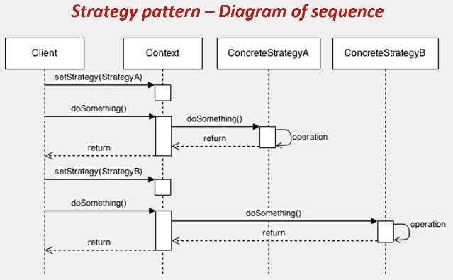
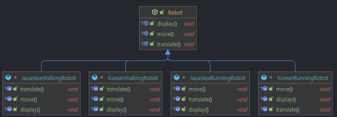

# 03.22 TIL(1)

날짜: 2025년 3월 22일
과목: Design Pattern
유형: 개인공부
상태: Done

### 참고

[💠 전략(Strategy) 패턴 - 완벽 마스터하기](https://inpa.tistory.com/entry/GOF-%F0%9F%92%A0-%EC%A0%84%EB%9E%B5Strategy-%ED%8C%A8%ED%84%B4-%EC%A0%9C%EB%8C%80%EB%A1%9C-%EB%B0%B0%EC%9B%8C%EB%B3%B4%EC%9E%90)

### 전략 패턴 (Strategy Pattern)

- 객체지향 프로그래밍의 디자인 패턴 중 하나
  - **행동 패턴(Behavior Pattern)에 속함.**
  - 알고리즘 군을 정의하고 각각 캡슐화하여 (객체 동작을) 실시간으로 교체 가능하게 만드는 패턴



- 어케 하는 건데?
  1. 동일 계열의 알고리즘군을 정의 → **전략 구현체로 정의**
  2. 각각의 알고리즘을 캡슐화하여 → 인터페이스로 추상화
  3. 이들을 상호 교환이 가능하도록 만든다. → 합성(composition)으로 구성
  4. 알고리즘을 사용하는 클라이언트와 상관없이 독립적으로 → 컨텍스트 객체 수정 없이
  5. 알고리즘을 다양하게 변경할 수 있게 한다. → 메소드를 통해 전략 객체를 실시간으로 변경함으로써 전략을 변경
- **구성 요소**

  - **전략 알고리즘 객체들** : 알고리즘, 행위, 동작을 객체로 정의한 구현체
  - **전략 인터페이스** : 모든 전략 구현제에 대한 공용 인터페이스
  - **컨텍스트(Context)** : 알고리즘을 실행해야 할 때마다 해당 알고리즘과 연결된 전략 객체의 메소드를 호출.
  - **클라이언트** : 특정 전략 객체를 컨텍스트에 전달 함으로써 전략을 등록하거나 변경하여 전략 알고리즘을 실행한 결과를 누린다.

    [https://inpa.tistory.com/entry/GOF-💠-전략Strategy-패턴-제대로-배워보자](https://inpa.tistory.com/entry/GOF-%F0%9F%92%A0-%EC%A0%84%EB%9E%B5Strategy-%ED%8C%A8%ED%84%B4-%EC%A0%9C%EB%8C%80%EB%A1%9C-%EB%B0%B0%EC%9B%8C%EB%B3%B4%EC%9E%90)

### 전략 패턴을 적용하지 않은 경우

- 아래 코드의 문제
  - 새로운 할인 정책을 추가할 때 `calculateDiscount()` 메서드를 수정해야함.
  - OCP 위반

```java
public class DiscountService {
		public enum DiscountType {
				FIXED, PERCENT, NONE
		}

		private DiscountType discountType;

		public DiscountService(DiscountType discountType) {
				this.discountType = discountType;
		}

		public int calculateDiscount(int price) {
				if (discountType == DiscountType.FIXED) {
						return price - 1000;
				} else if (discountType == DiscountType.PERCENT) {
						return price - (price * 10 / 100);
				} else {
						return price;
				}
		}
}
```

### 전략 패턴을 적용한 경우

```java
// 전략 인터페이스
public interface DiscountStrategy {
    int applyDiscount(int price);
}

// 구체적인 전략 1: 고정 할인
public class FixedDiscountStrategy implements DiscountStrategy {
    private int discountAmount = 1000;

    @Override
    public int applyDiscount(int price) {
        return price - discountAmount;
    }
}

// 구체적인 전략 2: 퍼센트 할인
public class PercentDiscountStrategy implements DiscountStrategy {
    private int discountPercent = 10;

    @Override
    public int applyDiscount(int price) {
        return price - (price * discountPercent / 100);
    }
}

// 구체적인 전략 3: 할인 없음
public class NoDiscountStrategy implements DiscountStrategy {
    @Override
    public int applyDiscount(int price) {
        return price;
    }
}

// 컨텍스트
public class DiscountService {
    private DiscountStrategy discountStrategy;

    public void setDiscountStrategy(DiscountStrategy discountStrategy) {
        this.discountStrategy = discountStrategy;
    }

    public int calculateDiscount(int price) {
        return discountStrategy.applyDiscount(price);
    }
}

// 사용 예시
public class Main {
    public static void main(String[] args) {
        DiscountService discountService = new DiscountService();
        int price = 10000;

        // 고정 할인 적용
        discountService.setDiscountStrategy(new FixedDiscountStrategy());
        System.out.println("고정 할인 후 가격: " + discountService.calculateDiscount(price));

        // 퍼센트 할인 적용
        discountService.setDiscountStrategy(new PercentDiscountStrategy());
        System.out.println("퍼센트 할인 후 가격: " + discountService.calculateDiscount(price));
    }
}
```

- 만약 새로운 할인 전략이 추가된다면?
  - 기존 코드를 수정할 필요가 없음.

```java
// 새로운 구체적인 전략: 회원 등급별 할인
public class MembershipDiscountStrategy implements DiscountStrategy {
    private String membershipLevel;

    public MembershipDiscountStrategy(String membershipLevel) {
        this.membershipLevel = membershipLevel;
    }

    @Override
    public int applyDiscount(int price) {
        if ("GOLD".equals(membershipLevel)) {
            return price - (price * 15 / 100); // 15% 할인
        } else if ("SILVER".equals(membershipLevel)) {
            return price - (price * 10 / 100); // 10% 할인
        } else {
            return price - (price * 5 / 100);  // 5% 할인
        }
    }
}
```

### 장점?

- 기존 코드 수정 없이 새로운 할인 전략을 추가할 수 있음 (OCP 만족)
- 각 전략은 자신의 로직에만 집중함 (SRP 만족)
- 런타임에 할인 정책을 유연하게 바꿀 수 있음
- 테스트 용이성이 증가함

### 예제



이거를


