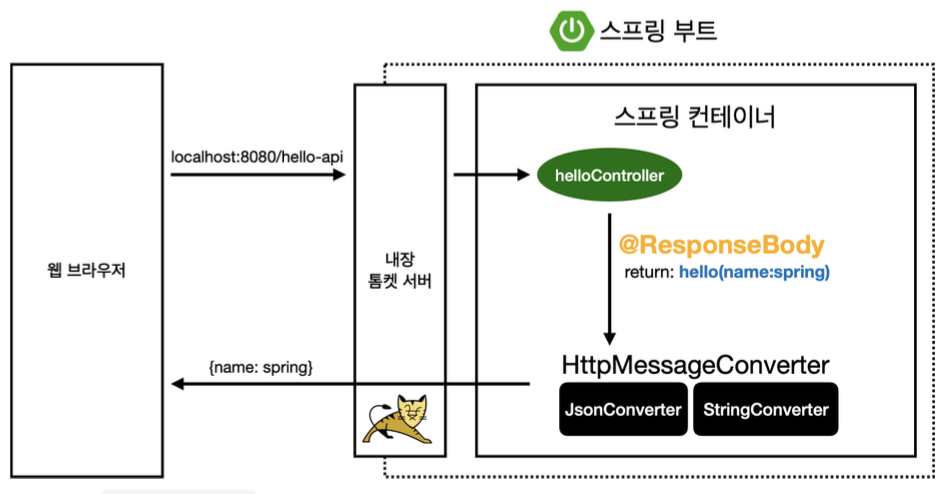
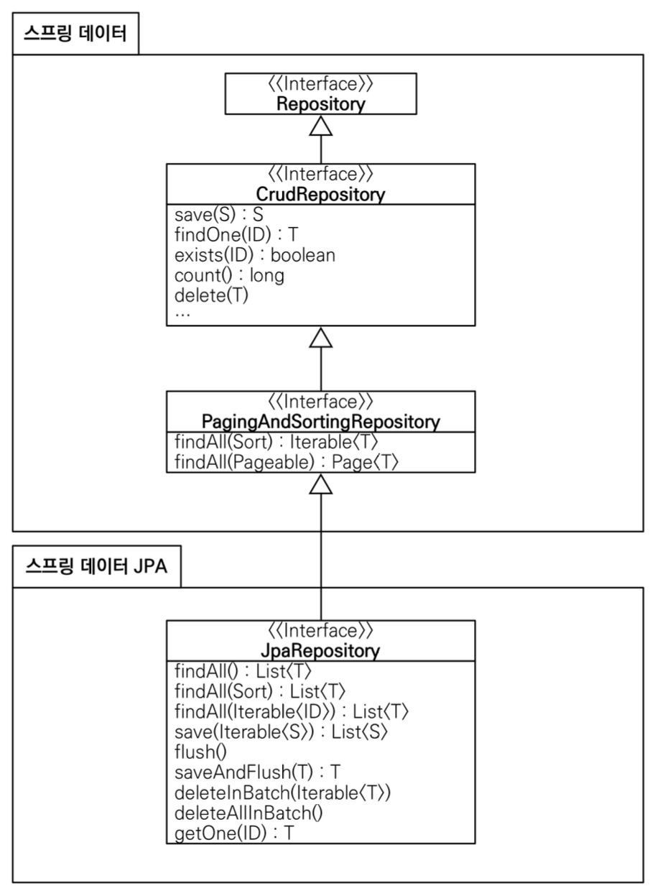

# 03.22 TIL(2)

### Spring

- 자바 enterprise 애플리케이션 개발을 위한 오픈소스 프레임워크
- 주요 특징
  - IoC, DI를 핵심 개념으로 사용
  - AOP 지원으로 비즈니스 로직과 공통 기능 분리
  - POJO(Plain Old Java Object) 기반 개발 방식 지원
  - 다양한 모듈(Spring MVC, Spring Data, Spring Security 등) 제공

```java
// 스프링 DI 예시
@Service
public class UserService {
    private final UserRepository userRepository;

    // 생성자를 통한 의존성 주입
    public UserService(UserRepository userRepository) {
        this.userRepository = userRepository;
    }
}
```

### Spring Boot

- 스프링 프레임워크를 더 쉽게 사용할 수 있도록 만든 프로젝트
- 주요 특징
  - 내장 서버(`톰캣`, 제티…) 제공으로 독립 실행 가능한 애플리케이션 생성
  - `자동 설정(Auto Configuration)`으로 복잡한 설정 코드 최소화
  - `Spring Boot Starters` 으로 쉬운 의존성 관리
  - 운영 환경에서 필요한 모니터링 기능 제공(`Actuator`)
  - XML 설정 없이 Java 코드와 어노테이션만으로 설정 가능

```java
// 스프링 부트 애플리케이션 시작점
@SpringBootApplication
public class MyApplication {
    public static void main(String[] args) {
        SpringApplication.run(MyApplication.class, args);
    }
}
```

<br>

**Auto Configuration**

- 애플리케이션 실행에 필요한 빈(Bean)들을 자동으로 등록해주는 기능
- 주요 특징
  - `classPath에` 있는 라이브러리를 기반으로 설정을 자동화함
  - `@EnableAutoConfiguration` 또는 `@SpringBootApplication` 어노테이션으로 활성화됨
  - 개발자가 직접 설정하지 않아도 스프링 부트가 상황에 맞는 설정을 추론함
  - `application.properties`나 `application.yml`에서 속성값만 변경하면 쉽게 커스터마이징 가능
- 예시
  - H2 DB가 클래스패스에 있으면 자동으로 데이터베이스 연결 설정
  - Thymeleaf가 있으면 `ViewResolver` 자동 설정
  - 톰캣이 있으면 웹 서버 자동 설정

```java
// 자동 설정의 내부 구현 예시 (실제 코드는 더 복잡함)
@Configuration
@ConditionalOnClass(DataSource.class)
public class DataSourceAutoConfiguration {

    @Bean
    @ConditionalOnMissingBean
    public DataSource dataSource() {
        // DataSource 빈 생성 로직
    }
}
```

<br>

**Spring Boot Starters**

- 특정 기능을 쉽게 추가할 수 있도록 관련 의존성을 미리 모아둔 패키지
- 주요 특징
  - 하나의 스타터만 추가해도 관련된 모든 라이브러리가 함께 추가됨
  - 라이브러리 간 버전 호환성 문제를 해결해줌
  - 의존성 관리의 복잡성을 크게 줄임
  - 일관된 명명 규칙: `spring-boot-starter-\*`  형식

```java
// build.gradle 예시
dependencies {
    // 웹 애플리케이션 개발에 필요한 모든 라이브러리 포함
    implementation 'org.springframework.boot:spring-boot-starter-web'

    // JPA 관련 모든 라이브러리 포함
    implementation 'org.springframework.boot:spring-boot-starter-data-jpa'
}
```

<br>

**Bean**

- 스프링 `IoC` 컨테이너가 관리하는 자바 객체
- 주요 특징
  - 스프링 컨테이너가 생성, 관리, 소멸시키는 객체
  - 싱글톤(`Singleton`) 패턴으로 관리되는 것이 기본 설정
  - 의존성 주입(`DI`)의 대상이 됨
  - XML 설정, 자바 설정, 어노테이션 등으로 등록 가능
- 등록 방법

  - 어노테이션 방식

    ```java
    @Component  // 가장 기본적인 빈 등록 어노테이션
    public class UserService {
        // ...
    }

    @Controller  // MVC의 컨트롤러로 등록
    @Service     // 비즈니스 로직 담당
    @Repository  // 데이터 접근 담당
    // 이들도 모두 @Component를 포함하고 있어 빈으로 등록됨
    ```

  - 자바 설정 클래스

    ```java
    @Configuration
    public class AppConfig {

        @Bean
        public UserService userService() {
            return new UserService(userRepository());
        }

        @Bean
        public UserRepository userRepository() {
            return new JpaUserRepository();
        }
    }
    ```

- 스프링 IoC 컨테이너는 이렇게 등록된 빈들을 생성하고 관리함.
  - 각 빈은 생명주기를 가지며, 스프링은 빈들간의 의존성을 자동으로 연결해줌
- 왜 쓰게 됨?
  - 객체 생성과 의존성 관리를 개발자가 직접 하지 않아도 됨
  - 테스트하기 쉬운 구조를 만듦 (의존성 `mocking` 용이)
  - `AOP` 적용이 가능
  - (기본)싱글톤으로 관리되어 메모리 사용을 효율적으로 함.

<br>

**스프링 컨테이너?**

- 빈(Bean)의 생명주기를 관리하고 의존성 주입을 담당하는 핵심 엔진
- 주요 특징
  - 빈 객체의 생성, 관리, 의존성 주입을 담당함
  - 객체 간의 의존 관계를 설정하고 연결함

---

### Gradle?

- 빌드 자동화 도구
- 자바 프로젝트에서 코드를 컴파일하고, 테스트하고, 패키징하는 과정을 자동화해주는 시스템
- **주요 특징**
  - `JVM` 기반의 오픈소스 빌드 도구
  - Groovy, Kotlin DSL을 사용해 빌드 스크립트 작성 가능
  - 의존성 관리, 테스트 실행, JAR 파일 생성 등 다양한 작업 지원
  - `Maven`보다 더 유연하고 성능이 좋음

---

### build.gradle

- Gradle 프로젝트의 빌드 설정 파일.
- 프로젝트의 구조, 의존성, 태스크 등을 정의하는 스크립트 파일
- **주요 내용**
  - 프로젝트에 필요한 플러그인 정의
  - 외부 라이브러리 의존성 설정
  - 프로젝트 정보(버전, 그룹 등) 설정
  - 커스텀 태스크 정의

**예시**

```java
plugins {
    id 'org.springframework.boot' version '2.7.0'
    id 'java'
}

group = 'com.example'
version = '0.0.1-SNAPSHOT'

repositories {
    mavenCentral()
}

dependencies {
    implementation 'org.springframework.boot:spring-boot-starter-web'
    testImplementation 'org.springframework.boot:spring-boot-starter-test'
}

test {
    useJUnitPlatform()
}
```

---

### 동작 환경 그림


**톰캣 서버**

- 자바 서블릿 컨테이너. 스프링 부트에서는 별도 설치 없이 내장된 형태로 제공
- 주요 특징
  - HTTP 요청을 받아서 자바 애플리케이션에 전달하는 역할
  - 웹 브라우저의 요청(localhost:8080/hello)을 받아 스프링 컨테이너로 전달
  - 스프링 부트에서는 `application.properties`나 `application.yml`에서 포트 등 설정 가능
  - 스프링 부트의 자동 설정 덕분에 별도 설정 없이도 작동함.

<br>

**Controller**

- 컨트롤러는 MVC에서 C를 담당
  > 클라이언트 요청을 처리하고 응답을 반환하는 역할을 한다.
- 주요 특징
  - @Controller 또는 @RestController 어노테이션을 사용해 정의
  - @RequestMapping, @GetMapping 등으로 URL 경로 매핑
  - 요청 파라미터 처리, 비즈니스 로직 호출, 모델 데이터 설정 등 담당
  - 그림의 helloController는 “/hello” 경로로 들어온 요청을 처리
  ```java
  @Controller
  public class HelloController {
      @GetMapping("/hello")
      public String hello(Model model) {
          model.addAttribute("data", "hello!!");
          return "hello";
      }
  }
  ```

<br>

**ViewResolver**

- 컨트롤러 반환한 뷰 이름을 실제 뷰 객체로 변환해주는 역할을 한다.
- 주요 특징
  - 컨트롤러가 반환한 문자열(”hello”)을 실제 뷰 파일 경로로 변환
  - 스프링 부트에서는 기본적으로 /templates/ 폴더 아래의 파일을 찾음
  - Thymeleaf, JSP, Freemarker 등 다양한 템플릿 엔진 지원
  - 그림에서는 Thymeleaf 템플릿 엔진을 사용해 hello.html 파일을 처리함.

**전체 흐름**

1. 웹 브라우저에서 [localhost:8080/hello](http://localhost:8080/hello) 요청
2. 내장 톰캣 서버가 요청 수신
3. 스프링 컨테이너 내의 helloController가 요청 처리
4. 컨트롤러가 모델에 “data!!” 데이터를 추가하고 “hello” 반환
5. ViewResolver가 “hello”를 /templates/hello.html 파일로 변환
6. Thymeleaf 템플릿 엔진이 HTML 파일 처리 (데이터 바인딩)
7. 변환된 HTML이 웹 브라우저로 전송

---

### 정적 컨텐츠

- 서버에서 별도의 처리 없이 파일을 그대로 웹 브라우저에 전달하는 방식


**과정**

1. 웹 브라우저에서 [localhost:8080/hello-static.html](http://localhost:8080/hello-static.html) 요청
2. 내장 톰캣 서버가 요청을 받음
3. 스프링 컨테이너에서 hello-static 관련 컨트롤러를 먼저 찾음
4. 컨트롤러가 없으면 resources/static 폴더에서 hello-static.html 파일을 찾음
5. 해당 파일을 그대로 웹 브라우저에 반환

**그렇다면 동적 컨텐츠는요?**

- 정적 컨텐츠는 서버에서 가공 없이 그대로 전달되지만, 동적 컨텐츠는 템플릿 엔진(Thymeleaf, JSP 등)을 통해 서버에서 HTML을 가공한 후 전달됨

---

### MVC 패턴

- Model-View-Controller의 약자, 웹 애플리케이션 구조를 세 가지 역할로 나눈 디자인 패턴.
- 각 요소의 역할이 분리되어 코드 유지보수와 확장이 용이해짐
  - Model: 데이터와 비즈니스 로직 담당
  - View: 사용자에게 보여지는 화면 담당
  - Controller: 사용자 요청을 처리하고 Model, View 연결 담당

**템플릿 엔진**

- 정적 HTML에 데이터를 동적으로 삽입하여 최종 HTML을 생성하는 도구.
  - Thymeleaf, JSP, Freemarker

**동작 과정**

1. 웹 브라우저에서 [localhost:8080/hello-mvc](http://localhost:8080/hello-mvc) 요청
2. 내장 톰캣 서버가 요청 받음
3. 스프링 컨테이너의 helloController로 요청 전달
4. 컨트롤러에서 hello-template을 뷰 이름으로 지정하고, model에 name:spring 데이터 추가
5. viewResolver가 뷰 이름에 해당하는 templates/hello-template.html 파일 찾음

```java
@Controller
public class HelloController {
    @GetMapping("hello-mvc")
    public String helloMvc(@RequestParam("name") String name, Model model) {
        model.addAttribute("name", name);
        return "hello-template";
    }
}
```

```html
<!-- templates/hello-template.html -->
<html xmlns:th="http://www.thymeleaf.org">
  <body>
    <p th:text="'안녕하세요. ' + ${name}">안녕하세요. 손님</p>
  </body>
</html>
```

1. Thymeleaf 템플릿 엔진이 HTML 파일을 처리 (모델 데이터 삽입)
2. 변환된 HTML이 웹 브라우저에 반환됨.

---

### API

**@ResponseBody**

- HTTP 응답 본문에 직접 데이터를 반환하는 어노테이션
- 이를 사용하면 뷰 템플릿을 거치지 않고 데이터를 클라이언트에 바로 전송함/



<br>

**문자열 반환**

- 문자열을 직접 반환하는 방식

  ```java
  @Controller
  public class HelloController {

  		@GetMapping("hello-string")
  		@ResponseBody
  		public String helloString(@RequestParam("name") String name) {
  				return "hello " + name;
  		}
  }
  ```

- 객체 반환 (JSON)

  ```java
  @GetMapping("hello-api")
  @ResponseBody
  public Hello helloApi(@RequestParam("name") String name) {
      Hello hello = new Hello();
      hello.setName(name);
      return hello;
  }

  static class Hello {
      private String name;

      public String getName() {
          return name;
      }

      public void setName(String name) {
          this.name = name;
      }
  }
  ```

<br>

**HTTP Message Converter**

- @ResponseBody를 사용하면 다음과 같은 처리가 일어난다.
  1. 객체 반환 시 기본값으로 JSON 형태로 반환
  2. 스프링은 객체 → JSON 변환을 위해 Jackson 라이브러리(기본 내장)을 사용
  3. 결과적으로 브라우저에는 {”name”:”spring”} 형태로 출력됨
- 특징
  - 기본 문자처리: `StringHttpMessageConverter`
  - 기본 객체처리: `MappingJackson2HttpMessageConverter`
  - byte 처리 등등 기타 여러 HttpMessageConverter가 기본으로 등록되어 있음

<br>

**REST API**

- 이러한 방식으로 개발하는 것이 REST API의 기본 원리
- 클라이언트에게 데이터만 제공하고 화면은 클라이언트 측에서 구성하는 방식이 최근 웹 개발 트렌드
- 스프링에서는 @ResponseBody, @RestController를 통해 REST API를 쉽게 구현할 수 있음.
  - @RestController는 클래스 레벨에서 모든 메서드에 @ResponseBody가 적용된 효과를 준다.

---

### 일반적인 웹 애플리케이션 계층 구조


- Controller: 웹 MVC의 컨트롤러 역할
- Service: 핵심 비즈니스 로직 구현
- Repository: 데이터베이스에 접근, 도메인 객체를 DB에 저장하고 관리
- Domain: 비즈니스 도메인 객체 (회원, 주문, 쿠폰 등등 주로 데이터베이스에 저장하고 관리됨)

<br>

### 테스트 코드

- 자바는 JUnit이라는 프레임워크로 테스트를 실행한다.

**예시**

```java

...

class MemberServiceTest {

    MemberService memberService;
    MemoryMemberRepository memoryMemberRepository;

    @BeforeEach
    public void beforeEach() {
        memoryMemberRepository = new MemoryMemberRepository();
        memberService = new MemberService(memoryMemberRepository);
    }

    @AfterEach
    public void afterEach() {
        memoryMemberRepository.clearStore();
    }

    @Test
    void 회원가입() {
		    // given
		    // when
		    // then
    }
}
```

- @AfterEach
  - 한번에 여러 테스트를 실행하면 메모리 DB에 직전 테스트의 결과가 남을 수 있다.
  - 이를 통해 DB에 저장된 데이터를 삭제
- @BeforeEach
  - 테스트 실행 전에 호출된다.
  - 테스트가 서로 영향이 없도록 항상 새로운 객체를 생성하고, 의존관계도 새로 맺어준다.
- 테스트는 각각 독립적으로 실행되어야 한다.
  - 테스트 순서에 의존관계가 있는 것은 좋은 테스트가 아니다.

---

### 컴포넌트 스캔과 자동 의존관계 설정

- 컴포넌트 스캔은 @Component 어노테이션이 붙은 클래스를 자동으로 스프링 빈으로 등록하는 기능
- @Controller, @Service, @Repository 등은 모두 @Component를 포함하고 있어 자동 등록됨.

```java
@Controller
public class MemberController {
    private final MemberService memberService;

    @Autowired
    public MemberController(MemberService memberService) {
        this.memberService = memberService;
    }
}
```

**@Autowired?**

- @Autowired가 생성자에 붙으면 스프링이 해당 타입의 빈을 찾아 주입한다.
- 생성자가 하나면 @Autowired 생략 가능
- 의존성 주입 방법: 생성자 주입, 필드 주입, setter 주입 (생성자 주입 권장)

**의존성 주입 방법**

1. Constructor Injection

   ```java
   @Service
   public class MemberService {
       private final MemberRepository memberRepository;

       @Autowired // 생성자가 하나만 있으면 생략 가능
       public MemberService(MemberRepository memberRepository) {
           this.memberRepository = memberRepository;
       }
   }
   ```

   - 특징
     - 객체 생성 시점에 의존성 주입
     - final 키워드 사용 가능 (불변성)
     - 순환 참조 문제를 컴파일 시점에 발견 가능
     - 테스트 코드 작성 용이

2. Field Injection

   ```java
   @Service
   public class MemberService {
       @Autowired
       private MemberRepository memberRepository;

       // 생성자 없이 필드에 직접 주입
   }
   ```

   - 특징
     - 코드가 간결함
     - 테스트하기 어려움 (직접 의존성 주입 불가)
     - final 키워드 사용 불가
     - 순환 참조 발견이 어려움

3. setter Injection

   ```java
   @Service
   public class MemberService {
       private MemberRepository memberRepository;

       @Autowired
       public void setMemberRepository(MemberRepository memberRepository) {
           this.memberRepository = memberRepository;
       }
   }
   ```

   - 특징
     - 선택적 의존성 주입 가능
     - 런타임에 의존성 변경 가능
     - final 키워드 사용 불가
     - 의존관계가 변경될 가능성이 있을 때 사용

<br>

**생성자 주입이 권장되는 이유**

1. 필수 의존성을 명확히 표현할 수 있음
2. 불변성 보장 (final 키워드)
3. 순환 참조 문제를 컴파일 시점에 발견
4. 테스트 코드 작성이 용이
5. 스프링 공식 문서에서도 권장

---

### Spring Bean 등록 방법

1. **컴포넌트 스캔 방식**
   - @Component 계열 어노테이션 사용
   - 개발자가 작성한 클래스를 자동으로 스캔하여 빈 등록
2. **자바 코드로 직접 등록**

   ```java
   @Configuration
   public class SpringConfig {
       @Bean
       public MemberService memberService() {
           return new MemberService(memberRepository());
       }

       @Bean
       public MemberRepository memberRepository() {
           return new MemoryMemberRepository();
       }
   }
   ```

**주의사항**

- `@Autowired`는 스프링이 관리하는 객체에서만 동작함
- 개발자가 직접 생성한 객체에서는 작동하지 않음

---

## 스프링 DB 접근 기술

### **DataSource**

- 데이터베이스 커넥션을 획득할 때 사용하는 객체
- 스프링 부트는 데이터베이스 커넥션 정보를 바탕으로 DataSource를 생성하고 스프링 빈으로 만들어둠.

  - 그 이후 DI를 받을 수 있다.

    ```java
    @Configuration
    public class SpringConfig {
        private final DataSource dataSource;

        public SpringConfig(DataSource dataSource) {
            this.dataSource = dataSource;
        }

        @Bean
        public MemberRepository memberRepository() {
            return new JdbcMemberRepository(dataSource);
        }
    }
    ```

- application.properties에서 설정한다.
  ```java
  spring.datasource.url=jdbc:h2:tcp://localhost/~/test
  spring.datasource.driver-class-name=org.h2.Driver
  spring.datasource.username=sa
  ```

<br>

### **JPA**

- Java Persistence API의 약자.
- 자바 진영의 Object Relational Mapping 기술 표준
- 기존 반복 코드, 기본적인 SQL도 직접 만들어서 실행해준다.

- 장점

  - 기존 반복 코드 대폭 감소
  - SQL과 데이터 중심 설계에서 객체 중심 설계로 패러다임 전환 가능
  - 개발 생산성 향상

- 설정
  - ddl-auto: JPA의 테이블 자동 생성 기능 설정 (none: 끔, create: 엔티티 정보로 테이블 생성)
  ```java
  spring.jpa.show-sql=true
  spring.jpa.hibernate.ddl-auto=none
  ```

<br>

**JPA가 제공하는 CRUD 작업 예시**

```java
public Member save(Member member) {
    em.persist(member);
    return member;
}

public Optional<Member> findById(Long id) {
    Member member = em.find(Member.class, id);
    return Optional.ofNullable(member);
}
```

<br>

### Entity

- Entity는 JPA에서 테이블과 매핑되는 자바 객체를 의미
- @Entity 어노테이션을 클래스에 붙여서 해당 클래스가 JPA 관리 대상임을 나타낸다.

  - @Id: 테이블의 PK와 매핑되는 필드
  - @GeneratedValue: PK 생성 전략 설정

  ```java
  @Entity
  public class Member {
      @Id @GeneratedValue(strategy = GenerationType.IDENTITY)
      private Long id;
      private String name;

      // getter, setter
  }
  ```

- Model은 더 넓은 개념으로 도메인 객체를 나타냄
  - Entity는 Model의 한 종류로 DB와 직접 매핑되는 객체를 특별히 지칭함.

<br>

### Transaction

- 데이터베이스의 상태를 변환시키는 작업의 단위
- ACID 특성을 가진다.
  - Atomicity, Consistency, Isolation, Durability
- 스프링에서는 @Transactional 어노테이션을 통해 트랜젝션을 관리함
  ```java
  @Transactional
  public class MemberService {
      // ...
  }
  ```

<br>

**@Transactional**

- 클래스나 메서드에 적용 가능
- 스프링은 해당 클래스의 메서드 실행 시 트랜잭션을 시작
- 메서드가 정상 종료되면 트랜잭션 커밋
- 런타임 예외 발생 시 롤백

→ JPA를 통한 모든 데이터 변경은 트랜잭션 안에서 실행되어야 함

<br>

### Spring Data JPA

- JPA를 더 편리하게 사용할 수 있도록 도와주는 라이브러리
- 인터페이스 선언만으로 구현 클래스를 자동으로 생성해줌

<br>

**특징**

- 인터페이스만 작성하면 구현체는 스프링이 자동으로 만들어줌
- findByName()처럼 메서드 이름만으로 조회 기능 제공
- 기본 CRUD 기능 자동 제공
- 페이징 기능 자동 제공



<br>

**예시**

```java
public interface SpringDataJpaMemberRepository extends JpaRepository<Member, Long>, MemberRepository {
    Optional<Member> findByName(String name);
}
```

**설정 방법**

```java
@Configuration
public class SpringConfig {
    private final MemberRepository memberRepository;

    public SpringConfig(MemberRepository memberRepository) {
        this.memberRepository = memberRepository;
    }

    @Bean
    public MemberService memberService() {
        return new MemberService(memberRepository);
    }
}
```

> 스프링 데이터 JPA를 사용하면 개발 생산성이 매우 높아지고, 반복적인 코드 작성을 줄일 수 있슴. 실무에서는 JPA와 스프링 데이터 JPA를 기본으로 사용하고, 복잡한 동적 쿼리는 Querydsl을 사용하는 것이 추천됨.

---

### AOP

- Aspect oriented programming → 관점 지향 프로그래밍
  - 객체지향 프로그래밍을 보완하는 중요한 프로그래밍 패러다임
- **공통 관심사와 핵심 관심사를 분리하는 프로그래밍 방법**

**언제 필요할까?**

- 모든 메서드의 호출 시간을 측정하고 싶을 때
- 트랜잭션 처리, 로깅, 보안과 같은 공통 기능이 여러 곳에서 필요할 때
- 핵심 비즈니스 로직에 영향을 주지 않고 추가 기능을 넣고 싶을 때

예로, 회원 가입과 회원 조회 시간을 측정하려면 각 메소드에 시간 측정 코드를 넣어야 함.

```java
public Long join(Member member) {
    long start = System.currentTimeMillis();
    try {
        validateDuplicateMember(member); //중복 회원 검증
        memberRepository.save(member);
        return member.getId();
    } finally {
        long finish = System.currentTimeMillis();
        long timeMs = finish - start;
        System.out.println("join " + timeMs + "ms");
    }
}
```

<br>

**AOP 없이 구현할 때의 문제**

- 시간 측정 로직 → 공통 관심사항
- **핵심 비즈니스 로직과 공통 관심사항이 섞여서 유지보수가 어려움**
- 유지보수성 우우

우리가 원하는 것은 아래 그림과 같은 공통 관심사항을 한번에 관리하는 것


**AOP를 적용한 해결책**

```java
@Component
@Aspect
public class TimeTraceAop {
    @Around("execution(* hello.hellospring..*(..))")
    public Object execute(ProceedingJoinPoint joinPoint) throws Throwable {
        long start = System.currentTimeMillis();
        System.out.println("START: " + joinPoint.toString());
        try {
            return joinPoint.proceed();
        } finally {
            long finish = System.currentTimeMillis();
            long timeMs = finish - start;
            System.out.println("END: " + joinPoint.toString() + " " + timeMs + "ms");
        }
    }
}
```

<br>

**주요 용어**

> 이에 대한 자세한 활용은 추후 알아보자.

- **Aspect**: 공통 관심사를 모듈화한 것(예: 트랜잭션, 보안, 로깅 등)
- **Advice**: Aspect가 실제로 수행하는 작업, 언제 실행할지 정의함(Before, After, Around 등)
- **JoinPoint**: Advice가 적용될 수 있는 위치(메서드 실행, 필드 접근 등)
- **PointCut**: JoinPoint의 상세 스펙을 정의한 것(어떤 클래스의 어떤 메서드에 적용할지)
- **Weaving**: AOP를 구현하기 위해 Aspect를 애플리케이션 코드에 연결하는 과정

<br>

**동작 방식**

- **AOP 적용 전**

  

- **적용 후**
  
- 스프링은 target 객체 대신 프록시 객체를 생성하고, 클라이언트는 프록시 객체를 호출함
- 프록시 객체는 공통 관심사(Aspect)를 먼저 실행한 후, 실제 target 객체의 메서드를 호출함.(joinPoint.proceed())

<br>

**효과**

- 핵심 관심사와 공통 관심사를 명확히 분리함
- 공통 코드를 한 곳에 모아 관리할 수 있음
- 핵심 비즈니스 로직이 깔끔해짐
- 변경이 필요할 때 공통 관심사만 수정하면 됨
- 원하는 적용 대상을 PointCut으로 정확히 지정할 수 있음

<br>

**활용?**

- 메소드 실행 시간 측정 및 성능 모니터링
- 트랜잭션 관리(선언적 트랜잭션 처리)
- 보안 처리(인증, 권한 검사)
- 예외 처리
- 로깅
