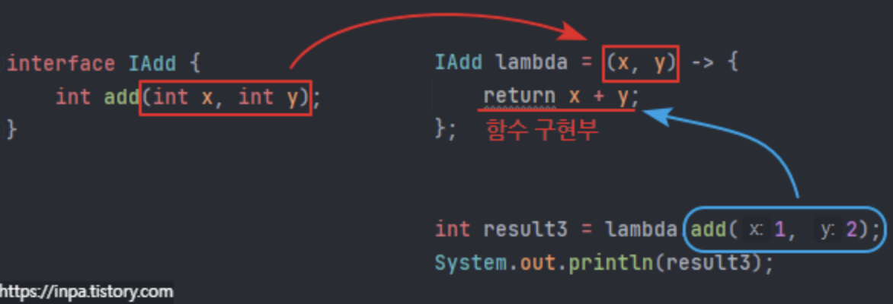

# 03.22 TIL(3)

날짜: 2025년 3월 22일
과목: java
유형: 개인공부
상태: In progress

### Lambda Expression

[람다 표현식(Lambda Expression) 완벽 정리](https://inpa.tistory.com/entry/%E2%98%95-Lambda-Expression)

- 함수형 프로그래밍을 구성하기 위한 함수식
  - 자바의 `메소드를 간결한 함수 식으로 표현` 한 것
- 이전까지 자바에서는 메서드를 하나 표현하려면 클래스를 정의해야 했다.
  - 하지만 람다식으로 표현하면 메서드의 이름, 반환값을 생략할 수 있고 이를 변수에 넣어 자바 코드가 매우 간결해지는 장점이 있다.

**예시**

```java
int add(int x, int y) {
		return x + y;
}

// 1.
(int x, int y) -> {
		return x + y;
}

// 2.
(x, y) -> {
		return x + y;
}

// 3.
(x, y) -> x + y;
```

<aside>

타입을 생략해도 컴파일러가 에러를 띄우지않는 이유는, 타입 추론 덕분이다.

</aside>

---

### Lambda, JS 익명 화살표 함수

- 사실 자바스크립트의 익명 화살표 함수 자체가 람다 함수 일종
  - 괄호를 생략하거나 등 람다의 기본 문법 체계도 자바, 자바스크립트 둘다 비슷

```jsx
const MyFunction = {
  print: function () {},
};

MyFunction.print = (str) => console.log(str);
let myFunc = MyFunction;
myFunc.print("Phil Foden");
```

```java
interface MyFunction {
		void print(String str);
}

public class Main {
		public static void main(String[] args) {
				MyFunction myFunc = (str) -> System.out.println(str);
				myFunc.print("Phil Foden");
		}
}
```

- 변수에 함수를 담을 때, JS는 약타입 언어라 타입에 관계없이 받을 수 있지만, 자바 같은 경우 강타입 언어 이기 때문에 `반드시 함수에 대한 타입` 을 선언해야 한다.
- 하지만 자바에서 8가지 (primitive, reference) 타입 밖에 없기 때문에 함수 데이터 자체를 담을 수 있을만한 자료형이 딱히 적합한 것이 없다.
- 그래서 자바 개발진들은 인터페이스를 익명 구현 객체 타입으로써, `함수를 해당 인터페이스 타입` 으로 받을 수 있게 설계한 것이다.

<br>

**약타입, 강타입?**

- 약타입(Weakly typed)
  - 변수의 타입이 동적으로 결정
  - 실행 시점에 타입이 결정되고 변경될 수 있음
- 강타입(Strongly typed)
  - 변수의 타입이 명시적으로 선언되어야 함
  - 컴파일 시점에 타입 검사가 이뤄짐
  - 타입 변환이 엄격

<br>

---

### Lambda, 함수형 인터페이스

- 람다식의 형태를 보면 마치 자바의 메소드를 변수로 선언하는 것처럼 보이지만..
  - 사실 자바는 메소드를 단독으로 선언할 수 없다.
  - 형태만 그렇게 보일 뿐이지 코드를 보면 람다 함수식을 변수에 대입하고 변수에서 메서드를 호출해서 사용하는 것이 마치 객체와 다름이 없다.

```java
MyFunction myFunc = (str) -> System.out.println(str);
myFunc.print("Hello world");
```

- 사실 람다식도 결국은 객체.
  - 정확히 말하면 인터페이스를 `익명 클래스` 로 구현한 익명 구현 객체를 짧게 표현한 것 뿐이다.

---

### 객체 지향 방식 vs 람다 표현 방식

- 다음 IAdd 라는 인터페이스가 있고 add() 추상 메서드가 있다.
  - 우리는 이 인터페이스를 구현하여 메서드를 정의해 덧셈 기능을 이용할 예정이다.

<br>

**기존 인터페이스**

```java
interface IAdd {
    int add(int x, int y);
}

class Add implements IAdd {
    public int add(int x, int y) {
        return x + y;
    }
}

public class Main {
    public static void main(String[] args) {
        Add a = new Add();

        int result1 = a.add(1, 2);
        System.out.println(result1);

    }
}
```

더 나아가서 `한번만` 사용하고 버려질 클래스라면, 굳이 번거롭게 클래스로 선언하지 말고 익명 클래스로 일회용 오버라이딩하자.

```java
interface IAdd {
    int add(int x, int y);
}

public class Main {
    public static void main(String[] args) {
        IAdd a = new IAdd() {
            public int add(int x, int y) {
                return x + y;
            }
        };

        int result1 = a.add(1, 2);
        System.out.println(result1);

    }
}
```

람다는 이 익명 클래스 코드 부분을 짧게 표현한 것이다.

```java
interface IAdd {
    int add(int x, int y);
}

public class Main {
    public static void main(String[] args) {
        IAdd lambda = (x, y) -> { return x + y; };

        int result1 = lambda.add(1, 2);
        System.out.println(result1);
				System.out.println(lambda.getClass());
    }
}

>> 3
>> class Main$$Lambda/0x000007e001003200
```

람다식 객체를 콘솔에 출력해보면, 익명 클래스 표현 형식과 또 다른 `외부클래스명$$Lambda$번호` 와 같은 독자적인 표현 형식을 지니고 있다.



즉, 아무 클래스나 추상 클래스의 메소드를 람다식으로 줄이거나 하는 행위는 못한다는 뜻이다.

오로지 인터페이스로 선언한 익명 구현 객체만이 람다식으로 표현이 가능하다.

그리고 람다 표현이 가능한 이러한 인터페이스를 가리켜 **함수형 인터페이스**라 총칭한다.

---

### 함수형 인터페이스?

> 딱 하나의 추상 메소드가 선언된 인터페이스

- 람다식 자체가 하나의 메소드를 한줄로 정의하는 표현식이다.

  - 인터페이스에 두개 이상 추상 메서드가 들어있으면 이를 코드로 겹쳐 표현할 방법이 달리 없다.
  - 따라서 추상 메소드 한개만 가진 인터페이스가 람다식의 타켓 타입(target type)이 될 수 있다.

- 단, java 8 이상부턴 인터페이스의 final 상수, default, static private 메서드는 추상 메서드가 아니다.

  - 이들 여러개가 인터페이스에 들어있어도 오로지 추상 메서드가 한개이면 함수형 인터페이스로 취급

  ```java
  interface IAdd {
  		int add(int x, int y);
  }

  // X
  interface ICalculate {
  		int add(int x, int y);
  		int min(int x, int y);
  }

  // O
  interface IAdd {
  		int add(int x, int y);

  		final boolean isNumber = true;
  		default void print() {};
  		static void print2() {};
  }
  ```

---

### @FunctionalInterface

- 두 개 이상의 추상 메소드가 선언되지 않도록 컴파일러가 확인해주는 어노테이션

```java
@FunctionalInterface
public interface MyFunctional {
		public void method();
		public void otherMethod(); // Compile Error
}
```

---

### Lambda 타입 추론

- 사실 컴파일러 스스로 람다 함수식을 보고 추론하여 타입을 유추한다.
  - 사람이 미리 정의해놓은 정의문을 보고 추론해준다.

```java
interface IAdd {
		// 3. 추상 메소드에 정의된 타입에 따라 람다 함수식의 타입을 자동으로 판별해준다.
		int add(int x, int y);
}

public class Main {

		public static int result(IAdd lambda) {
				// 2. 함수형 인터페이스 정의문을 찾아 추상 메소드 형태를 본다.
				return lambda.add(x, y);
		}

		public static void main(String[] args) {
				// 1. 람다식을 받는 메소드의 매개변수 타입을 본다.
				int n = result((x, y) -> x + y));
		}
}
```

대부분의 함수형 인터페이스를 이용하게 되면 `제네릭(Generic)` 을 사용한다.

- 컴파일러가 타입을 추론하는 데 필요한 타입 정보 대부분을 제네릭에서 판별하여 얻는다.

<br>

**예시**

```java
public class Main {
		public static void main(String[] args) {
				List<String> words = Arrays.asList("aaa", "bbb", "ccc", "ddd");
				Collections.sort(words, (s1, s2) -> Integer.compare(s1.length(), s2.length()));
		}
}

>>
@FunctionalInterface
interface Comparator<T> {
		int compare(T o1, T 02);
}

///
cclass Collections {
		...

		public static <T> void sort(List<T> list, java.util.Comparator<? super T> c) {
				list.sort(c);
		}

		...
}}
```

<br>

1. sort 메소드의 첫번째 매개변수로 List<String> 형태의 객체가 들어온다.
2. 첫번째 매개변수의 타입 지정에 의해 sort 메소드의 제네릭 타입 매개변수는 모두 String으로 지정되게 된다.
3. 따라서 Comparator 인터페이스 제네릭 타입도 String으로 지정, 추상 메서드의 매개변수 타입도 String으로 지정된다.
4. 최종적으로 람다 함수의 타입 구성은 int형 메소드 반환 타입과 String 형 매개변수 타입 두개로 추론되게 된다.

<br>


---

### 람다 표현식 활용하기

- 람다식의 가장 큰 특징은 `변수에 정수를 할당하듯이 함수를 할당` 할 수 있다는 것

1. 람다식 변수 할당

```java
interface IAdd {
    int add(int x, int y);
}

public class Main {
    public static void main(String[] args) {
        IAdd lambda = (x, y) -> x + y; // 함수를 변수에 할당
        lambda.add(1, 2); // 함수 사용
    }
}
```

1. 람다식 매개변수 할당

- 메소드의 매개변수에 바로 입력값으로 넣는 방식으로 정말 애용된다.
  - 이것을 함수를 메소드의 매개변수로 넘겨준다고 표현

```java
interface IAdd {
    int add(int x, int y);
}

public class Main {
    public static void main(String[] args) {
    	int n = result( (x, y) -> x + y ); // 메소드의 매개변수에 람다식을 전달
        System.out.println(n); // 3
    }

    public static int result(IAdd lambda) {
    	return lambda.add(1,2);
    }
}
```

→ 람다식이 이런식으로 응용이 가능한 이유는 람다는 익명 함수, 익명 함수는 모두 `일급 객체` 로 취급 되기 때문

일급 객체는 아래와 같은 조건을 만족하는 객체를 의미한다.

1. 변수나 데이터 구조에 담을 수 있음
2. 함수의 매개변수로 전달할 수 있음
3. 함수의 반환값으로 사용할 수 있음
4. 동적으로 프로퍼티 할당이 가능함

> 사실 클래스 참조 객체를 넘겨 준 것과 다름이 없다.

1. 람다식 반환값 할당

- 메서드의 반환값을 람다함수 자체를 리턴하도록 지정

```java
interface IAdd {
    int add(int x, int y);
}

public class Main {
    public static void main(String[] args) {
        IAdd func = makeFunction(); // 메소드의 반환값이 람다 함수
        int result = func.add(1, 2);
        System.out.println(result); // 3
    }

    public static IAdd makeFunction() {
        return (x, y) -> x + y;
    }
}
```

---

### 실전 예제

1. Thread 호출

```java
Thread thread = new Thread( () -> {
    for (int i = 0; i < 10; i++) {
        System.out.println(i);
    }
});
```

1. enum

```java
import java.util.function.DoubleBinaryOperator;

enum Operation {
    PLUS("+", (x, y) -> x + y),
    MINUS("-", (x, y) -> x - y),
    TIMES("*", (x, y) -> x * y),
    DIVIDE("/", (x, y) -> x / y);

    private final String symbol;
    private final DoubleBinaryOperator op;

    Operation(String symbol, DoubleBinaryOperator op) {
        this.symbol = symbol;
        this.op = op;
    }

    @Override
    public String toString() { return symbol; }

    public double apply(double x, double y) {
        return op.applyAsDouble(x, y);
    }
}

public class Main {
    public static void main(String[] args) {
        // 사용은 아래와 같이
        Operation.PLUS.apply(2, 3);
    }
}
```

---

### 람다의 단점

- 문서화가 불가능
- 디버깅이 어려움
- stream에서 람다를 사용할 시 for문보다 성능이 떨어짐
- 코드 가독성 저하할 수도(남발할 시)
- 재귀로 만들경우에는 다소 부적합
